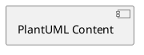

# PlantUML Lint Skill

自动修复 Markdown 文件中内嵌 PlantUML 代码块的语法错误，确保代码块 **100% 可被渲染**。

## 功能特性

### 双重校验机制

| 层级 | 方式 | 说明 |
|------|------|------|
| **第一层 (Regex Pass)** | 正则匹配 | 快速修复常见文本级错误，无需外部依赖 |
| **第二层 (Jar Pass)** | `plantuml.jar -syntax` | 调用本地 PlantUML 进行权威语法校验，根据行号进行针对性修复 |

### 自动修复类型

- **声明补全**：缺失的 `@startuml` / `@enduml` 自动补全
- **引号修复**：未闭合的双引号 `"` 自动闭合
- **箭头语法**：全角/Unicode 箭头（如 `–>`、`→`）标准化为 ASCII（`->`）
- **字体声明规范化**：逗号分隔的多字体回退列表（如 `"Inter", "sans-serif"`）截断为单字体
- **活动图 skinparam 清理**：移除活动图中无效的 `skinparam interfaceStyle rectangle`
- **分区语法标准化**：将 `end partition` 转换为大括号 `{ }` 语法（兼容旧版引擎）
- **浮动注释降级**：将 `floating note` 转换为标准 `note`（兼容旧版引擎）
- **块结束符**：缺失的 `endif`/`endwhile`/`endloop` 等关键字自动补全
- **参与者声明**：未定义的 participant/entity 自动添加声明
- **字符清理**：非法控制字符自动移除
- **空行规范化**：多余的连续空行清理

### Markdown 围栏规范

强制输出标准格式：

````markdown

````

## 图表类型选型规范 (Diagram Selection Policy)

为了保持文档的专业性与可维护性，必须严格遵守以下图表引擎选型规定：

1. **PlantUML 专用领域**：仅限输出以下标准 UML 图表：
   - **类图 (Class Diagram)**
   - **组件图 (Component Diagram)**
   - **时序图 (Sequence Diagram)**
   - **活动图 (Activity Diagram)**
   - **用例图 (Use Case Diagram)**
2. **Mermaid 专用领域**：其他所有非标准 UML 示意图应优先使用 Mermaid 输出，包括但不限于：
   - 流程图 (Flowchart - 非 UML 活动图)
   - 甘特图 (Gantt Chart)
   - 饼图 (Pie Chart)
   - 实体关系图 (ER Diagram)
   - 思维导图 (Mindmap) 等。

## 架构设计与渲染规范 (Design Guidelines)

在生成和修改 PlantUML 图表时，除了必须符合上述“选型规范”，还需遵循以下标准 UML 约束与最佳实践：

1. **接口方块化渲染**：
   - 默认情况下 PlantUML 会将 `interface` 渲染为“棒棒糖(lollipop)”样式。
   - 在组件图中，为了确保统一的方块渲染风格，应使用 `rectangle "接口名" as Alias <<Interface>>` 代替 `interface` 关键字。
   - 也可以在图表头部添加 `skinparam interfaceStyle rectangle`。
2. **标准连线语法**：
   - 严禁拼接不合规的方向箭头，如 `-> down->`。必须使用合法的方向修饰符（如 `-down->`、`..>`. `-->`等）。
   - **接口实现**：必须使用标准的实现/泛化符号 `..|>` 或 `<|..`，严禁使用普通的依赖虚线 `..>` 表示实现。
3. **连线文本极简原则**：
   - **不要**在关系连线（箭头上）写长句或时序过程（如 `1. 用户点击触发 (handleSelect)`）。
   - 连线上只应出现标准的 UML 连接语义小写原语：`use`、`create`、`delegate`、`implement`。
   - 如果需要进一步解释关系逻辑或调用时序，请使用 `note right of` / `note on link`，或者将详细的时序说明写在图表下方的 Markdown 正文中。
4. **组件命名与连字符保护**：
   - 定义类似 `dict-config.html` 带有 `-` 连字符的名称时，必须用双引号包裹为 `"dict-config.html" as UI` 进行别名声明。
   - 调用连线时始终使用别名（如 `Preload ..> UI`），避免连字符干扰箭头解析器。


## 前置要求

| 依赖 | 要求 |
|------|------|
| Node.js | >= 14 |
| Java Runtime | 用于运行 plantuml.jar（Jar Pass 必需） |
| plantuml.jar | 从 [PlantUML 官网](https://plantuml.com/download) 下载 |

> **注意**：如果缺少 Java 或 plantuml.jar，Skill 将降级为 **Regex-only 模式**（仅执行第一层校验）。

## 配置

编辑项目根目录的 `config.json`：

```json
{
  "plantuml_jar_path": "/absolute/path/to/plantuml.jar",
  "java_executable": "java",
  "max_retries": 3
}
```

| 字段 | 说明 | 默认值 | 环境变量覆盖 |
|------|------|--------|-------------|
| `plantuml_jar_path` | plantuml.jar 的绝对路径 | （必填） | `PLANTUML_JAR_PATH` |
| `java_executable` | Java 可执行文件路径 | `java` | `JAVA_EXECUTABLE` |
| `max_retries` | Jar Pass 最大重试次数 | `3` | — |

## 使用方式

### CLI 直接调用

```bash
node scripts/linter.js path/to/your/file.md
```

### 作为 Subagent 工具（推荐）

在生成 PlantUML 代码后，自动调用 Lint 进行校验：

```
用户: 请帮我画一个时序图

Agent: [生成 PlantUML 代码]
      [调用 linter.js 进行 lint 校验]
      [输出确保可渲染的结果]
```

### 输出示例

```
--- Block #1 (plantuml) ---
  [Jar Pass] Fixed in 1 attempt(s): Attempt 1: line 5 - Syntax error
--- Block #2 (plantuml) ---
  [Jar Pass] No errors found

✅ Fixed: ./docs/example.md
⚠ Some blocks could not be fully auto-fixed. Manual review recommended.
```

## 错误处理

| 场景 | 行为 |
|------|------|
| config.json 缺失 | 抛出错误，提示文件位置 |
| plantuml.jar 不存在 | 抛出错误，提示检查配置路径 |
| Java 未安装 | 抛出错误，提示安装或修改 java_executable |
| Jar Pass 无法修复 | 保留 Regex 修复结果，输出具体行号和错误描述 |
| 多块顺序处理 | 每个块单独报告结果，一个块失败不影响其他块 |

## 核心流程 (Fix-Loop)

对每个 `` ```plantuml `` 块执行以下流程：

```
提取 → Regex Pass(快速修复) → Jar Pass(循环校验+启发式修复) → 围栏规范化 → 回填
                                    ↓
                            写临时文件 → 执行 jar -syntax
                                  ↓
                            解析 Error line(X)
                                  ↓
                            heuristicFix(补全end/add participant等)
                                  ↓
                            重试直到成功 或 达到 max_retries
```

## 文件结构

```
plantuml-lint/
├── SKILL.md              ← 本文件
├── config.json           ← 配置文件
├── scripts/
│   ├── linter.js         ← 主入口 (CLI + 核心编排)
│   ├── jar_validator.js  ← Jar Pass 校验与启发式修复引擎
│   └── regex_rules.js    ← Regex 规则集 (9条规则)
├── docs/
│   └── PLAN.md           ← 开发计划
└── test.md               ← 测试用例
```
