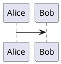
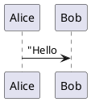
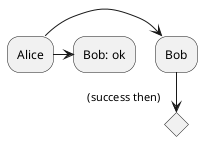
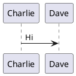
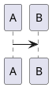
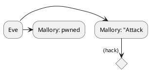

# PlantUML Lint Skill 开发计划

> 基于设计文档 `docs/2026-04-04-plantuml-lint-skill-design.md`

---

## 项目现状

| 文件 | 状态 | 说明 |
|------|------|------|
| `config.json` | ✅ | `plantuml_jar_path`, `java_executable`, `max_retries: 3` |
| `scripts/linter.js` | ✅ | Regex Pass + Jar Pass (带启发式修复) |
| `scripts/regex_rules.js` | ✅ | 包含 5 条核心正则修复规则 |
| `SKILL.md` | ✅ | 包含详细功能、**选型规范**与渲染规范 |
| `test.md` | ✅ | 包含 9 个核心测试场景 (puml-alias, errors 等) |

**核心差距**：设计文档 4.2 节 Fix-Loop 的 **步骤3（Jar Pass 循环校验 + 启发式修复）完全缺失**

---

## Phase 1: 核心引擎 — Jar Pass + 启发式修复

### 新增: `scripts/jar_validator.js`

```
模块导出:
├── validateWithJar(content, config)
│   ├── 写入临时 .puml 文件 (os.tmpdir + crypto.randomBytes)
│   ├── 执行: java -jar <plantuml_jar_path> -syntax <tmpfile>
│   ├── 用 child_process.execSync 同步调用, 捕获 stdout/stderr
│   ├── 正则解析 /Error line \((\d+)\)/g 提取 {line, message}
│   └── 返回 { ok: boolean, errors: [{line: number, message: string}] }
│
├── heuristicFix(content, errorLine, errorMsg)
│   ├── 缺 end 关键字 → 在块末 @enduml 前补全
│   │   匹配: /(if|while|loop|switch|group|case|else|fork|alt|opt|region|ref|salt|state)\b/
│   │   修复: 找到未闭合的 block 关键字，插入对应 endXXX
│   ├── 未定义 participant/entity/actor/component → 在 @startuml 后声明
│   │   匹配: /^(\w+)(?:\s*->|\s*-->|\s*:)/ 提取引用名
│   │   修复: participant XXX as XXX
│   ├── 非法字符/符号 → 移除或替换
│   │   常见: 全角箭头、非法 Unicode 控制字符
│   └── 返回修复后的 content 字符串
│
└── fixLoop(content, config)  ← 主入口函数
    ├── for (attempt = 0; attempt < max_retries; attempt++)
    │   ├── result = validateWithJar(currentContent, config)
    │   ├── if result.ok → return { success: true, content, attempts: attempt+1 }
    │   └── currentContent = heuristicFix(currentContent, result.errors[0])
    └── 失败 → throw Error("Unfixable after N retries: ...")
```

### 修改: `scripts/linter.js`
- 引入 `const { fixLoop } = require('./jar_validator');`
- `processMarkdown()` 中每个 block：先 `applyRegexFixes()` 再 `fixLoop()`
- 增加 `checkDependencies(config)` 函数验证 jar 文件存在性
- 输出增强：打印每个 block 的修复详情

---

## Phase 2: Regex 规则增强

### 修改: `scripts/regex_rules.js`

新增规则：

```javascript
// 规则3: 箭头语法标准化 - 将非标准箭头转为标准形式
{
  name: "Normalize arrow syntax",
  apply: (content) => {
    // 统一 -> --> ==> => 等格式
    return content.replace(/–>/g, '->')
                  .replace(/—>/g, '-->')
                  .replace(/=>>/g, '=>>');
  }
}

// 规则4: 清理多余空行
{
  name: "Remove extra blank lines inside diagram",
  apply: (content) => {
    const lines = content.split('\n');
    // 保留 @startuml 后第一行和 @enduml 前的空行，移除连续多空行
    // ...
  }
}

// 规则5: 特殊字符处理
{
  name: "Sanitize problematic characters",
  apply: (content) => {
    // 移除 ASCII 控制字符 (保留 \n \r \t)
    return content.replace(/[\x00-\x08\x0B\x0C\x0E-\x1F\x7F]/g, '');
  }
}
```

---

## Phase 3: Markdown 围栏规范化 + 错误处理

### 修改: `scripts/linter.js`

**围栏强制规范**：
```
输出格式严格为:

```
- 语言别名统一为 `plantuml`（支持 `puml` 输入）
- 确保 `@startuml` 和 `@enduml` 各占独立一行
- 内容前后无多余空行

**错误处理增强**：
```javascript
function checkDependencies(config) {
  if (!fs.existsSync(config.plantuml_jar_path)) {
    throw new Error(
      `plantuml.jar not found at ${config.plantuml_jar_path}. ` +
      `Please update config.json with the correct path.`
    );
  }
}
```

- 不可修复错误：输出 **行号 + 错误描述 + 上下文代码片段**
- 多块处理：顺序处理，每个块单独报告结果

---

## Phase 4: SKILL.md 文档完善

### 重写: `SKILL.md`

```markdown
# PlantUML Lint Skill

自动修复 Markdown 文件中内嵌 PlantUML 代码块的语法错误。

## 功能特性

1. **双重校验机制**
   - 第一层 (Regex): 快速修复常见文本级错误
   - 第二层 (Jar): 调用 plantuml.jar 进行权威语法校验

2. **自动修复类型**
   - 补全缺失的 @startuml / @enduml
   - 修复未闭合的引号
   - 修正箭头语法
   - 自动补全缺失的 end 关键字
   - 自动添加未声明的 participant
   - 清理非法字符

3. **Markdown 围栏规范化**
   - 确保输出符合标准 ```plantuml 围栏结构

## 前置要求

- Node.js >= 14
- Java Runtime (用于运行 plantuml.jar)
- plantuml.jar（需配置路径）

## 配置

编辑项目根目录的 `config.json`:

```json
{
  "plantuml_jar_path": "/absolute/path/to/plantuml.jar",
  "java_executable": "java",
  "max_retries": 3
}
```

## 使用方式

### CLI 直接调用
```bash
node scripts/linter.js <path/to/file.md>
```

### 作为子 Agent 工具
在生成 PlantUML 代码后，自动运行 lint 校验确保可渲染性。
```

---

## Phase 5: 测试用例扩展

### 扩展: `test.md`

```markdown
# PlantUML Lint 测试用例

## 1. 正常块 (应无变化)


## 2. 缺少 @startuml (应补全)
```plantuml
Alice -> Bob
@enduml
```

## 3. 缺少 @enduml (应补全)


## 4. 未闭合引号 (应补全)


## 5. 缺少 endif (启发式修复)


## 6. 未定义 participant (应自动声明)


## 7. puml 语言别名 (应转为 plantuml)


## 8. 空 block (应保持或填充最小结构)
````plantuml

````

## 9. 多错误叠加 (引号+缺少end+未定义participant)

```

---

---

## Phase 6: 选型规范集成与校验 (Selection Policy) — COMPLETED

### 修改: `SKILL.md`
- **新增**: `图表类型选型规范` 章节
- **明确**: 
    - **PlantUML**: 仅限 类图、组件图、时序图、活动图、用例图
    - **Mermaid**: 流程图、甘特图、饼图、ER图、脑图等其他所有图表

### 增强 (计划中): `scripts/linter.js`
- 增加类型启发式识别规则。
- 当检测到受限类型（如 `mindmap`, `gantt`）时，输出 **建议迁移至 Mermaid** 的警告。

---

## 实施顺序总结

```
Ph 1 [核心] → Ph 2 [规则] → Ph 3 [规范] → Ph 4 [文档] → Ph 5 [测试] → Ph 6 [选型规范]
     ↓            ↓             ↓            ↓            ↓             ↓
 jar_validator.js regex_rules.js linter.js    SKILL.md     test.md       SKILL.md 更新
```
