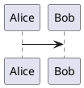
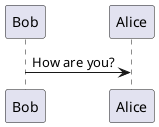
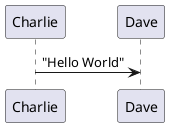
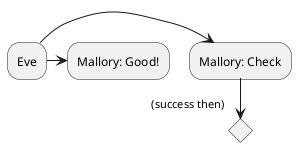
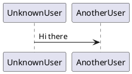
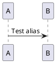
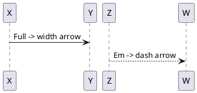
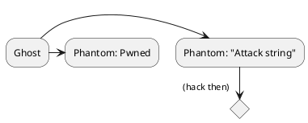
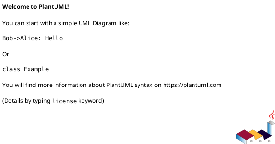

# PlantUML Lint 测试用例

## Block 1: 正常块（应无变化）



## Block 2: 缺少 @startuml 和 @enduml（应补全）

````plantuml
@startuml
Alice -> Bob: Hello
@enduml
````

## Block 3: 缺少 @enduml（应补全）



## Block 4: 未闭合引号（应自动补全）



## Block 5: 缺少 endif（启发式修复）



## Block 6: 未定义 participant（应自动声明）



## Block 7: puml 语言别名（应转为 plantuml 围栏）



## Block 8: 全角箭头（应标准化）



## Block 9: 多错误叠加（引号 + 缺 end + 未定义 participant）



## Block 10: 空 block（应填充最小有效结构）


