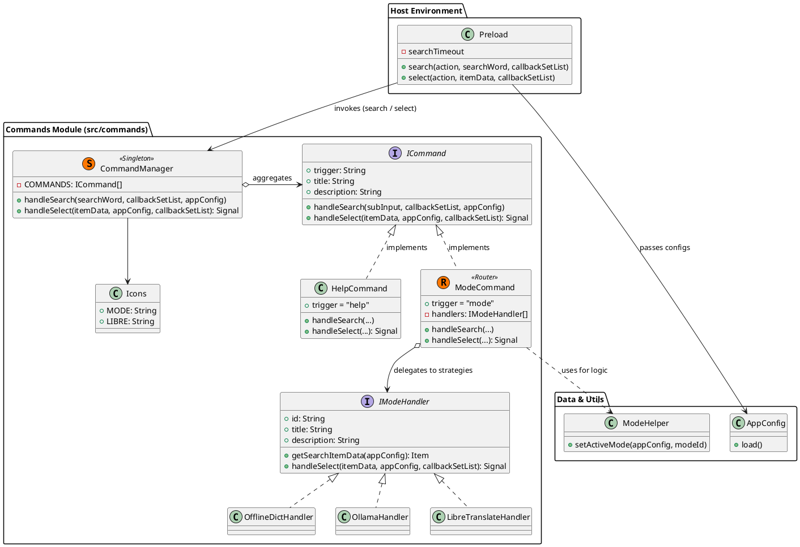
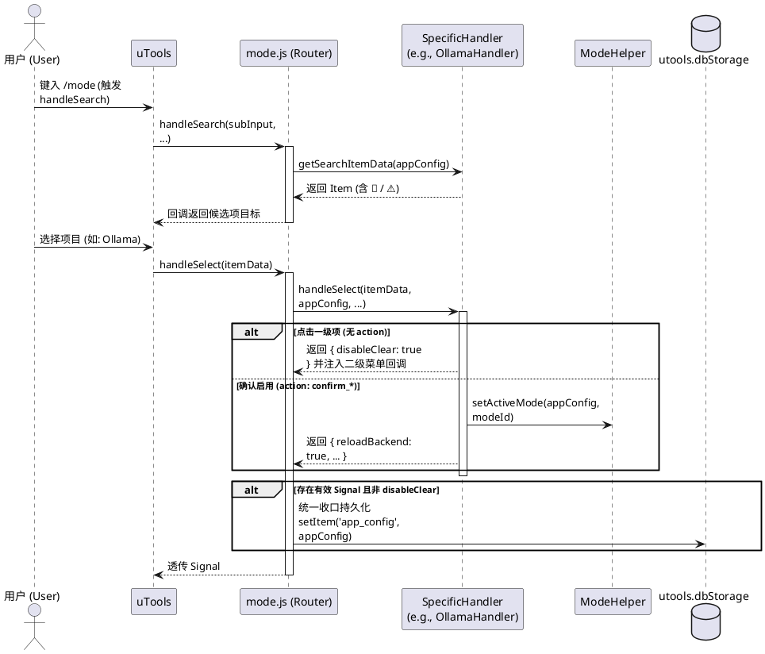

# 命令系统与模式切换 (Commands & Mode Switch) 架构设计

本文档融合了插件的**命令路由系统设计**以及具体的 **`/mode` (翻译模式切换)** 的架构实现与跨层级交互流转。

---

## 第一部分：命令系统整体架构 (Commands System)

`commands` 模块采取了经典的【命令管理器（Facade/Registry）+ 抽象命令接口（Strategy）】模式。`CommandManager` 通过路由前缀，将来自 `preload` 的输入法事件分发到确切的底层业务模块（如 `/mode` 切换模式或 `/help` 提供帮助文档）。

### 1. 核心类图与组成架构

#### 核心成员解释
1. **`Preload`**: uTools 注入的顶层环境沙箱入口，控制着渲染器界面的生命周期与所有原生交互。
2. **`CommandManager`** (`index.js`): 主力视图的命令路由网关。解析用户输入，根据首个词条（Token）将其精准分发到子 `ICommand` 实现类。
3. **`ICommand`**: 任何命令（如 `/mode` 或 `/help`）的鸭子类型契约。每个命令维护自身的 `handleSearch`（用于展示搜索列表）和 `handleSelect`（用于处理点击响应）。

---

## 第二部分：/mode (模式切换) 命令具体设计

`/mode` 核心职责是管理和调度系统多后端的翻译引擎。重构后，它采用 **Strategy Pattern (策略模式)**，将各后端特有的 UI 呈现、子菜单逻辑与具体 Action 逻辑解耦进专门的 `Handler` 模块中。

### 1. 策略分发与 Handler 架构
`/mode` 命令现在是一个纯粹的 **Router (路由器)**。
- 目录结构：`src/commands/modes/`
- 职责分离：`mode.js` 仅负责匹配 `modeId` 并转发。具体的 `handleSelect` 与 `handleSearch` 逻辑由对应后端的 Handler 闭环处理。

**就绪规则 (由各 Handler 内部维护)**：
- **离线词典 (OfflineDictHandler)**: 实时调用 `getDictStatus` 判断本地词典库。
- **Ollama (OllamaHandler)**: 基于 `OllamaConfig` 加载器校验 `READY` 状态。
- **LibreTranslate (LibreTranslateHandler)**: 校验 API 地址配置。

### 2. 交互流转时序图
为了提供安全的配置切换，`/mode` 采用了**二级操作（导航式）菜单**。

### 3. 容灾重定向 (Fallback)
对于尚未就绪处于异常状态（如 `UNAVAILABLE`）的模块，即便是绕过了二级确认树直接执行，模块也会启动容灾方案：它自动将指令修改为包含 `openConfigPanel: true`，强制拦截并跳转至对应配置界面避免报错崩溃。

---

## 第三部分：跨层接口通信与副作用指令契约

Commands 系统（无状态）与 Preload （顶层视图）之间是如何连接并引发视图刷新的？

### 1. 标准交互链路

- **搜索（呈现）期**：
  若输入首字母为斜线 `/`，`preload.js` 内的拦截器直接调用 `CommandManager.handleSearch(...)` 截断正常翻译流程。
- **点击（执行）期**：
  点击指令条目触发 `preload.js` 的 `select` 事件执行 `CommandManager.handleSelect(...)`。在这个操作中，具体的模块（如 `mode.js`）完成底层环境修改并抛出副作用指令载荷（`Signal`）。`preload.js` 进行最后指令消化。

### 2. 副作用指令映射 (Signal Dictionary)

| Mode/Command 抛出的字段 | 值类型 | `preload.js` 实际消费与控制原理 |
| :--- | :--- | :--- |
| `disableClear` | `boolean` | 阻止点击时系统自动清空输入框。被 `mode.js` 用来原地渲染出**二级确认/配置菜单**，而不跳出当前搜索流。 |
| `reloadBackend`| `boolean` | 核心挂载指令：调用 `BackendManager.reloadFromAppConfig()` 热重载单例设置并实例化最新的翻译底包驱动。 |
| `restoreSearch`| `boolean` | 配置命令全完成后，请求宿主返回普通翻译状态。`preload.js` 读取内存驻留的 `lastWordToSearch`，调用 `requestAnimationFrame` 配合 `setSubInputValue` 自动填入之前要翻译的词汇。 |
| `openConfigPanel`| `boolean` | 要求进入全屏配置流。底层调用 `BackendManager.openConfigPanel` 引出面板，并在该界面关闭时再次附赠一个 `reloadFromAppConfig()` 避免丢变动。 |
| `autoComplete` | `string`  | 向输入框反填字符串指令，实现代码级键盘导航。调用 `utools.setSubInputValue(signal.autoComplete)`。 |
