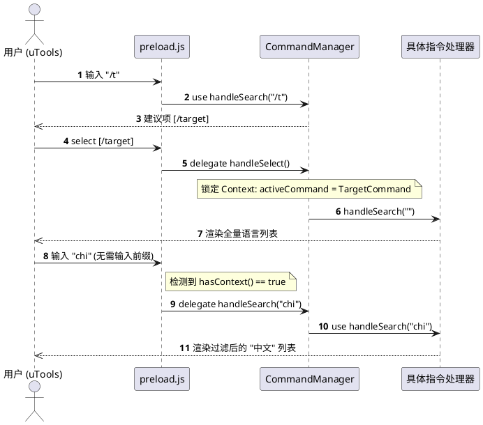

# 设计文档：基于上下文的命令子项过滤系统 (Context-based Filtering)

## 1. 背景与动机
在 uTools 插件中，进入 `/target`（设置目标语言）或 `/mode`（切换翻译模式）等二级列表后，用户期望能够通过在主搜索框输入关键词来快速过滤列表项。

由于直接调用 `utools.setSubInputValue` (autoComplete) 在当前插件架构中会触发不稳定的 UI 刷新周期，导致列表项偶发性消失，因此需要一种**不修改输入框内容**但能**智能识别搜索意图**的路由方案。

## 2. 方案概览：无感上下文路由 (Silent Contextual Routing)
本方案通过在 `CommandManager` 中引入一个轻量级的会话状态，实现在“指令导航模式”和“标准翻译模式”之间的平滑切换。

- **核心思想**：当用户显式选择一个“容器型指令”（如 `/target`）时，系统进入该指令的上下文周期。在此周期内，主搜索框的任何输入都将优先作为该指令的过滤条件，直到周期结束。

## 3. 详细设计

### 3.1 状态模型 (State Model)
在 `src/commands/index.js` 的 `CommandManager` 对象中增加：
- `activeCommand`: 存储当前锁定的指令处理器实例。

### 3.2 路由分发算法 (Dispatching Algorithm)
`CommandManager.handleSearch` 的逻辑更新为：

| 优先级 | 匹配条件 | 动作 |
| :--- | :--- | :--- |
| 1 | 输入以 `/` 开头且完全符合某前缀 (如 `/target `) | **重置上下文**为该指令，并分发子输入。 |
| 2 | 输入**不以** `/` 开头，但 `hasActiveContext` 为真 | **透穿上下文**，将输入交给活跃指令处理器过滤。 |
| 3 | 输入以 `/` 开头但未完全匹配前缀 | **清除上下文**，执行一级指令名的模糊搜索。 |
| 4 | 其他情况 | **清除上下文**，返回空列表，将控制权还给 `preload.js` 执行翻译任务。 |

### 3.3 生命周期管理 (Lifecycle)
| 事件 | 行为 | 理由 |
| :--- | :--- | :--- |
| **选择一级指令** | 锁定对应的 `activeCommand` | 用户明确表达了开始指令流的意愿。 |
| **选择二级结果项** | 清除 `activeCommand` | 操作已完成（如语言已设好），应退出指令流。 |
| **清空搜索框** | 清除 `activeCommand` | 物理清空是 uTools 中最自然的“退出/重置”信号。 |
| **输入其他 `/` 指令** | 切换到新的 `activeCommand` | 显式切换优先级最高。 |

## 4. 关键代码变更点

### src/commands/index.js
- 增加 `activeCommand` 追踪。
- 修改 `handleSearch` 路由分发逻辑。
- 修改 `handleSelect` 在选中根级命令时维护上下文。
- 增加 `hasContext()` 方法供 `preload.js` 判断。

### preload.js (search 回调)
- 修改判断条件：`if (searchWord.startsWith('/') || CommandManager.hasContext())`。
- 只有在上述条件均不满足时，才进入 `SEARCH_DEBOUNCE_MS` 后端翻译逻辑。

## 5. 交互时序图

## 6. 测试要点
1. **一致性测试**：确保在 `/target` 模式下输入内容，列表能正确收缩。
2. **退出机制测试**：删除搜索框内容后，再次输入单词，应恢复为普通的中英查词模式。
3. **隔离性测试**：进入 `/target` 模式后输入 `/mode`，应能成功切换到模式选择模式，且旧的上下文被清除。
