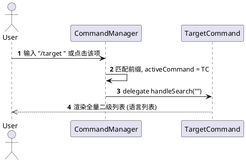
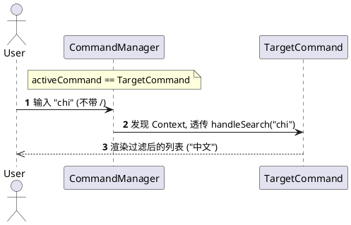
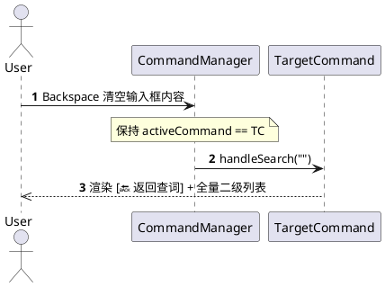
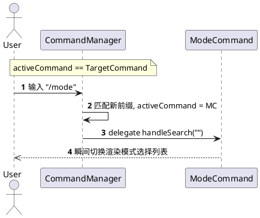
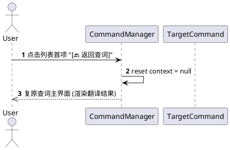
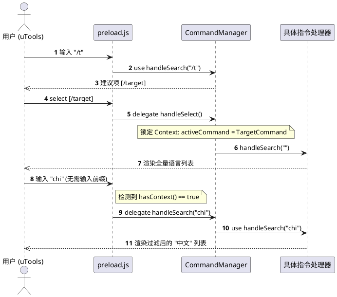

# 设计文档：基于上下文的命令子项过滤系统 (Context-based Filtering)

## 1. 背景与动机
在 uTools 插件中，进入 `/target`（设置目标语言）或 `/mode`（切换翻译模式）等二级列表后，用户期望能够通过在主搜索框输入关键词来快速过滤列表项。

由于直接调用 `utools.setSubInputValue` (autoComplete) 在当前插件架构中会触发不稳定的 UI 刷新周期，导致列表项偶发性消失，因此需要一种**不修改输入框内容**但能**智能识别搜索意图**的路由方案。

## 2. 方案概览：无感上下文路由 (Silent Contextual Routing)
本方案通过在 `CommandManager` 中引入一个轻量级的会话状态，实现在“指令导航模式”和“标准翻译模式”之间的平滑切换。

- **核心思想**：当用户显式选择一个“容器型指令”（如 `/target`）时，系统进入该指令的上下文周期。在此周期内，主搜索框的任何输入都将优先作为该指令的过滤条件，直到周期结束。

## 3. 详细设计

### 3.1 状态模型 (State Model)
在 `src/commands/index.js` 的 `CommandManager` 对象中增加：
- `activeCommand`: 存储当前锁定的指令处理器实例。

### 3.2 交互场景与路由逻辑 (Scenarios)

#### 3.2.1 场景一：显式进入指令 (Explicit Entry)
当用户输入完整指令前缀或从一级列表点击进入时，立即锁定上下文。

#### 3.2.2 场景二：隐式子项过滤 (Contextual Filtering)
在锁定状态下，直接输入普通字符即可进行过滤。

#### 3.2.3 场景三：粘性列表与手动返回 (Sticky Mode)
清空内容不自动退出，而是改为显示“手动返回项”以防误触退出。

#### 3.2.4 场景四：指令优先级抢占 (Preemption)
在模式内输入新的斜杠指令，自动切换上下文。

#### 3.2.5 场景五：彻底退出重启 (Explicit Exit)
通过返回项退出或完成业务逻辑。

### 3.3 生命周期管理 (Lifecycle - Sticky)
| 事件 | 行为 | 理由 |
| :--- | :--- | :--- |
| **选择一级指令** | 锁定对应的 `activeCommand` | 用户明确进入。 |
| **选择二级结果项** | 清除 `activeCommand` | 单次操作流程结束。 |
| **输入框变为内容** | **保持** `activeCommand` | **粘性模式**：防止误删导致掉出菜单。 |
| **点击 [返回查词]** | 清除 `activeCommand` | 用户手动退出。 |
| **输入其他 `/` 指令** | 切换到新的 `activeCommand` | 模式抢占。 |

## 4. 关键代码变更点

### src/commands/index.js
- 增加 `activeCommand` 追踪。
- 修改 `handleSearch` 路由分发逻辑。
- 修改 `handleSelect` 在选中根级命令时维护上下文。
- 增加 `hasContext()` 方法供 `preload.js` 判断。

### preload.js (search 回调)
- 修改判断条件：`if (searchWord.startsWith('/') || CommandManager.hasContext())`。
- 只有在上述条件均不满足时，才进入 `SEARCH_DEBOUNCE_MS` 后端翻译逻辑。

## 5. 交互时序图

## 6. 交互细节与边界情况 (Interaction Nuances & Edge Cases)

### 6.1 手动完整输入指令 (Manual Input)
当用户在搜索框手动完整输入 `/target`（未点击项）时，`CommandManager` 通过“优先级 1”的显式匹配逻辑，会自动在后台静默锁定上下文。这意味着手动输入和列表点击在功能上是完全等效的。

### 6.2 点击项后的输入框状态 (UI Retention)
为了规避 `autoComplete` 引起的 UI 渲染 Bug，用户点击 `/target` 后，主输入框将保留原有的字符（如 `/ta`）。用户只需通过 `Backspace` 清除或直接覆盖输入内容，即可利用已锁定的上下文进行子项过滤。

### 6.3 隐式分发机制 (Implicit Dispatching)
在上下文锁定期间，任何不以 `/` 开头的输入均被视为该活跃指令的过滤关键词。系统不会触发后端的翻译逻辑，从而保证子项过滤过程的纯净度。

### 6.4 快速退出机制 (Escape Mechanism)
最符合直觉的退出方式是彻底清空搜索框。当输入为空时，系统重置上下文。此外，输入一个代表新指令的 `/` 前缀（如从目标语言切换到模式选择 `/mode`）也会触发旧上下文的即时释放与新上下文的转移。

## 7. 测试要点
1. **一致性测试**：确保在 `/target` 模式下输入内容，列表能正确收缩。
2. **退出机制测试**：删除搜索框内容后，再次输入单词，应恢复为普通的中英查词模式。
3. **隔离性测试**：进入 `/target` 模式后输入 `/mode`，应能成功切换到模式选择模式，且旧的上下文被清除。
