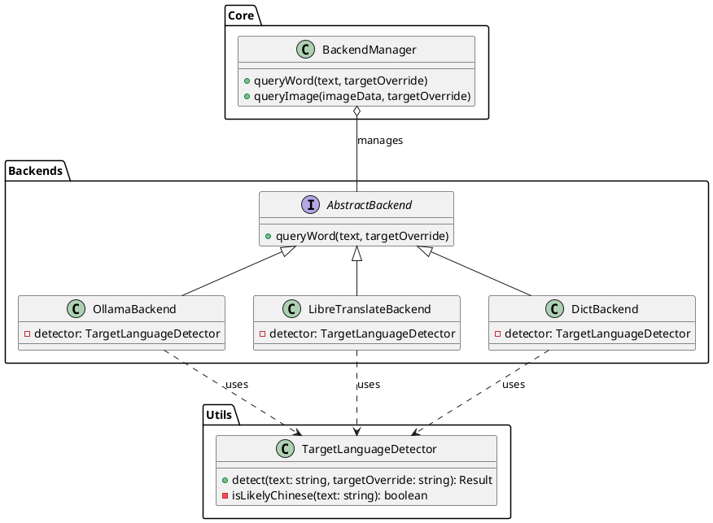
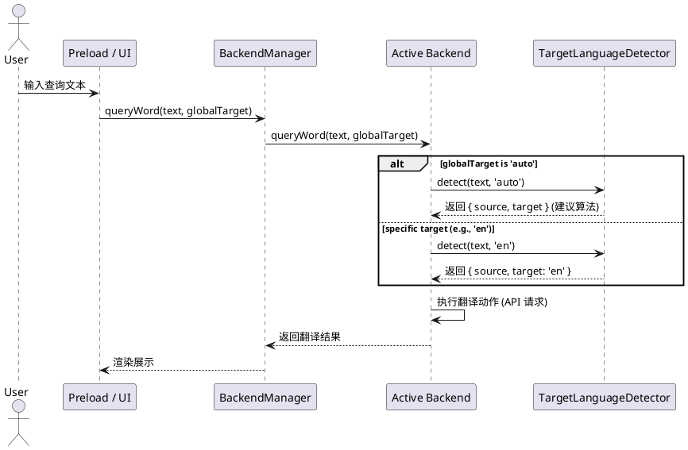
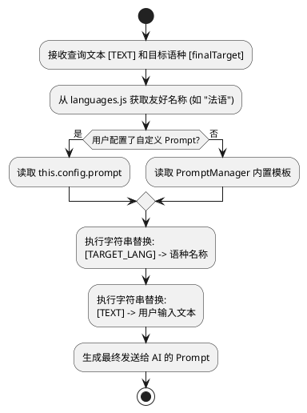

# 目标语言全局联动与动态 Prompt 实现方案

## 1. 背景与目标
随着 `/target` 指令的引入，用户现在可以指定全局翻译的目标语言。本方案旨在确保 `Ollama` 和 `LibreTranslate` 两个进阶后端能够完美适配这一设置，并实现在未指定语言（`auto` 模式）下的智能自动切换。

### 核心规则：
- **智能切换算法**：若输入包含中文 -> 翻译为英文；若不含中文 -> 翻译为中文。
- **配置解耦**：移除后端私有的目标语言设置，统一由 `AppConfig` 的全局目标决定。
- **动态 Prompt**：Ollama 需支持用户自定义 Prompt 模板，并自动填充当前目标语言的中文名称。

## 2. 详细设计

### 2.1 架构关系与职责
为了增强后端的自治性，语种检测逻辑被下沉到具体 Backend 内部实现。

#### 类图关系


#### 判定时序逻辑


### 2.2 核心判定工具 (TargetLanguageDetector)
`TargetLanguageDetector` 是一个无状态的纯算法类，不感知任何配置。

#### 核心方法：
- `detect(text)`: 
    - **逻辑**: 检测是否含中文。
    - **输出**: `{ source: 'zh'/'en', target: 'en'/'zh' }`。
- **定位**: 仅作为“中英互译建议算法”的实现者，供各后端按需调用。

### 2.3 后端决策逻辑 (策略决策权)

各后端在接收到 `queryWord(text, globalTargetOverride)` 调用时，应遵循以下内部决策流：

#### 1. Ollama & LibreTranslate (进阶后端)
```javascript
// 后端内部伪代码
function queryWord(text, globalTarget) {
    let finalSource = 'auto';
    let finalTarget = globalTarget;

    // 核心转变：由后端决定在 globalTarget 为 auto 时使用判定工具
    if (globalTarget === 'auto') {
        const suggestion = this.detector.detect(text);
        finalSource = suggestion.source;
        finalTarget = suggestion.target;
    }
    
    // 执行后续翻译逻辑 (如组装 Prompt 或 Payload)
}
```

#### 2. DictBackend (离线词典)
- **策略**: 始终调用 `this.detector.detect(text)`。
- **原因**: 离线词典的功能边界固定在中翻英/英翻中，它强制忽略 `globalTarget` 的设置（或将其视为自动模式的输入），以保证词典查询的确定性。

### 2.4 Ollama 动态 Prompt 链路
1.  **判定结果分发**：由 `OllamaBackend` 确定最终的 `finalTarget` 代码。
2.  **名称映射**：通过 `getNameByCode(finalTarget)` 从语言包中提取中文名（如：`英语`）。

#### Prompt 构建活动图


### 2.5 LibreTranslate 请求组装
1.  **参数对齐**：使用后端决策后的 `finalTarget` 作为 API 请求的 `target` 参数。

### 2.6 DictBackend 逻辑重构
由于离线词典数据集的特殊性（仅限中英），其内部逻辑将进行如下调整：
1.  **逻辑注入**：在 `createDictBackend` 构造时引入 `TargetLanguageDetector` 实例。
2.  **忽略全局目标**：`queryWord(text, globalTarget)` 会接收参数，但内部主要依靠 `detector.detect(text)` 产生的建议值。
3.  **路由逻辑**：
    - 调用 `detector.detect(text)` 得到 `{ source, target }`。
    - 若 `source === 'zh'`：路由至 `queryCccedictWithSqlJs` (中翻英)。
    - 若 `source === 'en'`：路由至 `queryWithSqlJs` (英翻中)。
4.  **收益**：确保了无论用户当前的全局翻译偏好如何改变，离线词典始终能提供稳定的中英双向查词能力。


## 3. 变更文件清单

| 文件路径 | 状态 | 变更说明 |
| :--- | :--- | :--- |
| `src/utils/target_language_detector.js` | **新增** | 定义 `TargetLanguageDetector` 类。 |
| `src/commands/languages.js` | 待修改 | 导出辅助方法 `getNameByCode(code)`。 |
| `src/backends/ollama/prompt-manager.js" | 待修改 | 实现动态替换 `[TARGET_LANG]` 的逻辑。 |
| `src/backends/ollama/index.js` | 待修改 | 在 `queryWord` 中注入配置好的 Prompt 模板。 |
| `src/backends/libretranslate/index.js` | 待修改 | 调整 `targetLang` 使用优先级。 |
| `src/backends/dict/index.js` | 待修改 | 引入 `TargetLanguageDetector`，重构内部判定逻辑。 |
| `preload.js` | 待修改 | 适配后端接口变更，直接透传全局 target 设置。 |


## 5. 测试设计

### 5.1 单元测试 (Unit Tests)
使用 `Jest` 对核心组件进行独立验证：
- **TargetLanguageDetector**:
    - 测试用例 1: 输入 "Hello" -> 预期 `{ source: 'en', target: 'zh' }`。
    - 测试用例 2: 输入 "你好" -> 预期 `{ source: 'zh', target: 'en' }`。
    - 测试用例 3: 边界情况（空字符串、纯数字）的安全性测试。
- **PromptManager**:
    - 测试用例 1: 提供 `targetCode='ja'` -> 预期 `[TARGET_LANG]` 被正确替换为 "日语"。
    - 测试用例 2: 自定义模板测试，确保用户定义的占位符能被精准填充。

### 5.2 后端逻辑模拟测试 (Mock Tests)
验证后端在不同 `globalTarget` 下的决策行为：
- **Ollama/LibreTranslate**:
    - Mock 全局目标为 `auto` -> 验证内部是否调用了探测器并拿到了正确的 `en/zh`。
    - Mock 全局目标为 `fr` -> 验证内部是否跳过了探测器并直接使用了 `fr`。
- **DictBackend**:
    - Mock 全局目标为 `ja` -> 验证内部是否仍然返回了探测器的建议值（中英判定），确保词典功能不崩溃。

### 5.3 质量保障 (QA)
- **零破坏保证**：在 `preload.js` 重构前后，对比同一批测试文本的翻译输出链路，确保参数透传无偏差。
- **UI 连通测试**：在手动验证环节，检查 `/target` 切换后，进阶翻译界面的目标语种下拉框是否能实时同步显示。
