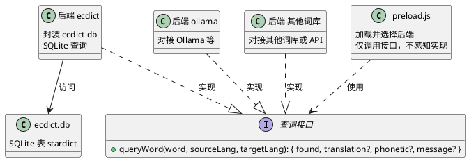

# spec-00001 ECDICT 查词 uTools 插件

## 需求

编写一个简单的 uTools 插件：用户在**输入框**中输入文字，在**下拉列表**中展示该词在 ecdict.db 中的中文解释。

- 不使用独立 HTML 页面（不需要 index.html）。
- 使用 uTools **模板插件**的**列表模式**：主界面为输入框 + 下拉结果列表。
- 用户输入单词 → 查询本地 `ecdict.db` → 在下拉表中显示释义（如音标、中文解释等）。

---

## 软件设计

### 1. 架构概览



- **界面**：uTools 内置的列表模式——顶部为输入框，下方为下拉结果列表；无需自定义 HTML 页面。
- **preload**：通过 `window.exports` 暴露列表模式配置（`mode: "list"`）；**不感知任何后端查询的实现细节**（不写 SQL、不调 ollama API、不接具体词库）。preload 的职责是**加载并选择**当前使用的查词后端模块（如 ecdict、ollama、其他词库），在 `args.search` 中仅调用该后端提供的**统一查词接口**，并根据返回值用 `callbackSetList` 填入下拉表。
- **查词**：抽象为**统一接口**（如 `queryWord(word, sourceLang, targetLang)` 及约定返回结构），由**多种后端实现**：
  - **ecdict 实现**：封装 ecdict.db（SQLite），内部打开 DB、执行 `SELECT`、返回释义。
  - **ollama 实现**（后续）：对接 Ollama 等本地/远程服务，实现同一接口。
  - **其他词库实现**：对接不同词库或 API，实现同一接口。
- preload 通过配置或选择逻辑决定加载哪一个后端，**只依赖接口约定，不依赖具体实现**。
- **数据**：本 spec 当前以 ECDICT 为例，仅依赖本地 `ecdict.db`，表结构遵循 `stardict`；其他后端各有自身数据源与约定。

### 2. 模块设计

#### 2.1 插件配置 (plugin.json)

| 项 | 说明 |
|----|------|
| preload | `preload.js`，预加载脚本，挂载 `window.exports` 提供列表模式逻辑。 |
| logo | 使用现有 `translate.png`。 |
| features | 至少一条：关键字（如 `dict` / `查词`）打开本插件；**不设置 main**，使用模板插件（列表模式）。 |

- **不设置 `main` 字段**：使用 uTools 模板插件，界面为系统自带的「输入框 + 下拉列表」，无需 index.html。
- 词库路径、API 地址等由**各后端实现**或**配置**决定，preload 不写死具体路径或实现。

#### 2.2 查词接口与后端实现

**设计原则**：preload 不感知任何后端查询的实现；查词抽象为**统一接口**，由**多种后端模块**分别实现。preload 负责**加载和选择**使用哪一个后端，并只调用该接口。

**统一查词接口（约定）**

- 方法：**`queryWord(word, sourceLang, targetLang)`**
  - `word`：待查词；`sourceLang` / `targetLang`：源语言、目的语言代码（如 `'en'`, `'zh'`）。
  - 返回：`{ found: boolean, translation?: string, phonetic?: string, message?: string }`（或等价的异步回调/Promise）。
- 所有后端实现均遵守此约定，便于 preload 统一调用与展示。

**后端实现（可插拔）**

- **ecdict 后端**：封装 ecdict.db（SQLite）查询。
  - 职责：打开并持有（或按需打开）`resources/ecdict.db`，执行 `SELECT translation, phonetic FROM stardict WHERE word = ?` 等，返回上述结构。
  - 数据库约定：表 `stardict`，至少字段 `word`, `translation`；可选 `phonetic`。路径由该后端内部或配置决定（如 `resources/ecdict.db`）。
  - 错误与边界：词库不存在或打开失败返回 `{ found: false, message: "词库未就绪" }`；未查到返回 `{ found: false }`；不向上抛未捕获异常。
- **ollama 后端**（后续）：对接 Ollama 等本地/远程服务，实现同一 `queryWord` 接口，内部为 HTTP 请求等，preload 无感知。
- **其他词库后端**：对接不同词库或 API，实现同一接口，由 preload 按配置加载并选择。

**实现位置**

- 各后端为独立模块，建议放在 **`backends/`** 目录下（如 `backends/ecdict.js`、`backends/ollama.js`）。
- preload 通过配置或选择逻辑（如 `require('./backends/ecdict')` 或根据用户设置加载不同后端），获得实现了上述接口的对象，并只调用 `queryWord(...)`，不包含任何 SQL、ollama、词库格式等实现细节。

#### 2.3 Preload (preload.js)

**职责**

- 挂载 **`window.exports`**，以 uTools **列表模式**暴露交互：键为 `plugin.json` 中对应 feature 的 `code`，值为 `{ mode: "list", args: { ... } }`。
- **加载并选择查词后端**：根据配置或选择逻辑（如默认后端、用户设置）`require` 对应后端模块（如 `backends/ecdict.js` 或 `backends/ollama.js`），获得实现统一查词接口的对象。preload **不包含任何后端实现细节**（不写 SQL、不调 ollama、不接具体词库格式）。
- 在 `args.search` 中：根据输入框内容及当前源语言、目的语言**仅调用当前后端的 `queryWord(word, sourceLang, targetLang)`**，再根据**统一返回结构**调用 **`callbackSetList`** 将释义填入下拉表。

**window.exports 结构（预设）**

- `window.exports[code] = { mode: "list", args: { ... } }`，其中 `code` 与 features[].code 一致。
- **args.placeholder**：输入框占位符，如 `"输入单词查词"`。
- **args.enter**（可选）：进入插件时调用；可不设或设为空列表 / 提示项。
- **args.search**：`(action, searchWord, callbackSetList) => void`
  - 对 `searchWord` 做 trim，若为空可 `callbackSetList([])` 或不调用。
  - **调用当前已加载后端的 `queryWord(word, sourceLang, targetLang)`**（preload 不感知该后端是 ecdict、ollama 还是其他），根据统一返回结构组列表项。
  - 查到：`callbackSetList([{ title: 单词, description: 音标 + 释义 }])`（格式按 uTools 列表项要求）。
  - 未查到或后端返回错误：`callbackSetList([{ title: "未找到释义" 或 "词库未就绪", description: searchWord 或 message }])`。
- **args.select**（可选）：用户选中列表项时调用；可复制释义到剪贴板、`utools.outPlugin()` 等。

**错误与边界**

- 后端返回 `found: false` 或带 `message` 时，preload 据此 `callbackSetList` 展示相应提示，不抛未捕获异常。

**依赖**

- **仅依赖查词接口约定**（见 2.2）及所加载的后端模块；不依赖具体后端实现。Node 内置模块按需使用（如 `path`、`require`）。

#### 2.4 界面（uTools 内置列表模板）

- 无自定义 HTML 页面；由 uTools 根据 `window.exports` 的 **mode: "list"** 渲染「输入框 + 下拉列表」。
- 用户在主输入框（子输入框）中输入单词 → uTools 调用 `args.search(action, searchWord, callbackSetList)` → preload 查词后 `callbackSetList([...])` → 下拉表展示释义项。
- 列表项格式：`{ title: string, description?: string, icon?: string }`，至少提供 `title` 与 `description` 用于展示单词与释义。

### 3. 数据流

1. 用户通过 uTools 关键字打开本插件 → uTools 加载 `plugin.json`（无 main）→ 加载 preload.js，执行并读取 `window.exports`。
2. uTools 显示列表模式界面：输入框（placeholder 为「输入单词查词」）+ 空下拉表。
3. 用户在输入框中输入单词（如 nite）→ uTools 调用 `args.search(action, searchWord, callbackSetList)`。
4. preload 根据当前源语言、目的语言调用**当前已加载后端**的 `queryWord(searchWord, sourceLang, targetLang)`；后端内部自行实现（如 ecdict 打开 SQLite、ollama 调 API），返回统一结构。
5. preload 根据该统一返回值调用 `callbackSetList([{ title: 所查单词, description: "音标 / 释义" }])`（或未找到时提示项）。
6. uTools 在下拉表中展示该列表项，用户看到释义。

### 4. 文件与目录

```
local_translate/
├── plugin.json          # 无 main；preload、logo、features（模板插件）
├── preload.js           # 仅负责加载/选择后端、调用统一接口、callbackSetList，不包含后端实现
├── backends/            # 查词后端实现（可插拔）
│   ├── ecdict.js        # ECDICT SQLite 封装，实现 queryWord
│   ├── ollama.js        # 可选：Ollama 等实现
│   └── ...              # 其他词库或 API 后端
├── translate.png        # 图标
├── resources/
│   └── ecdict.db        # ECDICT 词库（ecdict 后端使用；需用户/文档自行准备并放置）
├── test/                # 单元测试目录
│   └── README.md        # 测试说明
└── doc/
    └── spec/
        └── spec-00001-ecdict.md  # 本文档
```

- `ecdict.db` 不随代码提交时，需在 README 或 doc 中说明获取与放置方式（参见 spec 或 ECDICT 相关文档）。

### 5. 测试与验收要点

- 在 uTools 中通过配置的关键字打开插件后，应出现**输入框 + 下拉列表**（无独立 HTML 窗口）。
- 在输入框中输入单词（如 nite）后，下拉表中应**展示该词的中文解释**（来自 ecdict.db 的 `stardict.translation`，可选音标）。
- 若 `resources/ecdict.db` 不存在或表中无该词：下拉表应展示「未找到释义」或「词库未就绪」等提示，且不报未捕获异常。
- 表结构需与 ECDICT 的 `stardict` 表一致（至少含 `word`, `translation`）。

### 6. 单元测试

单元测试位于 **`test/`** 目录，对**各查词后端实现**进行测试（如 ecdict 后端、ollama 后端），确保其正确实现统一接口并完成查询（如 ecdict 使用 SQLite、ollama 调 API）。

**测试目标**

- 对各后端模块（如 `backends/ecdict.js`）直接调用 `queryWord(...)`，验证返回结构及查询结果；不依赖 uTools 或 preload。

**测试环境与数据**

- 运行环境：Node.js，与 preload 所用运行时一致。
- 词库：使用项目 `resources/ecdict.db`；已知词示例以 nite 为例。测试脚本通过查词类默认路径或可配置路径访问。
- 若词库较大或不可用，可仅运行不依赖真实 DB 的用例（如词库不存在时返回 `found: false`），或使用内存 SQLite / 临时文件构造最小数据集。

**建议用例**

| 用例 | 说明 |
|------|------|
| 已知词能查到 | 对 ecdict.db 中存在的单词（如 nite）调用 `queryWord(word, 'en', 'zh')`，返回 `found: true` 且 `translation` 非空。 |
| 未知词返回未找到 | 对不存在的单词调用 `queryWord`，返回 `found: false`。 |
| 大小写不敏感 | 对同一单词不同大小写（如 Nite、NITE）调用，均能查到或均按同一结果返回。 |
| 词库不存在或不可用 | 路径指向不存在或无效的 db 文件时，返回 `found: false` 或约定错误信息，不抛未捕获异常。 |
| 源语言与目的语言参数 | 调用 `queryWord(word, sourceLang, targetLang)` 时传入合法语言代码，行为符合当前实现（如仅支持英→中时，其他语言对可返回未找到或统一处理）。 |

**实现方式**

- 各后端以独立模块实现（如 `backends/ecdict.js`），在测试中 `require` 该后端并传入测试用路径或配置，执行上述用例。
- 测试框架可选：Jest、Mocha、Node 内置 `node:test` 等；断言后端返回值符合统一接口（`found`、`translation`、`phonetic` 等）。

**运行方式**

- 在项目根目录执行测试命令（如 `npm test` 或 `node --test test/`），具体以项目 `package.json` 中 scripts 为准。

### 7. 后续扩展（本需求不实现）

- **新增查词后端**：如 ollama 后端、其他词库或 API 后端，实现统一 `queryWord` 接口，由 preload 加载与选择。
- 前缀联想、模糊匹配（输入时展示多个候选词）。
- 选中列表项后复制释义、朗读等。
- 配置词库路径、多词库切换、后端选择（在 preload 中根据配置加载不同 backend）。

以上为 spec-00001 的完整需求与软件设计，可直接作为实现与验收依据。
