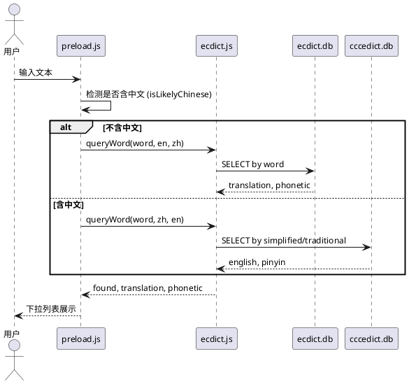

# spec-00002 中翻英功能（CC-CEDICT）

## 需求

- 使用 **CC-CEDICT** 数据实现**中翻英**功能。
- 仍然使用 **ecdict.js** 这个 backend 来实现该功能（在同一后端内同时支持英→中、中→英）。
- **自动识别输入语言**：根据输入框内容是否包含中文决定方向：
  - **不包含中文**（纯英文、数字、符号等）→ 视为英文输入，提供**英翻中**（沿用现有 ecdict 查词逻辑）。
  - **包含中文**（含中英混合）→ 视为中文输入，提供**中翻英**（基于 CC-CEDICT 数据查询）。

---

## 软件设计

### 1. 架构概览

- 沿用 spec-00001 的**统一查词接口** `queryWord(word, sourceLang, targetLang)`，preload 不感知后端实现。
- **语言方向由 preload 决定**：在调用 `queryWord` 前，根据输入文本是否包含中文字符，设置 `sourceLang` / `targetLang` 为 `'en','zh'` 或 `'zh','en'`。
- **双 SQLite 数据库**：运行时使用**两个独立的 SQLite 数据库文件**，均在**离线生成好后随插件一起发布**，用户安装即用：
  - **ecdict.db**：英→中查词，表 `stardict`（word, translation, phonetic）。
  - **cccedict.db**：中→英查词，表 `cccedict`（simplified, traditional, pinyin, english）。
- **ecdict 后端**：根据 `sourceLang` / `targetLang` 分支，仅打开对应数据库并执行查询，返回统一结构 `{ found, translation?, phonetic?, message? }`。



### 2. 模块设计

#### 2.1 输入语言检测（preload.js）

- **职责**：在 `args.search` 与 `args.enter` 中，在调用 `queryWord` 之前，根据当前输入文本决定 `sourceLang`、`targetLang`。
- **规则**：
  - 若输入文本（trim 后）**包含** CJK 统一汉字（Unicode `\u4e00-\u9fff` 中至少一个字符），则视为**中文输入**，传 `sourceLang='zh'`, `targetLang='en'`。
  - 否则视为**英文输入**，传 `sourceLang='en'`, `targetLang='zh'`。
- **实现方式**：在 preload 中提供工具函数，例如 `isLikelyChinese(text)`，使用正则 `/[\u4e00-\u9fff]/` 检测；不依赖额外 npm 包。
- **边界**：空字符串不调用查词；混合输入（如 "hello世界"）按“含中文”处理，走中→英。

#### 2.2 ecdict 后端扩展（backends/ecdict.js）

- **接口不变**：仍对外提供 `queryWord(word, sourceLang, targetLang, callback)`，返回结构仍为 `{ found, translation?, phonetic?, message? }`。
- **双库分支**：根据语言对仅打开**对应的一个** SQLite 数据库并查询，两个库互不共用：
  - **`sourceLang === 'en'` 且 `targetLang === 'zh'`**：英→中 → 打开 **ecdict.db**，`SELECT translation, phonetic FROM stardict WHERE word = ? COLLATE NOCASE LIMIT 1`。
  - **`sourceLang === 'zh'` 且 `targetLang === 'en'`**：中→英 → 打开 **cccedict.db**，`SELECT english, pinyin FROM cccedict WHERE simplified = ? OR traditional = ? LIMIT 1`（参数化查询）。
- **错误与边界**：ecdict.db 或 cccedict.db 不存在/查询失败时，对应分支返回 `{ found: false, message?: "..." }`，不抛未捕获异常。

#### 2.3 双数据库与查询方式

- **两个 SQLite 数据库**（均离线生成，随插件发布）：
  - **ecdict.db**：英→中，表 `stardict`（word, translation, phonetic）。
  - **cccedict.db**：中→英，表 `cccedict`（simplified, traditional, pinyin, english）；由 CC-CEDICT 文本经导入脚本离线生成（见 2.3.1）。运行时仅对该库做 SQL 查询。
- **实现位置**：均在 `backends/ecdict.js` 内根据 `sourceLang`/`targetLang` 选择打开哪一个库；preload 不感知具体库或表。
- **查询方式**：英→中查 ecdict.db；中→英查 cccedict.db，SQL 示例见 2.2；可对 cccedict 的 simplified/traditional 建索引以加速。
- **返回结构**：两种方向统一返回 `{ found, translation?, phonetic? }`；中→英时 `translation` 为英文释义，`phonetic` 可选存拼音。

#### 2.3.1 双数据库的离线生成与随插件发布

**发布策略**

- **ecdict.db** 与 **cccedict.db** 均在**离线环境**下提前生成，**随插件发布包一并提供**（置于 `resources/`），用户安装插件后即可使用，无需自行下载词库或运行导入脚本。
- 运行时插件仅读取上述两个已存在的 SQLite 文件并执行查询。

**scripts 下的 Python 脚本（下载并生成 cccedict.db）**

- **位置**：`scripts/` 目录下提供一 **Python 脚本**（脚本名由实现约定，如 `build_cccedict.py` 或 `download_and_build_cccedict.py`）。
- **职责**：
  1. **从网络下载** CC-CEDICT 原始数据（如官方或镜像的 `cedict_ts.u8`，UTF-8 编码）；下载地址可在脚本内配置或通过参数传入（如 https://www.mdbg.net/chinese/dictionary?page=cedict 或项目选定的镜像 URL）。
  2. **解析并导入**：解析下载得到的文本（每行格式 `繁体 简体 [拼音] /英文释义1/释义2/`，跳过以 `#` 开头的注释行），建表并写入项目所需的 **`resources/cccedict.db`**，表名 `cccedict`，列含 `simplified`, `traditional`, `pinyin`, `english`，并对 `simplified`、`traditional` 建索引。
- **输出**：在项目根目录或通过参数指定路径下生成 `resources/cccedict.db`，供后端运行时查询及后续随插件打包发布。
- **运行环境**：Python 3；可依赖标准库或少量第三方库（如 `requests`/`urllib` 下载、`sqlite3` 建库）。建议在 README 或脚本内注释中说明运行方式（如 `python scripts/build_cccedict.py`）及可选参数（如输出路径、下载 URL）。

**维护者构建流程（cccedict.db 的离线生成）**

1. 在项目根目录执行上述 **scripts 下的 Python 脚本**，脚本从网络下载 CC-CEDICT 数据并生成 `resources/cccedict.db`。
2. **打包发布**：将 `resources/ecdict.db` 与 `resources/cccedict.db` 一并打入插件发布包，用户安装后两者均位于插件目录的 `resources/` 下。

**两个 SQLite 数据库的路径与表结构**

- **ecdict.db**（英→中）：路径 `resources/ecdict.db`，表 `stardict`，字段 `word`, `translation`, `phonetic`。
- **cccedict.db**（中→英）：路径 `resources/cccedict.db`，**独立于 ecdict.db**。表 `cccedict`，字段 `simplified TEXT`, `traditional TEXT`, `pinyin TEXT`, `english TEXT`；索引建议：`idx_cccedict_s`(simplified)、`idx_cccedict_t`(traditional)。
- 后端根据语言对只打开其中一个库进行查询。

**使用约定（ecdict 后端）**

- 英→中：仅打开 **ecdict.db**；若文件不存在（如用户误删）返回 `{ found: false, message?: "词库未就绪" }`。
- 中→英：仅打开 **cccedict.db**；若文件不存在或表为空返回 `{ found: false, message?: "词库未就绪" }`。
- 文档与 README 中可说明：插件发布包已包含 `resources/ecdict.db` 与 `resources/cccedict.db`，无需额外准备；维护者构建新版本时，运行 `scripts/` 下 Python 脚本下载数据并生成 cccedict.db 后与 ecdict.db 一并打包。

#### 2.4 Preload 与列表展示

- **args.placeholder**：可改为更通用提示，如「输入单词或中文查词」。
- **args.search**：对 `searchWord` trim 后，先 `isLikelyChinese(searchWord)`，再 `queryWord(searchWord, sourceLang, targetLang, callback)`，根据返回的 `found`、`translation`、`phonetic`、`message` 组列表项（与 spec-00001 一致：查到则 title 为释义/音标，description 为输入词；未查到或错误则 title 为提示，description 为输入或 message）。
- **args.enter**：若有带入的 payload 或剪贴板文本，同样先做语言检测，再调用 `queryWord` 并展示结果。

### 3. 数据流

1. 用户在输入框输入或通过 enter 带入文本。
2. preload 对文本做 trim，若为空则不下发查词。
3. preload 调用 `isLikelyChinese(text)`：
   - 为 true → `sourceLang='zh'`, `targetLang='en'`；
   - 为 false → `sourceLang='en'`, `targetLang='zh'`。
4. preload 调用 `backend.queryWord(word, sourceLang, targetLang, callback)`。
5. ecdict 根据 `sourceLang`/`targetLang` 打开对应数据库（英→中打开 ecdict.db，中→英打开 cccedict.db）并查询，返回统一结构。
6. preload 用 `callbackSetList` 更新下拉列表，用户看到释义或“未找到”等提示。

### 4. 文件与目录

- 沿用 spec-00001 的目录结构；本需求仅扩展以下文件：
  - **preload.js**：增加 `isLikelyChinese`，在 search/enter 中根据检测结果传 `sourceLang`/`targetLang`，并可选更新 placeholder。
  - **backends/ecdict.js**：在 `queryWord` 内根据 `sourceLang`/`targetLang` 分支，英→中查 **ecdict.db**，中→英查 **cccedict.db**。
- **两个 SQLite 数据库**（详见 2.2、2.3、2.3.1）：均**离线生成后随插件发布**，发布包内 `resources/` 已包含两个 .db 文件，用户安装即用。
  - **resources/ecdict.db**：英→中，表 `stardict`。
  - **resources/cccedict.db**：中→英，表 `cccedict`；由维护者运行 `scripts/` 下 Python 脚本从网络下载 CC-CEDICT 数据并生成（见 2.3.1）。
  - 两个库独立存在，运行时按查询方向只打开其一。
- **scripts/**：维护者用脚本，用于构建 cccedict.db（见 2.3.1）：
  - **Python 脚本**：从网络下载 CC-CEDICT 数据并生成 `resources/cccedict.db`；运行方式见 2.3.1 及脚本内说明。

```
resources/
├── ecdict.db      # 英→中，表 stardict（随插件发布）
└── cccedict.db    # 中→英，表 cccedict（随插件发布，由 scripts 下 Python 脚本生成）

scripts/
└── build_cccedict.py   # 示例名：下载 CC-CEDICT 并生成 cccedict.db
```

### 5. 测试与验收要点

- **语言检测**：输入纯英文（如 "hello"）时走英→中并展示中文释义；输入含中文（如 "你好"、"hello世界"）时走中→英并展示英文释义（或“未找到”若词库无该条）。
- **英→中**：行为与 spec-00001 一致，现有 ecdict 查词正常。
- **中→英**：在 CC-CEDICT 数据就绪的前提下，输入常见中文词能返回对应英文；无数据或未命中时返回“未找到”或友好 message，不报错。
- **边界**：空输入、仅空格、仅数字/符号按“不含中文”处理（英→中）；词库/CC-CEDICT 缺失时仅提示，不崩溃。

### 6. 单元测试建议

- **preload 层**（可选）：对 `isLikelyChinese` 做单元测试，覆盖纯英文、纯中文、中英混合、空串、数字等。
- **ecdict 后端**：在现有 `queryWord` 测试基础上增加：
  - `queryWord(word, 'zh', 'en', callback)`：已知在 CC-CEDICT 中存在的中文词返回 `found: true` 且 `translation` 为英文；不存在则 `found: false`。
  - 词库或 CC-CEDICT 未就绪时返回 `found: false` 及可选 `message`。

### 7. 后续扩展（本需求不实现）

- 中英混合时按“比例”或“首词语言”更细粒度决定方向。
- 中→英多候选、拼音检索、繁简统一等。

以上为 spec-00002 的完整需求与软件设计，可直接作为实现与验收依据。
