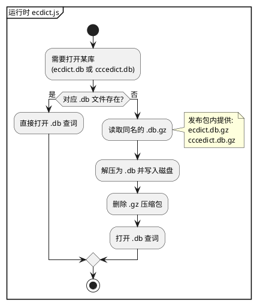

# spec-00003 词库压缩与首次解压

## 需求

- 提供一个 **Python 脚本**将 **ecdict** 和 **cccedict** 进行压缩，以减小插件体积。
- 在**第一次使用**时对压缩包进行解压，解压成功后**删除压缩包**。
- 之后每次使用直接使用解压后的词典，无需再解压。

---

## 软件设计

### 1. 架构概览

- **发布包**：不再直接包含 `ecdict.db`、`cccedict.db`，改为包含压缩包 **ecdict.db.gz**、**cccedict.db.gz**（或由维护者脚本生成的等价格式），以减小体积。
- **运行时**：ecdict 后端在需要打开某个库（英→中或中→英）时，先检查对应 **.db** 是否存在；若不存在则查找同名的 **.db.gz**，解压得到 .db 后删除 .gz，再按现有逻辑打开 .db 查词。若 .db 已存在则直接使用，不触碰 .gz。
- **preload** 与查词接口不变，仍调用 `queryWord`；解压逻辑封装在 **backends/ecdict.js** 内部，对上层透明。



### 2. 模块设计

#### 2.1 压缩脚本（scripts 下 Python）

- **职责**：供维护者在打包前运行，将已生成的 `resources/ecdict.db`、`resources/cccedict.db` 分别压缩为 **ecdict.db.gz**、**cccedict.db.gz**，输出到指定目录（默认 `resources/` 或发布用子目录）。
- **输入**：两个 .db 文件路径（可默认项目 `resources/` 下）。
- **输出**：同目录下的 `ecdict.db.gz`、`cccedict.db.gz`（或通过参数指定输出目录）。压缩格式为 **gzip**（与 Node 内置 zlib 解压兼容）。
- **运行方式**：如 `python scripts/zip_dicts.py [--output dir]`；脚本内注释或 README 说明用法。可选：压缩完成后删除原始 .db 或保留由维护者决定（发布时只打包 .gz）。
- **依赖**：Python 3 标准库（gzip、pathlib、argparse 等）。

#### 2.2 后端解压与查词（backends/ecdict.js）

- **约定路径**：每个库对应两个路径——**目标 .db**（如 `resources/ecdict.db`）与**压缩包 .db.gz**（如 `resources/ecdict.db.gz`）。仅当目标 .db 不存在时，才尝试从 .db.gz 解压。
- **解压流程**（以 ecdict 为例，cccedict 同理）：
  1. 若 `ecdict.db` 已存在 → 直接使用，不做任何解压或删文件。
  2. 若 `ecdict.db` 不存在且 `ecdict.db.gz` 存在 → 使用 Node 内置 **zlib**（如 `zlib.gunzipSync`）读取 .gz 内容，写入 `ecdict.db`，写入成功后 **fs.unlinkSync(ecdict.db.gz)** 删除压缩包；若解压或删除失败，返回 `{ found: false, message?: "词库解压失败" }`，不抛未捕获异常。
  3. 若两者都不存在 → 行为与当前一致，返回 `{ found: false, message?: "词库未就绪" }`。
- **实现位置**：在 `createEcdictBackend` 内，在调用 `queryWithSqlJs` / `queryCccedictWithSqlJs` 之前，对当前需要的 dbPath / cccedictDbPath 执行一次「确保 .db 存在（必要时从 .gz 解压并删 .gz）」的封装函数；该函数为同步或异步由实现选择（若解压耗时较长可异步，并在首次查词时返回“正在解压”类提示后再重试，或同步阻塞至解压完成）。
- **兼容**：若发布包中同时存在 .db 与 .db.gz（如开发环境），优先使用已存在的 .db，不读 .gz。

#### 2.3 发布与用户侧行为

- **维护者**：打包前运行 `scripts/zip_dicts.py` 生成 .gz；发布包中 **resources/** 下只包含 **ecdict.db.gz**、**cccedict.db.gz**（不包含 .db），以减小体积。
- **用户首次使用**：第一次触发英→中或中→英查词时，后端检测到对应 .db 不存在，从 .gz 解压并删除 .gz；此后该库一直使用 .db。
- **用户后续使用**：.db 已存在，直接查词，无解压步骤。

### 3. 数据流（首次使用中→英为例）

1. 用户输入中文，preload 调用 `queryWord(word, 'zh', 'en', callback)`。
2. ecdict 判断需要 cccedict.db，检查 `resources/cccedict.db` 是否存在。
3. 不存在则检查 `resources/cccedict.db.gz`，存在则读取并 gunzip 解压为 `resources/cccedict.db`，解压成功后删除 `cccedict.db.gz`。
4. 使用 `resources/cccedict.db` 执行 SELECT，返回释义；后续再查中→英直接使用该 .db。

### 4. 文件与目录

- **scripts/zip_dicts.py**（新增）：压缩 ecdict.db、cccedict.db 为 .gz 的 Python 脚本；输出路径可配置。
- **backends/ecdict.js**（扩展）：在打开 ecdict.db / cccedict.db 前增加「若 .db 不存在则从 .db.gz 解压并删除 .gz」的逻辑。
- **resources/**：
  - **发布包**：仅含 `ecdict.db.gz`、`cccedict.db.gz`（或按脚本约定命名）。
  - **用户环境**：首次解压后为 `ecdict.db`、`cccedict.db`（及可能尚未被使用而仍存在的 .gz）；之后可仅剩两个 .db。

```
resources/
├── ecdict.db.gz     # 发布包内：英→中词库压缩
├── cccedict.db.gz   # 发布包内：中→英词库压缩
├── ecdict.db        # 首次使用英→中后生成，之后一直使用
└── cccedict.db      # 首次使用中→英后生成，之后一直使用

scripts/
├── build_cccedict.py
└── zip_dicts.py     # 新增：将两个 .db 压缩为 .gz
```

### 5. 测试与验收要点

- **压缩脚本**：对已存在的 ecdict.db、cccedict.db 运行脚本，能生成 ecdict.db.gz、cccedict.db.gz；用标准 gzip 可解压回与原来一致的 .db。
- **首次使用**：仅含 .gz、不含 .db 时，第一次英→中（或中→英）查词能正常返回释义；检查 resources 目录，对应 .db 已存在且对应 .gz 已删除。
- **后续使用**：再次查词行为与 spec-00001/spec-00002 一致，无重复解压。
- **兼容**：若同时存在 .db 与 .gz，始终使用 .db，不覆盖、不重复解压。
- **错误**：仅有 .gz 但解压失败（如磁盘满、权限问题）时，返回友好 message，不崩溃；.gz 是否保留由实现决定（建议保留以便用户重试）。

### 6. 单元测试建议

- **压缩脚本**：运行后校验生成的 .gz 可被 `gzip -d` 或 Python `gzip.open` 正确解压，且内容与源 .db 一致（或校验大小/校验和）。
- **ecdict 后端**：在仅提供 .gz、无 .db 的测试目录下，调用 `queryWord` 触发解压，断言返回 found 且对应 .db 已生成、.gz 已删除；再次调用断言仍返回正确结果且无异常。

### 7. 后续扩展（本需求不实现）

- 压缩格式选用 zip 单文件包含两个 .db，一次解压得到两个文件。
- 解压进度或“首次加载中”的界面提示。
- 用户可配置词库路径或选择“仅使用已解压词库、不自动解压”。

以上为 spec-00003 的完整需求与软件设计，可直接作为实现与验收依据。
