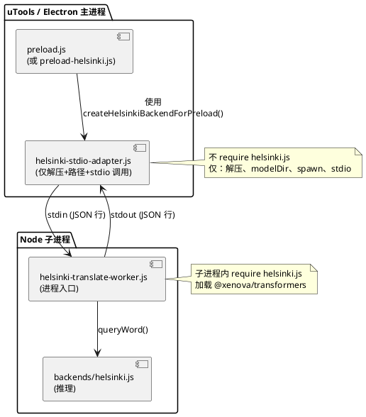
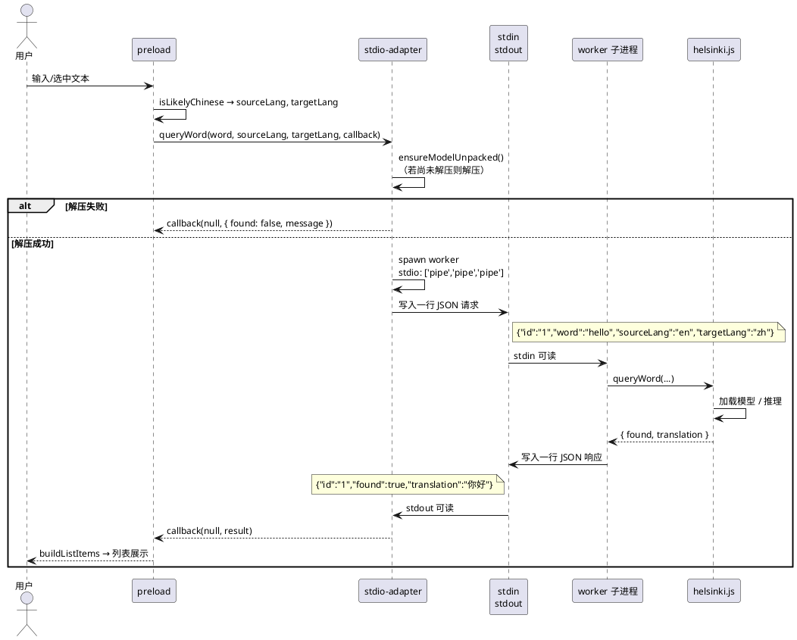

# spec-00005 本地翻译器：子进程 + stdin/stdout 架构

## 需求

- **按照在子进程中运行推理的软件架构设计**：uTools 主进程/preload **不**加载 `@xenova/transformers` 或 onnxruntime-node，避免 Electron 下 ABI 不一致导致的崩溃。
- **uTools 进程与子进程通过 stdin、stdout 进行通信**，实现最基本的翻译：采用标准输入/标准输出的 JSON 行协议，无需 socket 或 HTTP，实现简单、依赖最少。

---

## 软件方案设计

### 1. 架构概览

- **主侧（uTools/preload）**：只负责解压模型（若未解压）、解析模型目录路径、**按需或常驻启动** Node 子进程，并通过**子进程的 stdin 写入请求、从 stdout 读取响应**，得到翻译结果后按现有 `buildListItems` 等逻辑展示。
- **子进程（Worker）**：独立 Node 进程，入口为单一脚本（如 `scripts/helsinki-translate-worker.js`）；进程内 `require('backends/helsinki.js')` 并调用 `createHelsinkiBackend(options)`，从 **stdin 按行读取 JSON 请求**，执行 `queryWord`，将结果以 **一行 JSON 写入 stdout**。子进程不依赖 Electron，仅使用 Node + @xenova/transformers，无 ABI 冲突。
- **通信方式**：**仅使用 stdin/stdout**，协议为 **JSON Lines**（每行一条完整 JSON）。请求行与响应行一一对应，通过请求中的 `id` 字段关联（可选，若单请求单响应、顺序一致也可不设 id）。

**目标架构（组件图）**：



**数据流（序列图）**：



### 2. 协议设计（stdin / stdout）

- **编码**：UTF-8。
- **请求（主进程 → 子进程，stdin）**：每行一条 JSON 对象，字段约定如下：
  - `id`（可选）：字符串或数字，用于与响应关联；若单请求单响应、顺序一致可省略。
  - `word`：string，待译文本。
  - `sourceLang`：'en' | 'zh'。
  - `targetLang`：'zh' | 'en'。
  - 可选：`modelDir`（若主进程不通过环境变量/启动参数传入，则每请求携带）。
- **响应（子进程 → 主进程，stdout）**：每行一条 JSON 对象，与 `queryWord` 回调一致：
  - `id`（可选）：与请求 id 一致。
  - `found`：boolean。
  - `translation`：string | undefined。
  - `message`：string | undefined（错误或未就绪时）。
- **约定**：一行一条完整 JSON，行尾换行符 `\n`；不在一行内再嵌换行。子进程可将 stderr 用于日志，主进程不解析 stderr。

**示例**：

```
请求（stdin 写入）：
{"id":"1","word":"hello","sourceLang":"en","targetLang":"zh"}

响应（stdout 读取）：
{"id":"1","found":true,"translation":"你好"}
```

### 3. 模块设计

#### 3.1 preload 侧：stdio 适配器（新建）

- **文件**：`backends/helsinki-stdio-adapter.js`（或沿用 `helsinki-preload-adapter.js` 名并改为本方案实现）。
- **职责**：
  - 对外提供与 ecdict/helsinki 一致的 **`queryWord(word, sourceLang, targetLang, callback)`**，callback 签名为 `(err, result)`，`result` 为 `{ found, translation?, message? }`。
  - **不** `require('./backends/helsinki.js')`，仅 `require` 解压与路径的轻量逻辑（可从 helsinki.js 使用 `ensureModelUnpackedAndGetDir`，该函数不加载 transformers）。
  - 首次调用 `queryWord` 时：若模型未解压则调用 `ensureModelUnpackedAndGetDir` 得到 `modelDir`；若解压失败则直接回调 `{ found: false, message }`。
  - 启动子进程：使用 `child_process.spawn(process.execPath, [workerPath], { stdio: ['pipe', 'pipe', 'pipe'], env: { ...process.env, HELSINKI_MODEL_DIR: modelDir } })`（或通过 `workerPath` 与参数传递 `modelDir`），保存 `child.stdin` / `child.stdout`。
  - 请求发送：将 `{ id, word, sourceLang, targetLang }` 序列化为一行 JSON + `\n` 写入 `child.stdin`。
  - 响应接收：在 `child.stdout` 上按行缓冲（如按 `\n` 切分），每收到一行解析 JSON，通过内部维护的 pending 表按 `id` 找到对应 callback 并调用，再 callback(null, result)。
  - 超时：若在约定时间（如 30s）内未收到对应 id 的响应，则 callback(null, { found: false, message: '翻译超时' })。
  - 子进程异常退出：若检测到 `child.exitCode !== 0` 或 `close`，未完成的请求均回调 `{ found: false, message: '神经翻译未就绪' }`。
- **接口**：导出 `createHelsinkiBackendForPreload(options?)`，返回 `{ queryWord }`，options 可含 `modelArchivePath`、`modelDir`、`workerPath` 等，便于测试与配置。

#### 3.2 子进程入口（新建）

- **文件**：`scripts/helsinki-translate-worker.js`。
- **职责**：
  - 从环境变量或命令行参数读取 `HELSINKI_MODEL_DIR`（或等价名），作为 `createHelsinkiBackend({ modelDir })` 的 `modelDir`；若未提供则使用默认路径（与 helsinki.js 一致）。
  - 调用 `ensureModelUnpackedAndGetDir` 确保模型已解压（子进程内也可再检查一次）；然后 `createHelsinkiBackend({ modelDir })` 得到 backend。
  - 从 `process.stdin` 按行读取（readline 或 data 事件 + 按 `\n` 切分），每行解析为 JSON 请求。
  - 对每条请求调用 `backend.queryWord(word, sourceLang, targetLang, (err, result) => { ... })`，将 `result`（含 `id` 若请求有 id）序列化为一行 JSON 写入 `process.stdout`，并 `process.stdout.write('\n')`。
  - 若 stdin 关闭（如主进程退出），子进程可正常退出。
- **可执行**：文件头可加 `#!/usr/bin/env node`，且通过 `node scripts/helsinki-translate-worker.js` 启动。

#### 3.3 解压与路径（复用）

- 继续使用 `backends/helsinki.js` 导出的 **`ensureModelUnpackedAndGetDir(options)`**：主进程侧（stdio-adapter）在 spawn 前调用，得到 `modelDir` 并传给子进程；子进程内也可在启动时再调一次以兼容“主进程未解压、由子进程所在工作目录解压”的场景（可选，以主进程解压为准即可）。

#### 3.4 语言与列表展示（不变）

- 与 spec-00004 一致：**语言方向由 preload 决定**，继续用 `isLikelyChinese(text)` 得到 `sourceLang`/`targetLang`，再调用后端的 `queryWord`。列表展示仍用现有 `buildListItems(searchWord, result, isZhToEn)`。

### 4. 子进程生命周期

- **策略**：**按需启动**（首次 `queryWord` 时 spawn），子进程常驻直至主进程退出或插件卸载；或**懒关闭**（一段时间无请求后 kill，下次请求再 spawn）。为简化实现，推荐**按需启动、常驻不杀**，主进程退出时子进程随之结束。
- **单例**：同一 preload 实例内只 spawn 一个 worker 子进程，所有 `queryWord` 共用一个 stdin/stdout 与一个 pending 表，通过 `id` 区分并发请求。

### 5. 文件与目录

```
backends/
├── ecdict.js
├── helsinki.js                      # 已有：Node 内推理 + ensureModelUnpackedAndGetDir
└── helsinki-stdio-adapter.js        # 新建：preload 用，仅解压+路径+stdio 通信

scripts/
├── helsinki-translate-worker.js     # 新建：子进程入口，stdin 读请求、stdout 写响应
├── build-helsinki-browser.js        # 可选保留（非本方案）
└── download_helsinki_model.py       # 已有

resources/
├── helsinki-opus-en-zh.tar.gz       # 已有
└── helsinki-models/                 # 首次使用后解压
```

### 6. 与 spec-00004 的关系

- spec-00004 的 **2.5 Electron/uTools 下 Helsinki 推理（方案3）** 中，IPC 方式为“任选 stdio、socket 或 HTTP”。**本 spec 明确采用其中 stdio 方案**，并限定为 stdin/stdout 的 JSON 行协议，实现“最基本的翻译”路径。
- 不依赖 socket、HTTP，不依赖 browser bundle/WASM；preload 仅依赖 Node 的 `child_process.spawn` 与 `ensureModelUnpackedAndGetDir`，子进程仅依赖 `backends/helsinki.js`（即 @xenova/transformers）。

### 7. 验收要点

- uTools/preload **不**加载 `@xenova/transformers` 或 onnxruntime-node；选用本地 Helsinki 时，通过 **stdin/stdout** 与**唯一** Node 子进程通信完成翻译。
- 子进程入口为 `scripts/helsinki-translate-worker.js`，可从 stdin 读 JSON 行请求、向 stdout 写 JSON 行响应，且能正确调用 `backends/helsinki.js` 的 `queryWord`。
- 主进程侧适配器提供 `queryWord(word, sourceLang, targetLang, callback)`，行为与 ecdict/helsinki 一致（含解压、spawn、超时与异常时的 `found: false`）。
- 在 uTools 中能完成**最基本的**英→中、中→英翻译（列表展示正确），且无因主进程加载 onnxruntime-node 导致的崩溃。

---

以上为 spec-00005 的软件方案设计，可直接作为实现与验收依据。
