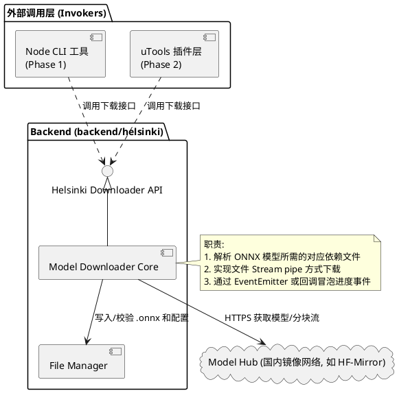
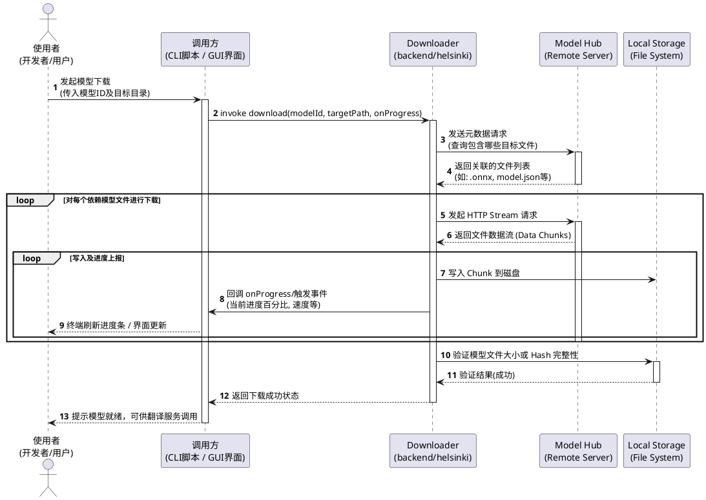

用nodejs设计一个下载onnx模型文件的工具，便于后续直接集成到utools插件中
下载模型文件的模块放在backend的helsinki子目录中
提供接口，第一阶段我基于node命令行离线下载模型文件，后续再集成到插件中

## 软件架构

根据需求描述，核心是将模型下载独立为通用的核心方法层（位于 `backend/helsinki` 中），使之可以在 Node.js 命令行环境和后续的 uTools 插件环境中无缝复用。

### 模块职责说明：
1. **Core Downloader (核心下载模块)**：封装模型文件的网络请求、流式下载、断点续传（可选）以及文件保存能力。
2. **CLI Entry (命令行入口)**：负责解析终端的命令与进度条渲染，便于在本地对下载模块做集成前测试与数据准备。
3. **uTools Wrapper (插件集成层)**：未来将此模块对接 uTools 插件体系并在多端提供图形化下载及应用反馈。

---

### 1. 组件架构图 (Component Diagram)

展示下载工具各模块之间的依赖与实现关系：

---

### 2. 下载时序图 (Sequence Diagram)

展示 CLI 或 uTools 环境下如何通过核心模块，发起并监控模型文件的下载。

---

## 具体软件实现架构

### 1. Helsinki Downloader API 设计

`Helsinki Downloader API` 提供面向业务逻辑的高层接口，屏蔽底层的网络请求和文件操作。其核心设计如下：

- **类/接口定义**: `ModelDownloader`
- **主要方法**:
  - `downloadModel(modelId: string, destDir: string, options?: DownloadOptions): Promise<void>`
    - `modelId`: 模型标识（例如 `Helsinki-NLP/opus-mt-zh-en`）。
    - `destDir`: 模型的本地存放路径。
    - `options`: 包含可选的回调函数，如 `onProgress(file: string, downloaded: number, total: number, speed: number)` 用于报告各文件的下载进度。
  - `checkModelExists(modelId: string, destDir: string): Promise<boolean>`
    - 校验指定的模型所需文件是否已经在本地并完整。
  - `fetchModelMetadata(modelId: string): Promise<ModelMeta>`
    - 从国内镜像网络（避免直接调用 Hugging Face 以提升国内网络连通性）获取该模型包含的具体文件列表（如 `source.spm`, `target.spm`, `model.onnx` 等）。

### 2. File Manager 设计

`File Manager` 负责具体文件的落地、校验与清理：

- **核心功能**:
  - **目录管理**: 提供 `ensureDir(dirPath: string): Promise<void>`，确保目标存储路径存在。
  - **流式写入**: 提供封装的写入方法，供网络下载流使用 `pipeline` 写入磁盘，防止大模型导致内存溢出。
  - **完整性校验**: 对下载完成的文件，进行文件大小核对或 SHA256 哈希校验 (`verifyFileCheckSum(filePath: string, expectedHash: string)`)。
  - **临时文件与清理**: 下载未完成或失败时，清理以 `.tmp` 为后缀或中断的临时文件，避免脏数据。

### 3. 配置文件设计

为了保证下载工具的配置灵活性，系统需要引入或对接一份基于 JSON 或环境变量形式的**配置文件**。该配置文件是驱动下载功能的基础，必须包含以下核心字段：

1. **模型镜像地址 (`endpoint`)**：用于下载 Helsinki 模型的网络镜像源地址（例如：`https://hf-mirror.com`）。这一设计有助于在网络被屏蔽时动态调整下载源。
2. **下载存储的绝对路径 (`targetAbsolutePath`)**：明确指出需要下载的模型所应当被保存的具体本地系统**绝对路径**，保障 CLI 工具与 uTools 环境下目录解析的一致性。
3. **需要下载的模型名称 (`modelName`)**：指定从远端仓库拉取的目标模型精准名称（例如：`Xenova/opus-mt-zh-en` 和 `Xenova/opus-mt-en-zh`）。

### 4. 下载依赖的 Node.js 模块

为保证轻量化和高内聚，主要依赖以下内置及基础模块：

- **Node.js 内置模块**:
  - `node:fs` / `node:fs/promises`: 进行目录创建及大文件流式读写。
  - `node:path`: 解析和拼接模型相对/绝对路径。
  - `node:stream` / `node:stream/promises`: 使用 `pipeline` 安全地将网络响应流对接至文件写入流。
- **第三方模块**（根据实际需求选用）：
  - **`@huggingface/hub` (推荐引入)**：与 Python 环境下使用 `huggingface_hub` 的 `snapshot_download` 专门工具同理，纯粹靠 Node.js 的底层 `fetch` 去手工下载模型，需要我们自行写逻辑调用 Hugging Face Tree API 进行目录结构遍历、手动处理模式匹配过滤（`allow_patterns`）以及对大文件 Git LFS 进行重定向跟踪下载，这极易出错且实现复杂。因此，Node.js 环境下**同样需要使用专门的工具**，建议引入官方的 `@huggingface/hub`。它不仅能轻松获取文件列表和结构，也能原生兼容国内镜像服务器的环境变量（通过指定 `HF_ENDPOINT=https://hf-mirror.com`）。
  - 若需要终端进度条展示，可在 CLI 层引入 `cli-progress` 辅助开发。

### 5. 异常处理设计

网络与磁盘环境复杂，必须设计完善的异常捕获与响应能力：

- **网络异常 (`NetworkError`)**: 涵盖 DNS 解析错误、连接超时、请求中断。应对策略是捕获异常并结合重试机制（例如失败后指数退避重试 3 次）。
- **国内镜像连通性问题**: 为防止官方域名被阻断或访问受限，默认使用国内镜像（例如设置 Base URL 为 `https://hf-mirror.com` 代替直接访问 Hugging Face），并在必要时支持后备镜像地址。
- **磁盘读写异常 (`FSError`)**: 捕获诸如 EACCES (权限不足)、ENOSPC (磁盘空间不足) 等底层错误，及时终止当前下载流程并通过 Promise 抛出明确的错误信息。
- **完整性异常 (`ChecksumError`)**: 如果文件下载后大小不匹配或校验和失败，主动抛出异常，标记该文件为损坏并删除，提示重试下载。

---

## 测试设计

为确保模型下载器稳定可靠，在此进行基础的单元测试与功能测试设计。
**要求**：全部测试基于 Node.js 原生的 `node:test` 与 `node:assert` 模块完成，保持技术栈纯粹与轻量。

### 1. 单元测试设计 (Unit Tests)

- **环境控制**: 利用 Node内置的 mock 能力对直接访问网络和文件系统的底层 API 进行隔离。
- **测试用例**:
  - `File Manager - File Creation`: mock `node:fs/promises` 接口，测试 `ensureDir` 在目录已存在、不存在或无权限创建时的各种表现。
  - `File Manager - Verification`: 提供编造的文件基础信息，测试在给定预期大小与实际大小匹配/不匹配时，校验函数的返回值和异常抛出情况。
  - `API - Metadata Parsing`: mock 网络 `fetch` 请求返回的 JSON 字符串，测试 `fetchModelMetadata` 能否正确提取模型核心所需的文件清单。
  - `API - Exception Throwing`: 模拟请求响应状态码 404/500、网络超时等场景，确保 `ModelDownloader` 能捕获并向上抛出具有可读语义的业务异常类型。

### 2. 功能测试设计 (Functional Tests)

- **集成测试范畴**: 在预设的独立隔离文件夹内执行端到端的完整文件下载流程（可使用实际体积较小的测试专用 mock 文件或配置，避免下载完整的百兆大模型）。
- **测试用例**:
  - `Standard E2E Download`: 启动一条小型文件的下载请求，指向真实的远端（国内镜像服务器），校验完成后磁盘上是否生成了对应的目标文件，且体积一致。
  - `Progress Event Verification`: 针对特定文件的下载，绑定 `onProgress` 回调监控，断言在下载过程中至少触发过进度事件，并且接收到的已下载字节数值递增正确、最终等于总大小。
  - `Interrupt Recovery`: 在下载中途模拟或直接 abort 网络连接，验证系统是否能识别残缺文件，以便安全退出或作为重新下载的依据。