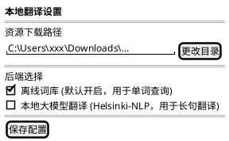

增加一个配置页面，用户通过关键字打开
配置页面和代码放在一个独立的目录中
配置页面包括：
1. 资源下载路径，资源包括词库和模型
2. 后端选择，使用多选框，默认只选中离线词库

## 软件设计

### 1. 目录结构设计
建立独立的代码目录与页面文件：
- `config/index.html`: 配置页面的 UI 结构（引入相关样式文件）。
- `config/renderer.js`: 视图层逻辑，负责管理页面表单状态、UI 变更响应。
- `config/preload.js`: （如有必要）配置页面专用预加载脚本，封装底层 API（系统弹窗、数据存储等）供 UI 层调用。

### 2. 插件注册与路由 (plugin.json)
增加通过关键字打开配置页面的功能，需要在 `plugin.json` 中的 `features` 内添加一个配置项：
```json
{
  "code": "settings",
  "explain": "设置 / 本地翻译配置",
  "cmds": ["设置", "配置", "config", "settings"]
}
```
主入口程序 (如 `index.html` 或路由调度) 在侦听到 `utools.onPluginEnter` 的 `code` 为 `settings` 时，应当渲染或跳转到配置页面 `config/index.html`。

### 3. 数据存储结构与持久化
采用 uTools 原生数据库 API (`utools.dbStorage` 或 `utools.db`) 进行配置的读写存储。该数据在每次插件启动和检索时都被主逻辑依赖。
存储的 JSON 字段格式类似下面：
```json
{
  "_id": "app_config",
  "resourcePath": "C:\\Users\\...\\Downloads", 
  "backends": {
    "offline_dict": true,
    "helsinki_model": false
  }
}
```

### 4. 页面交互行为设计
- **读取并初始化：** 页面加载时请求 `utools.dbStorage.getItem('app_config')` 获取存储数据并回填至页面（默认 `offline_dict` 开启）。如果没数据则使用默认值并写入。
- **资源路径选择：** 利用 `utools.showOpenDialog(...)` API 允许用户以可视化的目录选择器选择“资源下载路径”，并将获取到的路径填回输入框或直接保存。
- **后端选择：** 通过多选框组件绑定 `backends` 对象数据。
- **自动保存/手动保存：** 表单修改后，通过监听 change 事件或点击保存按钮，序列化新结构后重新调用 `utools.dbStorage.setItem('app_config', newData)` 更新至本地，同时可以在数据变动后通知后台重载翻译或词库服务。

### 5. 页面布局样例 (UI Mockup)

<!-- 以下为 HTML/CSS 实时渲染的布局表现，可在 Markdown 预览中直接查看效果 -->
<div id="utools-settings-mockup" style="
  max-width: 600px;
  margin: 20px 0;
  padding: 24px;
  background: var(--vscode-editor-background, #ffffff);
  color: var(--vscode-editor-foreground, #333333);
  border: 1px solid var(--vscode-panel-border, #e0e0e0);
  border-radius: 8px;
  font-family: -apple-system, BlinkMacSystemFont, 'Segoe UI', Roboto, Helvetica, Arial, sans-serif;
  box-shadow: 0 4px 12px rgba(0,0,0,0.1);
">
  <style>
    #utools-settings-mockup .c-header {
      font-size: 20px;
      font-weight: 600;
      margin-bottom: 24px;
      display: flex;
      align-items: center;
      gap: 10px;
      border-bottom: 1px solid var(--vscode-panel-border, #e0e0e0);
      padding-bottom: 12px;
    }
    #utools-settings-mockup .c-section {
      margin-bottom: 24px;
    }
    #utools-settings-mockup .c-title {
      font-size: 14px;
      font-weight: 600;
      margin-bottom: 12px;
      color: var(--vscode-descriptionForeground, #666666);
    }
    #utools-settings-mockup .c-input-group {
      display: flex;
      gap: 10px;
    }
    #utools-settings-mockup input[type="text"] {
      flex: 1;
      padding: 8px 12px;
      border: 1px solid var(--vscode-input-border, #cccccc);
      border-radius: 6px;
      background: var(--vscode-input-background, #fafafa);
      color: var(--vscode-input-foreground, #333333);
      font-size: 14px;
      outline: none;
    }
    #utools-settings-mockup button {
      padding: 8px 16px;
      background-color: var(--vscode-button-background, #007aff);
      color: var(--vscode-button-foreground, #ffffff);
      border: none;
      border-radius: 6px;
      font-size: 14px;
      cursor: pointer;
    }
    #utools-settings-mockup button:hover {
      background-color: var(--vscode-button-hoverBackground, #0062cc);
    }
    #utools-settings-mockup button.secondary {
      background-color: transparent;
      color: var(--vscode-editor-foreground, #333333);
      border: 1px solid var(--vscode-input-border, #cccccc);
    }
    #utools-settings-mockup .c-checkbox-group {
      display: flex;
      flex-direction: column;
      gap: 12px;
    }
    #utools-settings-mockup .c-checkbox-label {
      display: flex;
      align-items: center;
      gap: 10px;
      font-size: 15px;
      cursor: pointer;
    }
    #utools-settings-mockup input[type="checkbox"] {
      width: 18px;
      height: 18px;
    }
    #utools-settings-mockup .c-desc {
      font-size: 12px;
      color: var(--vscode-descriptionForeground, #888888);
      margin-top: 8px;
      display: block;
    }
    #utools-settings-mockup .c-footer {
      display: flex;
      justify-content: flex-end;
      margin-top: 30px;
      padding-top: 16px;
      border-top: 1px solid var(--vscode-panel-border, #e0e0e0);
    }
  </style>

  <div class="c-header">
    ⚙️ 本地翻译设置
  </div>

  <div class="c-section">
    <div class="c-title">资源下载路径</div>
    <div class="c-input-group">
      <input type="text" value="C:\Users\xxx\Downloads\local_translate_models" readonly>
      <button class="secondary">更改目录</button>
    </div>
    <span class="c-desc">用于存放离线词库和 Helsinki-NLP 大模型文件</span>
  </div>

  <div class="c-section">
    <div class="c-title">后端选择</div>
    <div class="c-checkbox-group">
      <label class="c-checkbox-label">
        <input type="checkbox" checked>
        离线词库 (默认开启，用于单词查询)
      </label>
      <label class="c-checkbox-label">
        <input type="checkbox">
        本地大模型翻译 (Helsinki-NLP，用于长句翻译)
      </label>
    </div>
  </div>

  <div class="c-footer">
    <button>保存配置</button>
  </div>
</div>

### 6. 配置页面原型图 (PlantUML)


