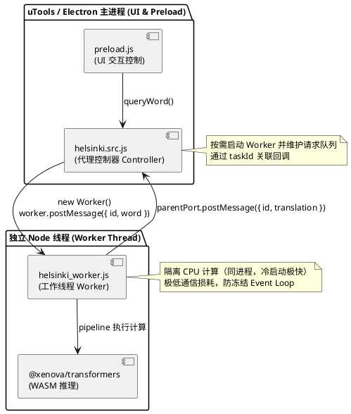
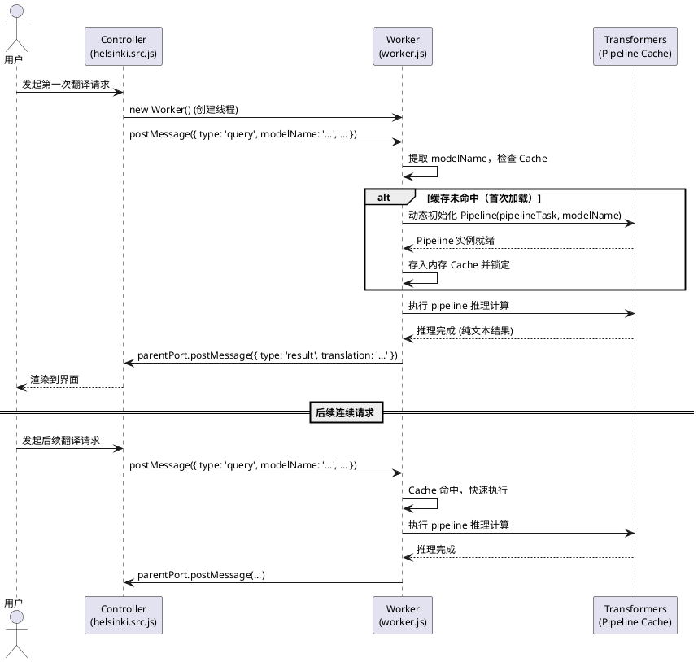
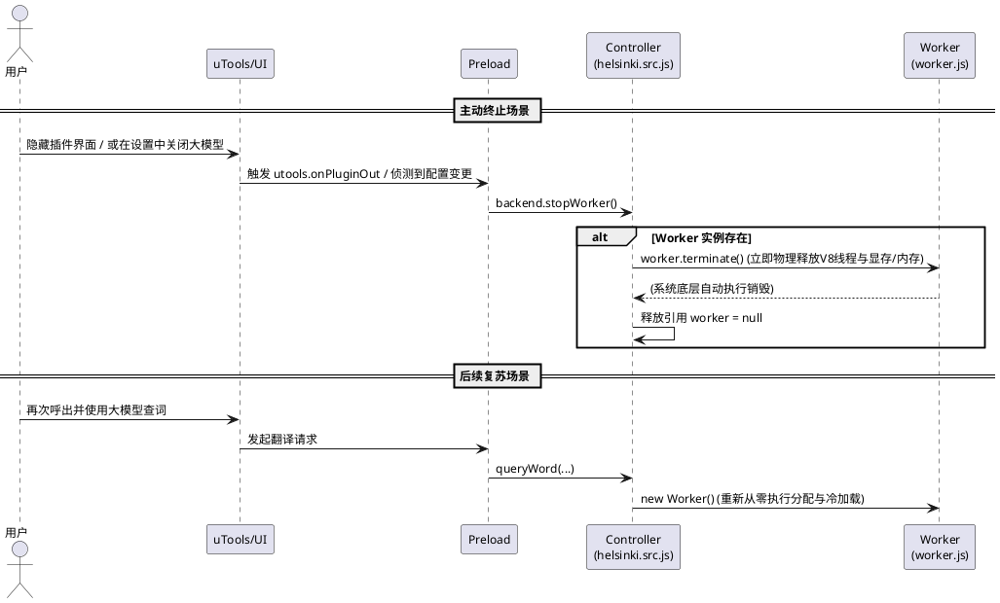

# spec-00005 本地翻译器：Web Worker Threads 异步架构优化

## 需求
目前在使用 `@xenova/transformers` 的 WASM 模式直接于主线程（uTools 插件渲染进程）执行大模型推理时，会导致 CPU 被持续占用并阻塞 Event Loop，进而引起 uTools 界面冻结卡死、无法输入字符。
我们需要**按照在独立的 Node.js Worker Thread 中运行推理的软件架构设计**重新改造本地计算层：
- uTools 主进程/preload **不**直接执行推理计算。
- uTools 进程与后台工作线程通过 **Node.js `worker_threads` (`postMessage` / `on('message')`)** 进行低开销通信，实现输入和渲染的完全异步隔离，保证界面流畅。

---

## 软件方案设计

### 1. 架构概览

- **主侧（uTools/preload 代理侧）**：负责接收用户指令。当首次处理翻译请求时，**按需唤醒**一个后台 Node.js Worker 线程，并通过 `postMessage` 异步发送翻译请求。接收到子线程的返回事件后，执行翻译结果的渲染列表展示。
- **工作线程（Worker）**：跑在同一个进程下的独立 V8 线程，入口为专用脚本（如 `backends/helsinki/helsinki_worker.js`）。线程内部加载 `@xenova/transformers` 进行环境配置并调用流水线推理。通过 `parentPort.on('message')` 接收请求队列，完成运算后通过 `parentPort.postMessage()` 将结果发回主线程。
- **通信方式**：Node.js 原生的 **`worker_threads` 通道**，消息载体为 JSON/对象。使用请求中的 `id` 字段将一次次离散的请求和响应进行关联，以处理高频打字时的防抖和并发清理。

**目标架构（组件图）**：

### 2. Worker 通信协议设计

- **请求消息（主线程 -> 工作线程）**：
  - `id`: string, 唯一请求标识符（UUID 或随机字符串），用于回调映射。
  - `type`: string, 操作类型（'query'）。
  - `word`: string, 待翻译文本。
  - `sourceLang`: string, 'en' 或 'zh'。
  - `targetLang`: string, 'zh' 或 'en'。
  - `modelDir`: string, 绝对路径，用于 Worker 内部首次加载模型实例。

- **响应消息（工作线程 -> 主线程）**：
  - `id`: string, 对应发起的请求标识符。
  - `type`: string, 操作类型（'result'）。
  - `found`: boolean。
  - `translation`: string (如果成功)。
  - `message`: string (如果有异常或错误日志)。

### 3. 核心模块改造

#### 3.1 Worker 入口脚本 (`backends/worker.js` 新建)
- **职责**：
  - 导入 `const { parentPort } = require('worker_threads');`。
  - 监听 `parentPort.on('message', async (msg) => { ... })`。
  - **模型解耦与通用化**：Worker 脚本本身作为纯净的环境容器不写死任何具体的模型名（如 helsinki）。在第一次收到包含模型配置（如 `pipelineTask`, `modelName`, `modelDir` 等参数）的 `type: 'init'` 或隐式的启动 `query` 消息时，进行 `@xenova/transformers` 的环境配置和按需初始化，并将该 `pipeline` 实例持久化到内存池中。
  - 针对具体的参数和模型架构执行多态的 `pipeline` 推理任务（支持各类 Seq2Seq translation，亦可拓展至 text-generation）。
  - 处理完成后，调用 `parentPort.postMessage({ id: msg.id, type: 'result', found: true, translation: '...' })` 吐出结果。
  - 异常捕获抛出，安全的返回 `found: false` 与详细的错误堆栈 `message`。

**动态加载与推理时序图**：

#### 3.2 代理控制器 Wrapper 改造 (`backends/helsinki/helsinki.src.js`)
- **职责**：
  - 代码对外部暴露的接口仍兼容 `createHelsinkiBackend(options)`，返回挂载了 `queryWord` 方法的对象。
  - 内部使用 `const { Worker } = require('worker_threads');` 懒加载初始化一次 `worker` 实例。
  - 维护一个 `pendingRequests: Map<string, Function>`：以生成请求 ID 作为 Key，将原来的 callback 方法作为 Value 存入。
  - 触发 `queryWord` 时，调用 `worker.postMessage(...)` 将参数送给纯净的 Worker 去算。
  - 挂载 `worker.on('message', (msg) => { ... })`，根据 `msg.id` 在字典内反查到对应毁调，调用并删除清理。

#### 3.3 Worker Thread 生命周期与退出机制设计
为了获得最好的性能并在后台执行各种动态模型参数推理，我们在架构设计上对 Worker Thread 的生命周期约束如下：

- **防止冷启动开销（常驻内存被动挂起）**：
  每次初始化 `@xenova/transformers`、读取数以百兆计的模型权重文件到内存都需要较多耗时。为实现“即用即翻”，一旦 Worker Thread 被创建并缓存了模型 pipeline 实例，它就会**一直挂起在后台存活（不占用 CPU，仅占用对应内存）**，专门等待下次下发的数据。
- **内存防泄漏：** 
  针对高频打字导致的频繁请求，如果晚到的响应在 Map 中已找不到对应 ID，则直接静默丢弃响应报文。
- **退出机制 1：被动销毁（依赖主进程退出）**：
  Worker Thread 依附于 uTools 插件渲染进程（Node.js 主进程）。当用户**完全退出翻译插件或隐藏插件且后台进程被系统回收时**，系统会连带这个挂靠的 V8 工作线程作为垃圾全部物理销毁，自动释放内存资源。
- **退出机制 2：主动终止（暴露 `terminate` 接口）**：
  在配置被重置、动态切换大型模型，或插件被挂起到 `utools.onPluginOut` 事件时，为了避免庞大的模型持续占用过多内存进而出现 OOM 引发系统崩溃：
  - **接口设计（Controller层）**：在 `helsinki.src.js` (Wrapper) 导出的对象中，额外增加暴露一个 `stopWorker()` 方法。该方法内部会检出当前的 `worker` 实例，若存在，则直接调用并触发 `worker.terminate()` 函数强制物理退出线程资源。清理后，将引用的 `worker` 置空 `null`，以便下次 `queryWord` 再次被动冷启动。
  - **触发时机（Preload层）**：主控制器（UI层）可在侦听到设定被大幅跨界改动（比如配置中关闭了本地大模型翻译选项），又或者监听 `utools.onPluginOut` （插件切入后台）时，主动调用 `backend.stopWorker()`，完成纯净的内存垃圾回收动作。

**主动终止与复苏时序图**：

### 4. 优化验收要点
- 通过长句子翻译触发大模型推理时，主界面依然能够流畅滚动、按钮可点击、输入框可响应删除与修改键盘敲击。
- Worker Thread 能够在后台跑满核心，完成计算后及时将纯净翻译文字 `postMessage` 吐出并在列表快速渲染。
- 未出现内存泄露、无尽占用或回调错乱引发的错误关联问题。
