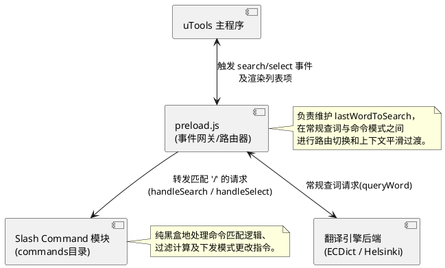
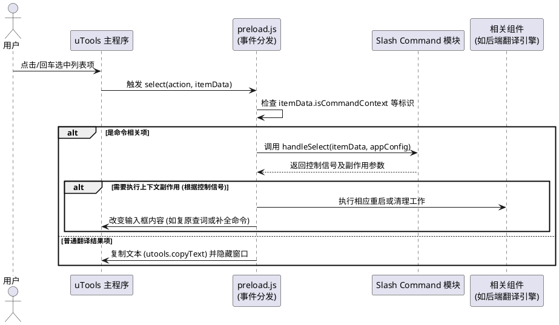
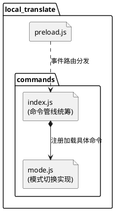
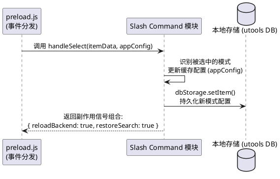

添加斜线（/）命令机制，并添加唯一的命令：选择模式
用户在输入框输入斜线后，显示所有的命令，并随着用户输入，筛选命令
用户选择命令后，执行命令
当用户激活选择模式命令后，显示已有的模式列表，用户选择模式后，切换模式
如果此时用户正在查词，则直接用新的模式输出查询结果，如果用户未在查词，则记录用户的选择，下次查词时，按照用户选择的模式输出查询结果

## 1. 顶层架构设计与模块集成

为了让系统具备良好的扩展性并保持核心逻辑清晰，对于斜线命令，我们需要设计一个解耦的顶层架构。其核心思想是：**将生命周期与底层事件接入交由 `preload.js` 统筹，将命令解析与执行业务抽离到独立的 Slash Command 模块**。`preload.js` 应尽量不感知斜线命令模块的具体实现和内容。

### 1.1 模块集成关系

如下组件图展示了 `preload.js` 与 `Slash Command` 模块及前后端的交互关系：

1. **统一入口 (`preload.js`)**：作为 uTools 插件入口，仅充当**事件网关/路由器**的角色。它负责监听 `search` 和 `select` 事件。根据当前输入内容或选中项的属性，决定是执行原有的“查词/复制”逻辑，还是将其转发给 Slash Command 模块。
2. **Slash Command 模块 (`commands` 目录)**：一个独立的命令处理器。负责提供以下对外接口：
   - 暴露命令的路由判断口（检查输入文本以决定是否命中命令模式）。
   - 提供 `handleSearch`：接收用户输入，内部负责状态维护和过滤过滤匹配，直接反馈经过封箱的 `listItems` 数据结构供 uTools 渲染。
   - 提供 `handleSelect`：接收用户的点选事件，执行具体逻辑（例如切换模式、主动修改输入框内容等），并返回控制信号，告诉网关 `preload.js` 接下来需要怎么做（例如是否重新初始化后台模型，是否自动退回上一级查词等）。

### 1.2 支持的命令列表

当前设计中，系统仅支持以下一个斜线命令，其包含的信息如下：
- **触发词**：`mode`（英文且大小写无关，即用户输入 `/mode` 触发）
- **命令标题/名称**：选择模式
- **命令描述**：切换翻译使用的模型或离线词典（在命令列表页中以副标题/小字展示）

---

## 2. 对 preload.js 的核心改造方案

由于在斜线命令模式下，无论对 `search` 事件还是对 `select` 事件的响应行为都会与普通的查询截然不同，因此我们需要对 `preload.js` 的既有逻辑进行适当翻新：

### 2.1 添加状态挂载点
`preload.js` 内需增加 `lastWordToSearch`：记录用户在遇到 `/` 前最后一次输入的正常检索词语。它不在意命令内容，仅仅是为了实现“查完命令后无缝衔接原查询任务”的能力。

### 2.2 重构 `search` 事件处理器
在 `window.exports.dict.search` 事件中加入**路由分发逻辑**：
1. **判断**：优先检查 `searchWord` 首字符是否为 `/` 以及该请求是否应当交由 Slash Command 接管。
2. **拦截**：如果是命令模式，首先调用 `clearTimeout(searchTimeout)` 切断原有的查词防抖动作。
3. **分发**：调用 Slash Command 模块提供的 `CommandManager.handleSearch(searchWord, callbackSetList)` 方法。一切渲染文案交由该模块全权负责。
4. **回退**：如果首字符并非 `/`，则说明是常规查词，将词汇同步到 `lastWordToSearch`，并恢复原有的模型推理查询动作。

### 2.3 重构 `select` 事件处理器
在 `window.exports.dict.select` 中同样新增**路由分发逻辑**：

如下时序图展示了用户选择列表项后的完整处理流程：

1. **判断**：通过检查用户回车/点击的 `itemData` 对象是否包含特殊标识符（如 `itemData.isCommandContext === true`）来确定。
2. **执行**：如果命中了上述标识，将整个执行权转移：`CommandManager.handleSelect(itemData, appConfig)`。
3. **生命周期响应**：根据 `handleSelect` 传回的执行后状态，`preload.js` 决定是否需要干预主程序，主要包括两个：
   - 如果触发了翻译服务的变更（例如引擎重刷），`preload.js` 则重新调用并覆盖 `backend` 实例。
   - 如果命令执行完毕需要退出命令模式，`preload.js` 调用 `utools.setSubInputValue(lastWordToSearch || '')` 被动复原之前的查词动作。

---

## 3. Slash Command 模块功能实现方案

内部逻辑对 `preload.js` 是黑盒的，专注于解析和过滤命令：

### 3.1 目录结构设计

为了隔离命令模块与核心网关的耦合，新增 `commands` 目录：

- **`commands/index.js`**：中心注册表，对外暴露 `handleSearch` 与 `handleSelect`；负责读取用户输入并将其路由投递给对应具体的命令脚本。
- **`commands/mode.js`**：实现 `/mode` 命令的专属数据（模式列表）与选中后的响应事件细节。

### 3.2 定义实体与数据维护
- **命令注册表 (`COMMANDS`)**：维护当前所有激活与支持的斜线命令。

### 3.3 `handleSearch(input, callback)` 实现
- 随着用户的输入变化进行局部匹配。
- 若输入仅有 `/`，则基于标题前缀将所有存在的 `COMMANDS` 组装返回给前端面板。
- 若输入匹配了特定的完全命令词（如 `/mode` 或 `/mode 关键字`），则路由跳入具体命令层（如 `mode` 处理器），动态渲染出专属的候选子集列表，并给每一个候选列表项的 `itemData` 附带上对应的触发参数。

### 3.4 `handleSelect(itemData, currentState)` 实现
- 收到一级 `COMMANDS` 项的点选，主动向网关代发输入指令将其子命令补全：`utools.setSubInputValue(itemData.trigger)`。
- 收到二级菜单项的点选（如果某命令拥有自己的视图逻辑），记录选择的状态机变更，并向 `preload.js` 返回受控的信号组（包含重新初始化指令或回退视图指令）。

### 3.5 模式选择命令（`/mode`）的具体设计

这里专门就 `mode` 命令的工作流程与数据实体进行独立描述：

**1. 预构建常量**
- 当前提供两种工作模式支持：1. 离线词典，2. 离线翻译模型。
- `MODES` 集合记录于 `mode` 命令中。

**2. 筛选与展示 (`handleSearch` 执行段)**
- 当发生 `searchWord` 完全匹配 `/mode ` 后跳出命令查询，`mode` 命令处理器接管渲染，转换为列表结构并调用 `callbackSetList` 渲染出离线词典与离线翻译模型项。

**3. 用户确认下发副作用 (`handleSelect` 执行段)**

拦截获取到特定模式项（如“离线翻译模型”）的点选后，命令解析器将产生副作用。如下时序图演示了内部流转动作：

配合时序图的简要步骤说明：
- **更新配置与持久化**：命令组件在收到选中行为后，修改状态树并保存新的 `backends` 设置到本地数据库。
- **返回受控信号**：为避免操作外域对象，模块只暴露下一步工作指令给网关（如上图返回的 JSON 信号）。由网关（preload）去负责销毁旧 `backend` 重新初始化，并通过自动补填 `lastWordToSearch` 的内容来达到接力查词展示体验。

---

## 4. 测试与验收设计

为确保 Slash Command 模块能够稳定工作，且不影响原有的查词防抖、翻译与剪贴板流程，设计如下测试与验收要点：

### 4.1 单元测试（Unit Tests）

针对 `commands` 模块开发相关的单元测试，保证逻辑隔离：
1. **输入解析测试**：输入空串、含有前导空格的斜线（` /`）、全拼 ` /mode ` 及其他非法命令时，模块 `handleSearch` 是否能提供正确的路由与反馈（是否命中命令注册表与二级菜单）。
2. **命令组装测试**：验证在仅输入 `/` 时，返回的数据是否包含了全部已被激活的命令列表，且展示格式符合 uTools 的 `callbackSetList` 数据约束。
3. **模式更新指令测试**：模拟用户触发一二级菜单的点选 (`handleSelect`)，断言其是否下发了正确的动作（诸如下发重新设值的信号 `utools.setSubInputValue` 等）。

### 4.2 联调与集成测试（Integration Tests）

在 `preload.js` 集成网关层面进行打通测试：
1. **状态恢复验证 (`lastWordToSearch`)**：
   - 场景 1：输入 `hello`，等翻译结果出来后，接着在输入框追加（或全选替换）输入 `/mode` 更改模型，验证更改模型后能否自动恢复查询 `hello` 并在新模型下展示。
   - 场景 2：初始进入没有查询词，直接输入 `/mode` 更改模型，更改完成后输入框应恢复为空白/欢迎语提示，不应报错。
2. **查词防抖中断（Debounce Cancellation）**：查词输入一半（比如输入 `apple` 未满 600ms 定时器时间），迅速通过快捷键替换输入 `/`。验证原有的 `searchTimeout` 被正确销毁，原先预期的 `apple` 释义没有突然跳出覆盖掉命令列表的渲染结果。
3. **副作用执行测试 (Backend 切换)**：验证从“离线词典”切至“离线翻译模型”后，紧接着下一次普通查询是否确实走了 Helsinki 算法逻辑（例如耗时、释义格式或响应体发生改变）；通过重启插件断言配置是否被成功持久化。

### 4.3 体验与验收评估 (Acceptance Criteria)
1. **用户体验**：斜线菜单的出现应极其顺滑，不应出现卡顿/白屏或频繁闪烁。所有一级与二级菜单文案（含副标题）清晰一致。
2. **异常拦截**：如果是正常包含 `/` 的文本（非首字符，例如 `test/dev`），系统能如期当做普通文本去查词而不发生命令拦截。