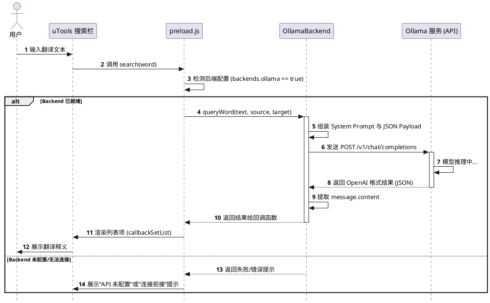

# 支持 Ollama API 方案设计

## 1. 需求分析与目标
为了扩展本地翻译的能力并利用用户自行部署的模型，本系统计划接入 Ollama API。
文档中的基础需求：
1. **支持 Ollama 的斜线命令配置**：列出 Ollama 的配置项，并支持用户配置。
2. **确认 Ollama 是否支持 OpenAI 格式 API**：Ollama 已经原生支持兼容 OpenAI 的 `/v1/chat/completions` API 接口格式。
3. **基于配置项进行翻译**：基于配置好的连接信息，请求 Ollama 接口进行文本翻译。
4. **Prompt 支持**：系统需要提供默认的 prompt，同时允许用户自定义 prompt。

## 2. 方案设计

### 2.1 确认 Ollama 的 API 兼容性
Ollama 提供与 OpenAI 完全兼容的 API 端点。默认情况下可通过以下地址调用：
* URL: `http://127.0.0.1:11434/v1/chat/completions`
* 请求体格式与 OpenAI 官方 `chat/completions` 格式完全一致，只需在 `model` 字段填入 Ollama 已部署的模型名称（例如 `qwen2:7b`、`llama3` 等）。

### 2.2 模式选择中新增 Ollama 选项
通过在 `/mode` 命令生成的列表中新增 Ollama 选项，允许用户手动切换翻译后端。
*   **功能**: 在模式选择界面（包含 `/mode` 命令和设置页）新增 "Ollama (LLM)" 选项。
*   **状态检查**: 切换时会检查 `ollama` 配置项是否完整（`apiBase` 和 `model` 是否已填写）。
*   **配置引导**: 如果用户在未配置的情况下选择该模式，系统将提示用户使用 `/ollama` 命令进行配置。

### 2.3 可视化配置页面设计
为了提升用户体验，`/ollama` 命令不再仅限于简单的文本反馈，而是像设置页一样唤出一个精美的 UI 配置面板。

#### 1. 界面原型设计 (Visual Mockup)
界面采用 **Glassmorphism (玻璃拟态)** 风格，深色模式适配，利用鲜艳的渐变色强调操作按钮。

#### 2. 配置项与 HTML 结构
配置页面（`config/ollama.html`）将包含以下核心组件：

| 组件名称 | 字段名 | 说明 |
| :--- | :--- | :--- |
| **API 端点** | `apiBase` | 默认 `http://127.0.0.1:11434/v1` |
| **API Key** | `apiKey` | 默认为空或 `ollama` |
| **模型选择** | `model` | 带刷新按钮，可实时获取 Ollama 本地模型列表 |
| **翻译提示词** | `prompt` | 多行文本框，支持自定义翻译指令 |

#### 3. 界面原型草图 (Renderable UI Mockup)

<div style="background: #ffffff; padding: 30px; border-radius: 12px; color: #333333; font-family: Inter, system-ui, sans-serif; max-width: 500px; box-shadow: 0 4px 20px rgba(0,0,0,0.08); border: 1px solid #eaeaea;">
<div style="display: flex; justify-content: space-between; align-items: center; margin-bottom: 20px;">
<h2 style="margin: 0; font-size: 20px; font-weight: 600; color: #111111;">Ollama 配置</h2>
</div>
<div style="margin-bottom: 15px;">
<label style="display: block; margin-bottom: 5px; font-size: 13px; color: #555555; font-weight: 500;">API Base URL</label>
<input type="text" value="http://127.0.0.1:11434/v1" style="width: 100%; padding: 10px; background: #fafafa; border: 1px solid #dcdcdc; border-radius: 6px; color: #333333; box-sizing: border-box; font-size: 14px; outline: none;" disabled>
</div>
<div style="margin-bottom: 15px;">
<label style="display: block; margin-bottom: 5px; font-size: 13px; color: #555555; font-weight: 500;">Model Name</label>
<div style="display: flex; gap: 10px;">
<select style="flex-grow: 1; padding: 10px; background: #fafafa; border: 1px solid #dcdcdc; border-radius: 6px; color: #333333; font-size: 14px; outline: none;" disabled>
<option>llama3</option>
<option>qwen2:7b</option>
</select>
<button style="background: #ffffff; border: 1px solid #dcdcdc; color: #333333; padding: 0 15px; border-radius: 6px; cursor: pointer; display: flex; align-items: center; justify-content: center; box-shadow: 0 1px 3px rgba(0,0,0,0.05);">🔄</button>
</div>
</div>
<div style="margin-bottom: 20px;">
<label style="display: block; margin-bottom: 5px; font-size: 13px; color: #555555; font-weight: 500;">System Prompt</label>
<textarea style="width: 100%; padding: 10px; background: #fafafa; border: 1px solid #dcdcdc; border-radius: 6px; color: #555555; box-sizing: border-box; font-size: 13px; min-height: 80px; font-family: monospace; outline: none; line-height: 1.5;" disabled>你是一个专业的翻译助手。请将以下文本翻译为${target_lang}。只输出翻译结果，不要输出任何解释说明。</textarea>
</div>
<button style="width: 100%; padding: 12px; background: #2563eb; border: none; border-radius: 6px; color: #ffffff; font-weight: 600; cursor: pointer; font-size: 15px; box-shadow: 0 4px 12px rgba(37, 99, 235, 0.3);">保存配置</button>
</div>


#### 4. 技术实现细节
*   **模型拉取**: 渲染进程启动后或点击刷新时，调用 `fetch(`${apiBase}/api/tags`)` 获取本地模型列表。
*   **数据持久化**: 点击保存后，通过 `utools.dbStorage.setItem('app_config', ...)` 进行全局同步。
*   **页面呼叫**: 在 `commands/ollama.js` 中判断选中后，发送 `show-ollama-config` 信号给 `preload.js`。

### 2.4 Prompt (提示词) 设计
*   **自定义 Prompt 模式**: 在斜线命令 `/ollama prompt "你的新提示词..."` 供用户更新配置。
*   **默认 Prompt**: 当用户未提供 prompt 或配置为空时，使用系统自带的默认指令：
    ```text
    你是一个专业的翻译助手。请将以下文本翻译为${target_lang}。只输出翻译结果，不要输出任何解释说明。
    ```
*   **实际请求组装**: 将上述提示词作为 `role: "system"` 的 message 放入，用户想要翻译的内容作为 `role: "user"` 传入。

### 2.5 新增后端支持模块 (Backend)
实现模块：在 `backends/` 下建立通用的 `ollama`/`openai` 驱动类。
*   **建立连接与配置初始化**: 初始化时读取全局配置里的 `apiBase`、`model`、`prompt`。
*   **发送请求**: 根据指定的模型和文本组装成 JSON，并通过原生 `fetch` 发送 POST 请求。
*   **解析响应**: 从返回 JSON 的 `choices[0].message.content` 获取最终模型输出。
*   **容错处理**: 拦截并处理 ECONNREFUSED (Ollama 未启动)、404 URL 错误、或请求模型未拉取等报错，反馈易懂的提示给前端UI。

### 2.6 集成到主翻译入口
*   修改全局工作模式状态：判断当前的翻译请求对应的 backend 后端是否为 ollama。
*   一旦选定为 Ollama 模式配置，后续的所有翻译均经由新封装的 API 类来调度。

#### 翻译流程时序图 (PlantUML)


### 2.7 测试设计
为确保 Ollama 接入的稳定性和正确性，规划以下测试方案：

#### 1. 单元测试 (Unit Testing)
*   **OllamaBackend API 调用测试**:
    *   Mock 浏览器的 `fetch` API，验证向 Ollama 发送的 JSON Payload 中 `model`、`messages` (系统 Prompt 以及 用户输入) 等字段是否构造正确。
    *   验证各类异常情况的处理：服务未启动 (ECONNREFUSED)、模型未拉取 (404/500)、网络超时等，确保抛出对用户友好的错误。
*   **指令解析测试**:
    *   测试 `commands/mode.js` 和 `commands/ollama.js` 对于开启或校验 Ollama 配置时的状态反馈逻辑。

#### 2. 交互与集成测试 (Integration Testing)
*   **执行链路验证**:
    *   Mock API 返回数据，模拟触发工作流，验证输入被正确拦截、交由 `OllamaBackend` 翻译、并最终调用 `callbackSetList` 返回列表项的通畅性。

## 3. 分步实施计划
1. **阶段一：网络通信类实现**
   - 编写对接 Ollama OpenAI 兼容端点的逻辑。
   - 实现组装 system prompt 与接口发送、响应解析的代码。
2. **阶段二：配置注入与命令集成**
   - 开发 `commands/ollama.js`。
   - 接入现存的 slash-command 系统，完成对配置项 (apiBase, model, prompt) 的增、查、改。
3. **阶段三：界面对接和用户体验完善**
   - 补充缺失的完善错误处理日志和前端吐出提示。
   - (可选) 提供获取本地模型列表的功能，简化用户需通过命令行查看模型的步骤。