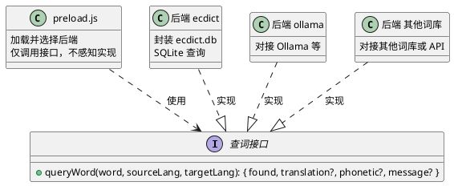
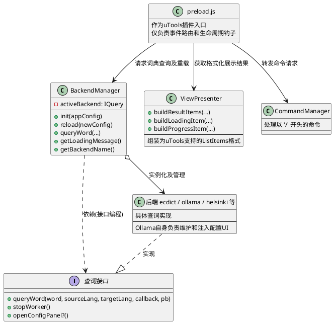
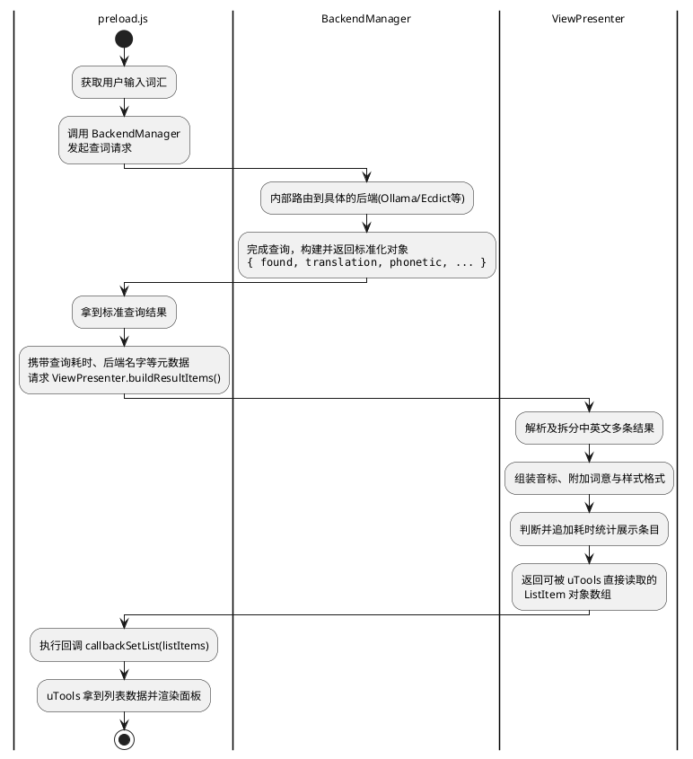

梳理当前preload.js的软件架构，是否还能满足以下架构图描述的架构约束。

即Backend实现实际的查词功能，preload.js只分发查词请求，对查词后端的实现不感知。

---

## 现状分析
当前 `preload.js` **已经不能满足** “仅调用接口，不感知实现” 的架构约束，存在严重的职责不清晰和过度耦合问题：

1. **感知后端实现细节**：
   - 随处可见针对特定后端的硬编码判断（如 `if (appConfig.backends.ollama) ...`），这打破了面向接口编程的约定。
   - 查询时延的提示描述（`modeDesc`）和加载提示语句（`loadingDesc`）强依赖于当前判断出激活的是哪个后端。
2. **生命周期和初始化逻辑散落**：
   - 包含多处模型后端的初始化与销毁逻辑（`createOllamaBackend(...)`、`window.stopLocalWorker()`），甚至在 UI 交互的回调（如配置面板关闭、命令选择器返回 `reloadBackend`）中重复编写重新初始化的代码。
3. **混合了大量 UI 与 DOM 逻辑**：
   - `preload.js` 作为 uTools 插件入口，理应仅负责分发事件并返回列表。但目前代码中引入了大量 iframe 的创建、样式注入及销毁逻辑（如 `config-container` 和 `ollama-config-container`），代码长且难以维护。
4. **格式化逻辑杂糅**：
   - 列表项的拼装（`buildListItems`）充斥了根据语种（`isZhToEn`）的强判断和拆分页面的逻辑，过于臃肿。

## 废弃全局配置页面与子命令
当前的 `settings` 子命令和全局的配置主页（`config/index.html`）功能已经冗余，在本次重构中将相关的界面和入口内容全部删除：
- 目前有配置面板 UI 交互诉求的仅有 Ollama 模式。
- 原本在 `preload.js` 中导出的 `settings` mode 及其入口将被完全移除，只保留核心的查词入口。
- 我们将把实际仅供 Ollama 下使用的页面弹窗（如 `ollama.html`）的注入与交互控制隔离收拢，与 Ollama Backend 内部进行合并整合。

## 重构方案
为了让系统重新回归“单一职责”原则并遵循架构图的约束，提出以下具体的重构点及相应的修改方案。

整体的重构目标架构图如下：

### 重构点 1：抽离后端统一管理逻辑 (`src/core/backend_manager.js`)
- **存在的痛点**：`preload.js` 直接依赖后端工厂函数，且在初始化、搜索时、重载时散落了多处 `if (appConfig.backends.xxx)` 的逻辑，加载提示也在硬编码。
- **修改方案**：
  1. 创建 `src/core/backend_manager.js`，将 `createDictBackend`、`createHelsinkiBackend`、`createOllamaBackend` 的引入统一移入此类。
  2. 暴露 `init(appConfig)` 接口用于初始化活动后端。
  3. 暴露统一查询接口 `queryWord(word, sourceLang, targetLang, callback, progressCallback)`，内部代理给当前活跃的真实后端对象。
  4. 暴露元数据方法，如 `getLoadingMessage()` 用于获取形如“正在请求 Ollama 服务...”的状态，以及 `getBackendName()` 用于拼装查询时延条目的名字。
  5. 暴露 `reload(newConfig)` 接口统一负责关闭旧的 worker 线程（如 `stopWorker()`）并根据新配置实例化新后端。

### 重构点 2：整合 Ollama 配置逻辑至自身 Backend
- **存在的痛点**：`preload.js` 违背了仅作为路由网关的职责，混杂了巨量的原生 DOM 操作（如通过创建 `iframe` 并设置全屏悬浮等），代码十分冗长，且重构后这部分配置面板仅有 Ollama 模式需要。
- **修改方案**：
  1. 删除全局的配置子页面代码以及相关的入口模式。
  2. 将涉及 Ollama 配置 UI 的生成逻辑（`ollama-config-container` 及其 `iframe` 的注入控制）进行剥离，全量整合下沉到 Ollama Backend 内部。
  3. 当在搜索框命中打开配置指令时，由 Backend 负责挂载自己的配置界面、监听 `window.hideOllamaConfig` 等闭环操作，以保证对 `preload.js` 主入口的影响降到最低。

### 重构点 3：提取展现逻辑 (`src/utils/view_presenter.js`)
- **存在的痛点**：`buildListItems` 承载了太多的渲染判决，比如结果中英拆分、音标处理、耗时字符串拼接等。对具体后端的识别（`modeDesc`）也耦合了全局配置对象 `appConfig`。
- **与 Backend 的关系**：`ViewPresenter` **不直接依赖任何具体的 Backend 实现**。它仅仅接收遵循 `IQuery` 接口规范输出的标准化结果数据结构（即 `{ found, translation?, phonetic?, message? }`），从而完全与底层查词逻辑解耦。以下活动图描述了 `preload.js` 是如何在这两者之间进行数据交换的：

- **修改方案**：
  1. 创建 `src/utils/view_presenter.js` 或纯函数模块。
  2. 提取并改造原本的 `buildListItems` 成为 `buildResultItems(searchWord, result, isZhToEn, costTime, backendName, showCostConfig)`，彻底解耦 `appConfig`，将依赖数据通过传参输入。
  3. 提供 `buildLoadingItem(loadingMessage)` 与 `buildProgressItem(progressMsg)`，方便统一管理 UI 态呈现。

### 重构点 4：清理并重写 `preload.js` 主入口
- **存在的痛点**：主文件体积过大（400+ 行），逻辑杂糅，无法作为高层模块被清晰阅读。
- **修改方案**：
  1. 移除上述涉及的所有具体实现和辅助函数，**并彻底移除原有的 `settings` mode 导出**。如有需要（如读取剪贴板 `readClipboardText`、文本定语检测 `isLikelyChinese`）可一并提取到 `src/utils/utools_helper.js`。
  2. 在头部仅仅 `require` `BackendManager` 和 `ViewPresenter`（或 `CommandManager`）。
  3. 主体仅导出一个干净的 `window.exports = { dict: { ... } }`，各生命周期仅做：
     - **模块加载**：从 uTools db 读配置，然后调 `BackendManager.init()`
     - **enter**：利用 `BackendManager.getLoadingMessage()` 调 `callbackSetList`，接着发起 `BackendManager.queryWord()`，结果借由 `ViewPresenter` 处理后返回。
     - **search**：处理防抖，流程同 enter。如果是指令，转交 `CommandManager`。
     - **select**：处理指令或回车选择的结果。触发打开 Ollama 面板的操作，直接交予对应后端执行。
  4. 当收到 `CommandManager` 传达的后重载回调时，由 `BackendManager` 实现平滑过渡。

## 测试设计
本次重构将核心逻辑与 uTools 强关联环境（`preload.js`）解耦，使得绝大部分代码可以通过单元测试进行覆盖，极大提升代码的可测试性：

1. **`ViewPresenter` 单元测试**：
   - 因为其现在作为纯函数模块只接受纯数据对象并输出格式化数组，我们可以使用 Jest 为其编写详尽的用例。
   - 测试重点：验证不同语种的处理（中英分离拼接）、音标拼装、空释义回退效果（未找到）以及耗时等附加信息显示逻辑是否正确。
2. **`BackendManager` 单元测试**：
   - 对底层的具体生成后端（如 `DictBackend` / `OllamaBackend`）进行 Mock，测试工厂方法的分配逻辑。
   - 测试重点：验证多后端状态切换（`init` 和 `reload`）时是否安全调用了上一个废弃后端的 `stopWorker()`，并正常代理请求。
3. **`preload.js` 集成与手动回归**：
   - 基于解耦后的架构，提供 uTools API （如 `utools.dbStorage`，`utools.setSubInputValue` 等）的全局 Mock，对生命周期事件执行端到端覆盖。
   - 测试重点：验证防抖在连续按键下的正常截断、自动读取剪贴板发起搜索等场景闭环体验是否顺畅。

## 开发计划
为了安全、平滑地推进重构，将整个重构实施拆分为以下五个阶段：

### 阶段一：准备工作与基础模块抽离
- 创建基础架构目录（`src/core/`, `src/utils/` 等）。
- 将 `preload.js` 中独立无依赖的帮助函数（如剪贴板读取 `readClipboardText`、文本定语检测 `isLikelyChinese` 等）独立迁移至 `src/utils/utools_helper.js`，并验证有效性。

### 阶段二：展现逻辑重构与测试
- 抽离核心的列表组装代码至 `src/utils/view_presenter.js`，实现 `buildResultItems`, `buildLoadingItem` 与 `buildProgressItem`。
- 引入对应的单元测试。通过直接输入Mock对象与预期输出数组进行断言，保证在重构时不破坏原有翻译展现、音标样式及耗时展示的准确性。

### 阶段三：基于接口的后端调度替换
- 编写 `BackendManager` 类并实现相关生命周期逻辑。整合原先写死的依赖判定逻辑及 `getLoadingMessage()` 状态文案。
- 将原本放在全局的 Ollama iframe 配置相关挂载代码移入 Ollama Backend 内部统一管理。
- 对 `BackendManager` 配合后端Mock实例进行简单的状态流转测试（特别是验证重装载 `reload` 时旧 worker 能否安全回收）。

### 阶段四：清理解耦主入口
- 彻底清理和瘦身 `preload.js`。移除超过 200 行不再需要的 DOM 操作和特定的条件绑定逻辑。
- 删除系统中的 `settings` 模式项导出以及 `config/index.html` 无用资源。
- 将 `preload.js` 中所有关于搜索、选择的回调事件委托至 `BackendManager` 进行实际转发执行。

### 阶段五：集成与回归验证
- 对重构完毕的 `preload.js` 主入口进行生命周期与行为链路集成。重点处理并覆盖诸如 `search` 节流防抖处理的测试。
- 在 uTools 运行时环境黑盒内执行端对端手动闭环走查。流程包含：不同引擎中英双向查词交互、快速直接查词、独立 Ollama 配置页面展现与退出等关键流程。