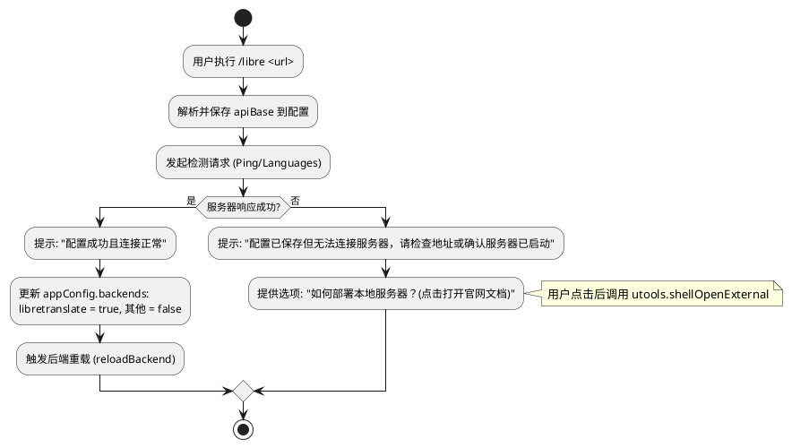

# 软件设计文档：支持 LibreTranslate 翻译后端

## 1. 背景
LibreTranslate 是一款开源的机器翻译 API。为了提供更多元化的本地/私有化翻译选择，本项目决定接入 LibreTranslate API。用户可以自行启动 LibreTranslate 服务（通过 Docker 或本地运行），并在插件中配置相应的服务器地址进行翻译。

## 2. 功能范围
- **新增翻译后端**：实现 `LibreTranslateBackend` 类，负责与 LibreTranslate /translate 接口通讯。
- **模式切换**：通过现有的 `/mode` 命令选择“LibreTranslate”模式。
- **配置管理**：支持用户配置服务器地址（API Base URL）及可选的 API Key（通过新增的 `/libre` 命令）。

## 3. 详细设计

### 3.1 核心后端实现
在 `backends/libretranslate/index.js` 中实现 `LibreTranslateBackend` 类。

#### 1) API 协议细节
- **请求方式**: `POST`
- **接口地址**: `${apiBase}/translate`
- **Content-Type**: `application/json`
- **请求体参数**:
  - `q`: 待翻译的文本内容（String）。
  - `source`: 源语言代码（如 `"en"`），支持 `"auto"`。
  - `target`: 目标语言代码（如 `"zh"`）。
  - `format`: 文本格式，固定为 `"text"`。
  - `api_key`: 可选，从配置中读取，若为空则不发送。

#### 2) 数据处理与映射
- **前端语种决策**: 
  - 根据项目现有设计，源语言（`sourceLang`）和目标语言（`targetLang`）的检测与选择逻辑完全位于 `preload.js` 中。
  - `LibreTranslateBackend` 接收到的语种代码（目前为 `"zh"` 或 `"en"`）是前端预判好的结果，后端直接透明传输给 API，不执行额外的翻译方向判断。
- **语言代码兼容性**: 
  - 使用 **ISO 639-1** 标准。
  - 由于 `preload.js` 传下的代码（`zh`, `en`）与 LibreTranslate 官方标准高度契合，后端实现无需进行额外的映射表转换。
- **返回解析**: 
  - 成功时解析 JSON：`{ "translatedText": "..." }`。
  - 解析逻辑应具备健壮性，若 API 返回错误码（如非法 API Key 或并发受限），需转换为用户可理解的提示信息并返回给前端展示。


#### 3) 核心逻辑示例
```javascript
async queryWord(text, sourceLang, targetLang, callback) {
  const payload = {
    q: text,
    source: sourceLang,
    target: targetLang,
    format: 'text',
    api_key: this.config.apiKey
  };
  // 发起 fetch 请求并处理返回...
}
```


### 3.2 配置结构 (`preload.js`)
在全局 `appConfig` 对象中添加相关字段：

```javascript
let appConfig = {
  // ...
  backends: {
    offline_dict: true,
    ollama: false,
    libretranslate: false // 默认关闭
  },
  libretranslate: {
    apiBase: 'http://127.0.0.1:5000',
    apiKey: ''
  }
};
```

### 3.3 逻辑集成 (`src/core/backend_manager.js`)
更新 `BackendManager` 类以识别并初始化 LibreTranslate 后端。

```javascript
// src/core/backend_manager.js
init(appConfig) {
  this.currentConfig = appConfig;
  
  if (appConfig.backends.libretranslate) {
    const { createLibreTranslateBackend } = require('../../backends/libretranslate/index.js');
    this.activeBackend = createLibreTranslateBackend(appConfig.libretranslate);
  } else if (appConfig.backends.ollama) {
    // ...
  } else {
    // 降级为本地词典
  }
}
```

### 3.4 用户命令设计
为了保持交互的一致性，LibreTranslate 的模式切换将集成到现有的 `/mode` 命令中：

1.  **/mode**: 列表项中新增 **"LibreTranslate"**。
    - 如果未配置服务器地址，点击时显示配置引导条目：
        *   **条目 1**: "如何部署 LibreTranslate 服务器？"，点击调用 `utools.shellOpenExternal` 打开官网文档。
        *   **条目 2**: "去官网获取帮助"，链接指向 `https://docs.libretranslate.com/`。
        *   **条目 3**: 提示用户使用 `/libre <url>` 配置地址。
    - 如果已配置，点击则切换 `backends.libretranslate` 为 `true`。
2.  **/libre <url> [apiKey]**: 专门用于配置服务器地址。
    - **交互增强**：除命令说明外，在输入框下方的指引列表中提供可点击的“访问官网文档”条目，自动打开浏览器访问 `https://docs.libretranslate.com/`。
    - **连通性校验**：配置完成后，立即向服务器发起一次检测。

### 3.5 交互流程逻辑



### 3.6 默认指引提示
在所有相关的配置界面或空状态提示中，统一包含以下引导条目：
*   **标题**：查看 LibreTranslate 部署指引
*   **描述**：点击访问官网文档 (https://docs.libretranslate.com/) 了解如何使用 pip 或 Docker 部署。
*   **动作**：调用 `utools.shellOpenExternal('https://docs.libretranslate.com/')`


## 4. 实施计划
1.  创建 `backends/libretranslate/` 目录及 `index.js` (核心逻辑)。
2.  在 `commands/` 目录下创建 `libre.js` (快捷配置命令)。
3.  更新 `commands/mode.js` 使其支持 `LibreTranslate` 模式选择。
4.  更新 `src/core/backend_manager.js` 以支持新后端的初始化与生命周期管理。
5.  在 `preload.js` 中添加默认配置并处理新命令的路由。

## 5. 测试设计

### 5.1 单元测试 (`test/libretranslate.test.js`)
使用 `nock` 模拟网络请求，对 `LibreTranslateBackend` 类进行单元测试：

- **用例 1: 正常翻译响应**
  - 模拟 `POST /translate` 返回 200 及包含 `translatedText` 的 JSON。
  - 验证结果中的 `found` 为 `true` 且翻译内容正确。
- **用例 2: 服务器错误处理**
  - 模拟 500 或 403 错误。
  - 验证 `found` 为 `false` 且返回了友好的错误提示。
- **用例 3: 网络连接失败**
  - 模拟 `ECONNREFUSED`。
  - 验证是否提示“无法连接到服务器”并给出部署建议。
- **用例 4: 配置缺失校验**
  - 在未配置 `apiBase` 时调用，验证是否返回配置指引提示。

### 5.2 命令测试 (`test/libretranslate-command.test.js`)
测试 `/libre` 配置命令的逻辑：

- **解析逻辑测试**：验证输入 `/libre http://127.0.0.1:5000 mykey` 能正确提取地址和 Key。
- **配置持久化测试**：模拟 uTools 环境，验证 `dbStorage.setItem` 是否被正确调用。
- **连通性校验逻辑测试**：验证命令执行后是否触发了网络探测。

### 5.3 手动集成测试 (uTools 环境)
- **切换流程**：执行 `/mode` 选择 `LibreTranslate` -> 若未配置应弹出官网跳转选项。
- **配置流程**：执行 `/libre <url>` -> 观察输入框下方的实时检测结果反馈。
- **功能验证**：配置成功后，输入单词，确认翻译结果能正确在 uTools 列表中展示。
- **跳转验证**：点击“官网文档”选项，确认能唤起系统默认浏览器并打开正确页面。

