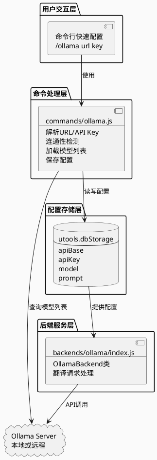
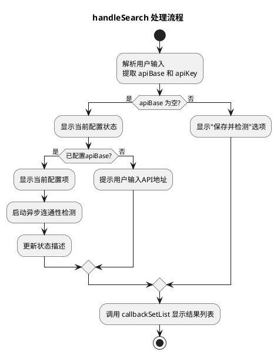
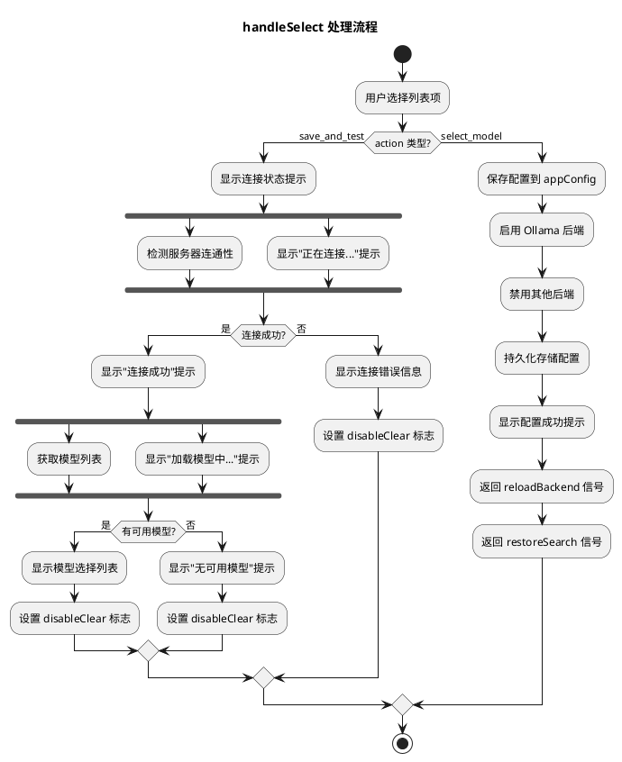
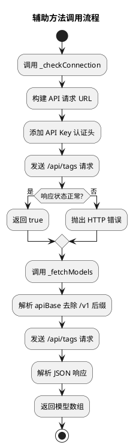

# Ollama 配置命令设计文档

## 需求概述

仿照 `/libre` 命令，实现一个 ollama 配置命令。

ollama 的配置主要有 3 项：
1. ollama url + api key
2. ollama 模型列表
3. prompt

当设置完 ollama url 和 api key 后，保存到 utools 的配置文件中，并加载模型列表。prompt 配置通过当前设计的 html 配置页面来配置。

---

## 软件架构设计

### 整体架构



### 模块设计

#### 1. 命令层改造 (`commands/ollama.js`)

**现状**：当前 `/ollama` 命令仅支持打开配置面板。

**改造目标**：仿照 `/libre` 命令实现完整的命令行配置能力。

```javascript
module.exports = {
    trigger: 'ollama',
    title: 'Ollama 配置',
    description: '设置 Ollama API 地址、密钥和模型 (/ollama <url> [key])',
    
    // 输入解析与列表展示
    handleSearch(subInput, callbackSetList, appConfig) {
        // 1. 解析输入: /ollama <url> [apiKey]
        // 2. 显示当前配置状态
        // 3. 异步检测连通性
        // 4. 提供"打开完整配置面板"选项
    },
    
    // 选择处理
    async handleSelect(itemData, appConfig, callbackSetList) {
        // 1. action === 'save_and_test': 保存配置 + 连通性检测 + 加载模型列表
        // 2. action === 'open_panel': 打开 HTML 配置面板
        // 3. action === 'select_model': 选择模型
    }
};
```

**交互流程**：

```
用户输入: /ollama
├── 显示当前配置状态（apiBase, model）
├── 异步检测连通性
└── 提供"打开完整配置面板"选项

用户输入: /ollama http://127.0.0.1:11434/v1 my-api-key
├── 显示"保存并检测: http://127.0.0.1:11434/v1"
├── 点击后执行连通性检测
├── 成功后自动加载模型列表
├── 显示模型选择列表
└── 选择模型后保存配置并启用 Ollama 后端
```

#### 2. 配置数据结构

```javascript
// app_config.ollama 结构扩展
ollama: {
    apiBase: 'http://127.0.0.1:11434/v1',  // API 基础地址
    apiKey: '',                             // API 密钥（可选）
    model: '',                              // 当前选中的模型
    prompt: '你是一个专业的翻译助手...'     // 系统提示词
}
```

#### 3. 模型列表获取 API

**Ollama 原生 API**：
```
GET {baseUrl}/api/tags
Response: { models: [{ name: "llama2", ... }, ...] }
```

**注意**：`apiBase` 通常为 `http://127.0.0.1:11434/v1`，获取模型列表需要去掉 `/v1` 后缀。

```javascript
// 模型列表获取逻辑
async function fetchModels(apiBase) {
    let baseUrl = apiBase;
    if (baseUrl.endsWith('/v1')) {
        baseUrl = baseUrl.substring(0, baseUrl.length - 3);
    }
    const response = await fetch(`${baseUrl}/api/tags`);
    const data = await response.json();
    return data.models || [];
}
```

#### 4. HTML 配置面板保留

现有 `backends/ollama/ollama.html` 和 `ollama-renderer.js` 保持不变，继续作为完整配置入口：
- 配置 API Base URL
- 选择模型（从服务器拉取）
- 编辑 System Prompt
- 保存全部配置

**触发方式**：
1. 命令行输入 `/ollama` 无参数时，显示"打开完整配置面板"选项
2. 命令行配置完成后，仍可通过 `/ollama` 修改 prompt 等高级设置

---

## 详细设计

### commands/ollama.js 核心逻辑

#### handleSearch 处理流程



#### handleSelect 处理流程



#### 辅助方法调用流程



---

## 文件修改清单

| 文件路径 | 修改内容 |
|---------|---------|
| `commands/ollama.js` | 重构：实现完整的命令行配置逻辑 |
| `backends/ollama/index.js` | 无需修改（保留现有功能） |
| `backends/ollama/ollama.html` | 无需修改（保留现有功能） |
| `backends/ollama/ollama-renderer.js` | 无需修改（保留现有功能） |
| `preload.js` | 确认 `appConfig.ollama` 包含 `apiKey` 字段 |

---

## 用户操作流程

### 快速配置流程（命令行）

```
1. 输入: /ollama http://127.0.0.1:11434/v1
   └── 显示: "保存并检测: http://127.0.0.1:11434/v1"

2. 回车确认
   └── 检测连接 → 加载模型列表

3. 选择模型 (如: llama2)
   └── 保存配置 → 启用 Ollama 后端
```


---


## 测试要点

1. **连通性检测**：正确处理各种错误（超时、连接拒绝、认证失败）
2. **模型列表加载**：正确解析 Ollama API 响应
3. **配置持久化**：配置正确保存到 `utools.dbStorage`
4. **后端切换**：配置完成后自动切换到 Ollama 后端
5. **向后兼容**：现有 HTML 配置面板功能不受影响
