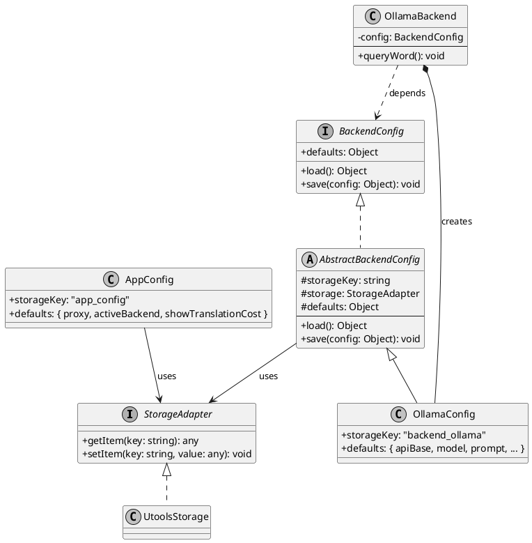
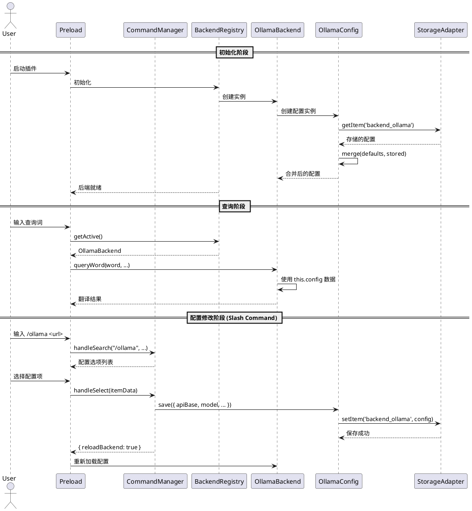

# 架构差距分析：配置管理重构

## 问题概述

本文档分析当前项目中配置管理相关的架构问题，并提出重构方案。

---

## 问题 3: `GLOBAL_CONFIG` 在 `preload.js` 中定义

### 现状

`GLOBAL_CONFIG` 在 `preload.js` 第 35-37 行定义：

```javascript:preload.js:35-37
const GLOBAL_CONFIG = {
  showTranslationCost: true
};
```

### 问题分析

1. **职责不清**: `preload.js` 作为入口文件，应该只负责引导和协调，不应承载具体配置定义
2. **扩展困难**: 随着功能增加，全局展示配置项会增多，分散定义难以维护
3. **与其他配置割裂**: `GLOBAL_CONFIG` 与 `appConfig` 是两种不同性质的配置，但管理方式不统一

### 影响范围

- `preload.js` 第 87 行、第 160 行使用 `GLOBAL_CONFIG.showTranslationCost`

---

## 问题 4: `appConfig` 初始化逻辑分散

### 现状

配置初始化逻辑分散在多处：

| 文件 | 行号 | 功能 |
|-----|------|------|
| `preload.js` | 14-32 | 定义默认配置结构 |
| `preload.js` | 40-63 | 从 uTools 加载并合并配置 |
| `preload.js` | 186-191 | select 回调中重新加载配置 |
| `backends/ollama/ollama-renderer.js` | 23-39 | 独立的配置加载函数 |

### 问题分析

1. **配置与 Backend 分离**: `appConfig.ollama` 定义在 `preload.js`，但使用者在 `backends/ollama/`，职责不清晰
2. **重复代码**: 配置加载逻辑在多处重复实现，且合并策略不完全一致
3. **维护困难**: 修改 backend 配置需要同时修改 `preload.js`，违反就近原则
4. **扩展困难**: 新增 backend 需要修改多处代码（preload.js、backend_manager.js）
5. **容易出错**: `preload.js` 中有复杂的合并逻辑，在其他地方缺失

### 详细代码位置

**preload.js 默认配置定义 (14-32行)**:
```javascript:preload.js:14-32
let appConfig = {
  resourcePath: '',
  proxy: '',
  backends: {
    offline_dict: true,
    ollama: false,
    libretranslate: false
  },
  ollama: { /* ... */ },
  libretranslate: { /* ... */ }
};
```

**ollama/index.js 内部配置默认值 (8-15行)**:
```javascript:backends/ollama/index.js:8-15
constructor(config = {}) {
    this.config = {
        apiBase: config.apiBase || 'http://127.0.0.1:11434/v1',
        apiKey: config.apiKey || 'ollama',
        model: config.model || '',
        prompt: config.prompt || '...',
        temperature: typeof config.temperature !== 'undefined' ? config.temperature : 0.1
    };
}
```

**问题**: `preload.js` 和 `ollama/index.js` 都定义了 ollama 的默认配置，存在重复且可能不一致。

---

## 重构方案：配置与 Backend 归并管理

### 设计原则

1. **高内聚**: 每个 backend 的配置定义、默认值、验证逻辑与其实现代码放在一起
2. **单一职责**: `preload.js` 不再承载配置定义，只负责协调
3. **统一接口**: 配置管理器提供统一的加载/保存接口，内部委托给各 backend
4. **可扩展**: 新增 backend 只需在自己的模块中定义配置，无需修改其他文件

### 新架构设计

```
backends/
├── dict/
│   ├── index.js           # DictBackend 类
│   ├── config.js          # DictConfig（内部使用，不导出）
│   └── ...
├── ollama/
│   ├── index.js           # OllamaBackend 类
│   ├── config.js          # OllamaConfig（内部使用，不导出）
│   ├── ollama-renderer.js
│   └── ...
├── libretranslate/
│   ├── index.js           # LibreTranslateBackend 类
│   ├── config.js          # LibreTranslateConfig（内部使用，不导出）
│   └── ...
├── base/
│   └── config.js          # AbstractBackendConfig 基类
├── registry.js            # Backend 注册表（管理实例，不管理配置）
└── index.js

src/utils/
├── storage_adapter.js     # StorageAdapter 接口 + UtoolsStorage 实现
├── app_config.js          # AppConfig（应用级配置）
├── utools_helper.js
└── view_presenter.js
```

### 模块接口设计

#### 1. Backend 内部管理配置

每个 Backend 在内部创建和管理自己的 Config 实例，**不对外导出配置**：

```
backends/
├── ollama/
│   ├── index.js        # OllamaBackend 类
│   └── config.js       # OllamaConfig（内部使用，不导出）
├── libretranslate/
│   ├── index.js
│   └── config.js
└── dict/
    ├── index.js
    └── config.js
```

**设计要点**：
- Config 类在 backend 目录内定义，仅供 Backend 内部使用
- Backend 构造函数中创建 Config 实例
- 外部模块通过 Backend 的方法间接访问配置，不直接操作 Config

#### 2. Backend 注册表

注册表只管理 Backend 实例，**不收集配置**：

```
backends/
└── registry.js         # Backend 注册表
```

注册表职责：
- 注册和获取 Backend 实例
- 管理当前激活的 Backend
- 提供后端列表供 UI 选择

**不负责**：
- 收集配置
- 管理配置默认值
- 配置持久化

#### 3. 架构设计（PlantUML 类图）

核心思想：**各 Backend 自行管理配置**，无需统一的 ConfigManager 类。



#### 类图设计阐述

**一、存储层**

`StorageAdapter` 是存储抽象接口，屏蔽底层存储差异：
- 生产环境使用 `UtoolsStorage`，调用 `utools.dbStorage` API
- 测试环境可注入 Mock 实现

**二、配置层**

配置分为两条独立的继承链：

| 配置类型 | 基类 | 具体实现 | 存储键 |
|---------|-----|---------|-------|
| Backend 配置 | `AbstractBackendConfig` | `OllamaConfig`, `LibreTranslateConfig`, `DictConfig` | `backend_{name}` |
| 应用配置 | 无（独立类） | `AppConfig` | `app_config` |

两条链**平行独立**，无继承关系，各自管理自己的存储键。

**三、Backend 层**

每个 Backend 类：
1. **依赖接口**：声明 `config: BackendConfig`，依赖抽象而非具体实现
2. **创建实例**：构造函数中创建具体的 Config 子类（如 `OllamaConfig`）
3. **委托调用**：通过接口调用 `load()` / `save()`，不关心内部实现

```javascript
// 示例：OllamaBackend 使用配置
class OllamaBackend {
  constructor() {
    this.config = new OllamaConfig();  // 创建具体 Config
  }

  queryWord(text, sourceLang, targetLang, callback) {
    const cfg = this.config.load();    // 通过接口加载
    // 使用 cfg.apiBase, cfg.model 等...
  }
}
```

**四、扩展性**

新增 Backend 只需：
1. 创建 `XxxConfig` 继承 `AbstractBackendConfig`
2. 创建 `XxxBackend` 持有该 Config
3. 无需修改任何现有代码

#### 4. 配置交互时序图



**说明**：当前配置修改主要通过 Slash Command（如 `/ollama`、`/libre`、`/proxy`）完成，而非传统的配置界面。CommandManager 调用对应 Backend 的 Config 类进行保存。

#### 5. 配置项设计

**AppConfig（应用级配置）**

存储键: `app_config`

| 字段 | 类型 | 默认值 | 说明 |
|-----|------|-------|------|
| `proxy` | string | `''` | HTTP 代理地址 |
| `activeBackend` | string | `'offline_dict'` | 当前激活的 Backend |
| `showTranslationCost` | boolean | `true` | 是否显示翻译耗时 |

---

**OllamaConfig**

存储键: `backend_ollama`

| 字段 | 类型 | 默认值 | 说明 | 配置方式 |
|-----|------|-------|------|---------|
| `apiBase` | string | `'http://127.0.0.1:11434/v1'` | API 地址 | `/ollama <url>` |
| `apiKey` | string | `'ollama'` | API Key | `/ollama <url> <key>` |
| `model` | string | `''` | 模型名称 | `/ollama` 后选择 |
| `prompt` | string | (翻译提示词模板) | 系统提示词 | 配置界面 |
| `temperature` | number | `0.1` | 生成温度 | 配置界面 |

---

**LibreTranslateConfig**

存储键: `backend_libretranslate`

| 字段 | 类型 | 默认值 | 说明 | 配置方式 |
|-----|------|-------|------|---------|
| `apiBase` | string | `''` | API 地址 | `/libre <url>` |
| `apiKey` | string | `''` | API Key | `/libre <url> <key>` |

---

**DictConfig**

存储键: `backend_dict`

| 字段 | 类型 | 默认值 | 说明 | 配置方式 |
|-----|------|-------|------|---------|
| `dictRepoPath` | string | `''` | 词典数据路径 | `/path <path>` |

---

**配置关系总结**：

```
┌─────────────────────────────────────────────────────┐
│                   StorageAdapter                     │
└─────────────────────────────────────────────────────┘
          ↑              ↑              ↑
          │              │              │
    ┌─────┴─────┐  ┌─────┴─────┐  ┌─────┴─────┐
    │ AppConfig │  │OllamaConfig│  │DictConfig │ ...
    └───────────┘  └───────────┘  └───────────┘
    存储: app_config  存储: backend_ollama  存储: backend_dict
```

- **独立存储**：各自使用不同的存储键，互不干扰
- **无依赖**：AppConfig 不依赖 BackendConfig，反之亦然
- **各自管理**：AppConfig 由 preload.js 使用，BackendConfig 由各 Backend 内部使用

### 重构步骤

| 步骤 | 操作 | 文件 | 说明 |
|-----|------|------|------|
| 1 | 创建 `src/utils/storage_adapter.js` | 新建 | 存储适配器接口 |
| 2 | 创建 `backends/base/config.js` | 新建 | Backend 配置基类 |
| 3 | 创建 `backends/ollama/config.js` | 新建 | Ollama 配置类 |
| 4 | 创建 `backends/libretranslate/config.js` | 新建 | LibreTranslate 配置类 |
| 5 | 创建 `backends/dict/config.js` | 新建 | Dict 配置类 |
| 6 | 更新各 Backend 类 | 修改 | 引入各自的 Config 实例 |
| 7 | 创建 `backends/registry.js` | 新建 | Backend 注册表 |
| 8 | 创建 `src/utils/app_config.js` | 新建 | 应用级配置 |
| 9 | 更新 `preload.js` | 修改 | 使用 BackendRegistry 和 app_config |
| 10 | 更新 `ollama-renderer.js` | 修改 | 使用 OllamaBackend.config |
| 11 | 添加单元测试 | 新建 | 测试各配置类 |

---

## 测试设计

### 测试架构

采用分层测试策略，每层隔离被测对象，通过 Mock 解除外部依赖：

```
┌─────────────────────────────────────────────────────────────┐
│                    Slash Command 测试                        │
│  Mock: AppConfig, Backend, fetch                            │
│  测试目标：命令解析 → 配置更新 → UI 响应                      │
├─────────────────────────────────────────────────────────────┤
│                    Backend 层测试                            │
│  Mock: Config, fetch, utools API                            │
│  测试目标：业务逻辑、错误处理、结果转换                       │
├─────────────────────────────────────────────────────────────┤
│                    Config 层测试                             │
│  Mock: StorageAdapter                                       │
│  测试目标：load/save/merge、默认值、缓存                      │
├─────────────────────────────────────────────────────────────┤
│                    Storage 层测试                            │
│  无 Mock（真实内存实现）                                      │
│  测试目标：读写接口、边界条件                                 │
└─────────────────────────────────────────────────────────────┘
```

### Mock 对象设计

| Mock 对象 | 被测层级 | Mock 行为 |
|----------|---------|----------|
| `MockStorage` | Config 层 | 内存存储，模拟 `getItem`/`setItem` |
| `MockConfig` | Backend 层 | 返回预设配置，记录 `save` 调用 |
| `MockFetch` | Backend 层 | 返回模拟 API 响应，模拟网络错误 |
| `MockAppConfig` | Command 层 | 返回应用配置，记录配置变更 |
| `MockBackend` | Command 层 | 模拟后端状态，记录重载请求 |

### 各层测试设计

#### 1. Storage 层测试

**测试对象**：`MockStorage`（测试环境）和 `UtoolsStorage`（生产环境）

**测试场景**：

| 场景 | 测试内容 | 预期行为 |
|-----|---------|---------|
| 基础读写 | 写入后读取 | 返回写入的值 |
| 空值处理 | 读取不存在的键 | 返回 `null` |
| 覆盖更新 | 同一键多次写入 | 保留最后一次的值 |
| 类型保持 | 写入对象/数组 | 读取时类型一致 |

#### 2. Config 层测试

**测试对象**：`AppConfig`、`OllamaConfig`、`LibreTranslateConfig`、`DictConfig`

**Mock 依赖**：`MockStorage`

**测试场景**：

| 场景 | 测试步骤 | 预期结果 |
|-----|---------|---------|
| 默认值加载 | 注入空 MockStorage，调用 `load()` | 返回完整默认配置 |
| 存储值合并 | MockStorage 预设部分配置，调用 `load()` | 默认值 + 存储值合并 |
| 配置保存 | 调用 `save()`，检查 MockStorage | 存储被正确更新 |
| 增量更新 | 先加载，再 `save()` 部分字段 | 仅更新传入字段，其他保留 |
| 缓存机制 | 连续两次 `load()` | 第二次不访问存储 |

**边界测试**：

| 场景 | 测试内容 |
|-----|---------|
| 类型校验 | 传入非法类型（如 `temperature` 传入字符串） |
| 必填字段 | 缺少必填配置时的行为 |
| 迁移兼容 | 旧版本存储格式能否正确加载 |

#### 3. Backend 层测试

**测试对象**：`OllamaBackend`、`LibreTranslateBackend`、`DictBackend`

**Mock 依赖**：`MockConfig`、`MockFetch`、`MockUtools`

**测试场景**：

| 场景 | Mock 设置 | 预期行为 |
|-----|----------|---------|
| 配置缺失 | `MockConfig` 返回空 `model` | 返回 `{ found: false, message: '模型未配置' }` |
| 正常查询 | `MockFetch` 返回有效响应 | 调用 API，返回翻译结果 |
| 网络错误 | `MockFetch` 抛出错误 | 返回错误提示，不崩溃 |
| 超时处理 | `MockFetch` 延迟响应 | 触发超时逻辑 |
| 代理设置 | `MockConfig` 包含 proxy | fetch 使用代理配置 |

**集成测试场景**：

| 场景 | 测试内容 |
|-----|---------|
| 完整流程 | 真实 Config + Mock fetch |
| 并发请求 | 同时发起多个翻译请求 |

#### 4. Slash Command 层测试

**测试对象**：`/ollama`、`/libre`、`/proxy` 命令处理器

**Mock 依赖**：`MockAppConfig`、`MockBackend`、`MockFetch`

**测试场景**：

| 命令 | 场景 | Mock 设置 | 预期行为 |
|-----|-----|----------|---------|
| `/ollama` | 无参数 | - | 显示当前配置状态 |
| `/ollama` | 设置 URL | `MockFetch` 返回模型列表 | 显示模型选择列表 |
| `/ollama` | 连接失败 | `MockFetch` 抛出错误 | 显示连接失败提示 |
| `/ollama` | 选择模型 | `MockBackend` 记录调用 | 保存配置，请求重载后端 |
| `/libre` | 设置 URL | `MockFetch` 返回成功 | 显示配置成功 |
| `/proxy` | 设置代理 | `MockAppConfig` 记录调用 | 显示代理已设置 |

### 测试文件结构

```
test/
├── mocks/
│   ├── mock_storage.js       # 存储层 Mock
│   ├── mock_config.js        # 配置层 Mock
│   ├── mock_fetch.js         # 网络 Mock
│   └── mock_backend.js       # 后端 Mock
├── config/
│   ├── app_config.test.js
│   ├── ollama_config.test.js
│   ├── libretranslate_config.test.js
│   └── dict_config.test.js
├── backends/
│   ├── ollama_backend.test.js
│   ├── libretranslate_backend.test.js
│   └── dict_backend.test.js
└── commands/
    ├── ollama.test.js
    ├── libre.test.js
    └── proxy.test.js
```

### 测试覆盖率目标

| 层级 | 模块 | 目标覆盖率 | 重点 |
|-----|-----|-----------|------|
| Storage | `storage_adapter.js` | 100% | 核心基础组件 |
| Config | 各 `config.js` | 90%+ | load/save/merge 逻辑 |
| Backend | 各 `backend.js` | 80%+ | 业务逻辑、错误处理 |
| Command | `commands/*.js` | 70%+ | 关键用户路径 |
