# 自动下载词典功能设计文档

## 需求概述

1. 当选择离线词典查词模式时，如果没有下载过该词典，则自动下载该词典
2. 如果设置了代理服务器，则下载词典时要使用代理服务器连接下载数据
3. 在设计文档中说明使用哪种下载库进行下载
4. 下载时的进度百分比，用小字来表示

---

## 软件架构设计

### 整体架构

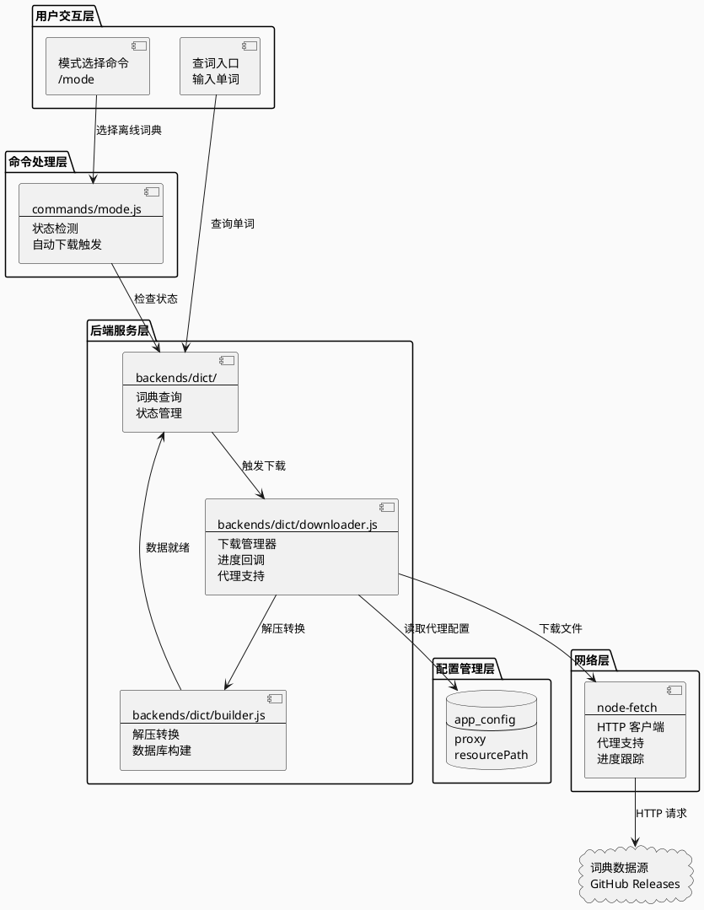

---

## 详细设计

### 1. 词典下载管理器 (`backends/dict/downloader.js`)

#### 职责
- 管理词典下载任务
- 支持代理设置
- 提供下载进度回调
- **支持断点续传（已实现）**

#### 核心接口设计

**DictDownloader 类设计**：

**构造函数参数**：

| 参数名 | 类型 | 必填 | 说明 |
|-------|------|------|------|
| proxy | string | 否 | 代理服务器地址（如 http://127.0.0.1:7890） |
| destDir | string | 是 | 目标存储目录，下载的文件将保存到此目录 |

**主要方法**：

| 方法名 | 参数 | 返回值 | 说明 |
|-------|------|--------|------|
| downloadEcdict | onProgress(回调函数) | Promise&lt;{success, path, error, resumed?}&gt; | 下载 ECDICT 词典，从 GitHub Releases 获取 ecdict-sqlite-28.zip |
| downloadCccedict | onProgress(回调函数) | Promise&lt;{success, path, error, resumed?}&gt; | 下载 CC-CEDICT 词典，从 MDBG 官方获取 cedict_1_0_ts_utf-8_mdbg.zip |
| downloadFile | url, filename, onProgress, options? | Promise&lt;{success, path, error, resumed?}&gt; | 通用文件下载方法，返回下载文件路径，支持断点续传 |
| getDownloadStatus | filename | {status, progress, downloaded, total} | 获取下载状态（none/downloading/completed） |
| cleanupTempFile | filename? | void | 清理临时文件，不传参数则清理所有临时文件 |

**断点续传实现**：

下载过程中使用临时文件（`.downloading` 后缀）保存已下载的数据，下载完成后再重命名为最终文件名。

**断点续传流程**：

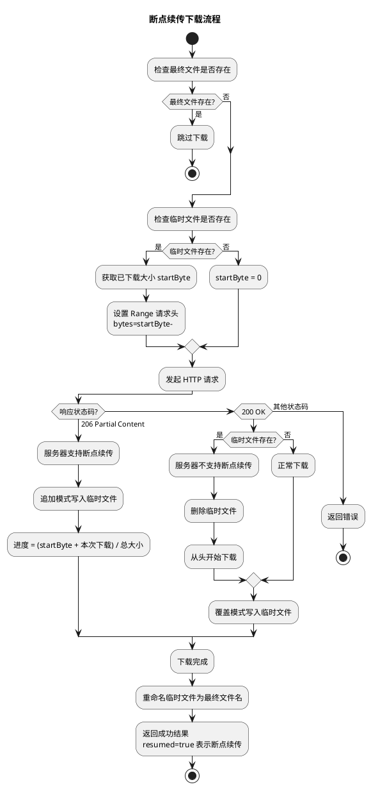

**进度回调函数签名**：

回调函数接收三个参数：
- **percent**: 当前进度百分比（0-100）
- **downloaded**: 已下载字节数
- **total**: 文件总字节数

### 2. 下载库选择说明

#### 选择方案：`node-fetch` + `https-proxy-agent`

**理由**：

1. **项目已有依赖**：项目中 `node-fetch` 已作为 devDependencies 存在，可直接升级为生产依赖使用
2. **轻量级**：`node-fetch` 是轻量级的 HTTP 客户端，无冗余功能
3. **代理支持**：通过 `https-proxy-agent` 配合环境变量 `HTTP_PROXY`/`HTTPS_PROXY` 实现代理支持
4. **进度跟踪**：可通过读取 `Content-Length` 头和 `response.body` 流实时计算下载进度
5. **uTools 兼容性**：在 uTools 的 Node.js 环境中运行良好

**依赖更新**：

需要在 `package.json` 的 dependencies 中添加以下依赖：

| 依赖包 | 版本 | 用途 |
|-------|------|------|
| sql.js | ^1.10.0 | SQLite 数据库操作（已有） |
| node-fetch | ^3.3.2 | HTTP 客户端，用于下载文件 |
| https-proxy-agent | ^7.0.0 | 代理支持，配合 node-fetch 使用 |

**代理配置方式**：
- 读取 `appConfig.proxy` 配置
- 设置环境变量 `HTTP_PROXY` 和 `HTTPS_PROXY`
- `https-proxy-agent` 会自动读取这些环境变量

**进度计算实现**：

下载进度的计算通过流式读取响应数据实现，具体流程如下：

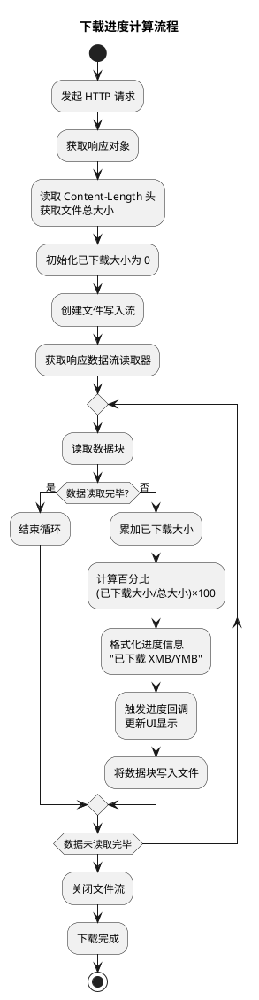

**关键点说明**：

1. **文件总大小获取**：从 HTTP 响应头的 `Content-Length` 字段读取，表示要下载文件的总字节数。如果服务器未提供该字段，则无法计算准确百分比，只能显示已下载字节数。

2. **流式读取**：使用响应流的读取器（Reader）逐块读取数据，避免一次性加载大文件到内存中。每次读取的数据块大小由底层网络层决定，通常在几KB到几十KB之间。

3. **实时进度计算**：每次成功读取数据块后，立即累加已下载字节数，并根据总大小计算当前百分比。计算公式为：`百分比 = Math.round((已下载字节数 / 总字节数) × 100)`。

4. **进度回调触发**：每当读取到一个数据块并计算出进度后，调用进度回调函数，将百分比和格式化的字节数传递给上层，驱动 UI 更新。

5. **数据持久化**：读取的数据块同时写入本地文件流，实现边下载边保存，避免内存中保存完整文件数据。

6. **断点续传机制**：
   - **临时文件**：下载过程中使用 `.downloading` 后缀的临时文件保存数据
   - **Range 请求**：检测临时文件存在时，添加 `Range: bytes=start-` 请求头
   - **状态码处理**：206 表示断点续传成功，200 表示服务器不支持断点续传
   - **进度修正**：断点续传时进度 = (已下载 + 本次下载) / 总大小
   - **文件重命名**：下载完成后将临时文件重命名为最终文件名

7. **临时文件管理**：
   - 下载中断时保留临时文件，下次可继续下载
   - 提供 `cleanupTempFile()` 方法清理临时文件
   - 提供 `getDownloadStatus()` 方法查询下载状态

### 3. 状态检测与自动下载流程

#### 状态枚举扩展

在现有状态基础上，增加下载相关状态：

**词典状态枚举**：

| 状态值 | 状态名称 | 说明 |
|-------|---------|------|
| READY | 已就绪 | 词典数据库文件存在且可用 |
| DOWNLOADED_UNPROCESSED | 已下载未处理 | 压缩包已下载，但尚未解压转换为数据库 |
| DOWNLOADING | 下载中 | 正在进行下载操作 |
| DOWNLOAD_FAILED | 下载失败 | 下载过程中发生错误 |
| UNAVAILABLE | 未下载 | 词典文件完全不存在 |

**状态转换关系**：

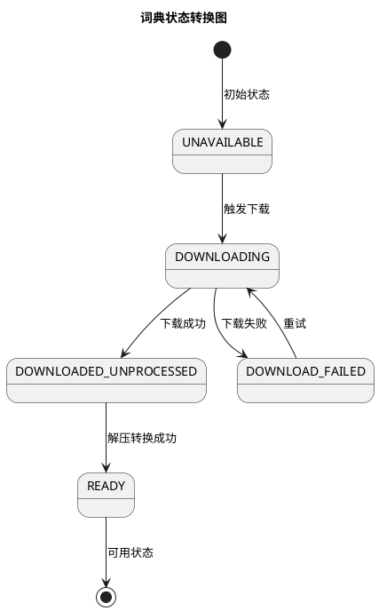

#### 自动下载触发逻辑

**触发时机**：
1. 用户选择离线词典模式时，如果词典未下载，触发自动下载
2. 用户查询时，如果对应词典未下载，触发自动下载

**流程设计**：

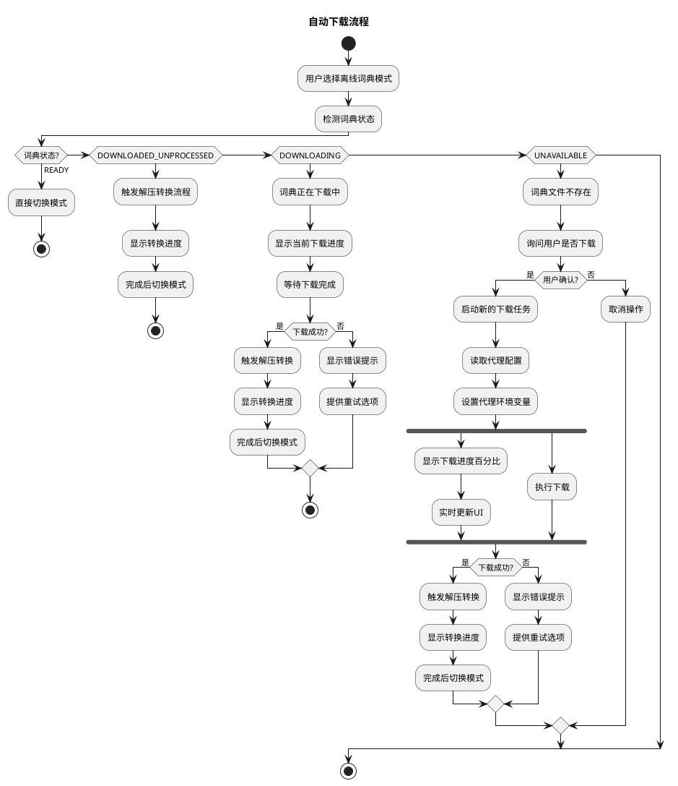

**各分支说明**：

1. **READY（已就绪）**：词典数据库已存在，直接切换模式，无需任何操作。

2. **DOWNLOADED_UNPROCESSED（已下载未处理）**：压缩包已下载，需要解压和转换。直接触发处理流程，显示转换进度。

3. **DOWNLOADING（下载中）**：
   - **场景**：用户之前已触发下载，下载任务正在进行中
   - **行为**：显示当前下载进度，等待下载完成
   - **无需**：重新启动下载任务或询问用户
   - **后续**：下载完成后自动进入解压转换流程

4. **UNAVAILABLE（未下载）**：
   - **场景**：词典文件完全不存在
   - **行为**：询问用户是否下载，用户确认后启动新的下载任务
   - **差异**：需要用户确认才会启动下载，避免自动下载占用带宽

### 4. UI 交互设计

#### 进度显示格式

在 uTools 列表中显示下载进度，采用标准列表项格式：

- **title 字段**：显示主要操作信息，例如"正在下载 ECDICT 词典..."
- **description 字段**：显示详细进度信息，格式为"百分比 | 已下载大小/总大小"

**显示示例**：
- title: 正在下载 ECDICT 词典...
- description: 45% | 已下载 45MB/100MB | 速度: 2.5MB/s

**小字显示**：使用 `description` 字段显示进度百分比和详细信息。

#### 下载状态列表项

| 状态 | title | description |
|------|-------|-------------|
| 下载中 | 正在下载 ECDICT 词典... | 45% \| 已下载 45MB/100MB |
| 下载失败 | 下载失败 | 网络错误，点击重试 |
| 解压中 | 正在解压词典文件... | 已解压 30% |
| 构建中 | 正在构建数据库... | 已处理 5000 条 |

### 5. 模块设计详细说明

#### 5.1 `backends/dict/downloader.js` - 下载器模块

**模块职责**：管理词典文件的下载过程，提供统一的下载接口，支持代理配置和进度回调。

#### 5.2 `backends/dict/builder.js` - 构建器模块

**模块职责**：解压下载的 zip 文件并构建 SQLite 数据库。

**核心方法设计**：

1. **buildEcdict**：解压 ECDICT zip 文件，提取其中的 .db 文件
   - ECDICT 的 zip 直接包含 SQLite 数据库，只需解压并重命名

2. **buildCccedict**：解压 CC-CEDICT zip 并创建 SQLite 数据库
   - CC-CEDICT 的 zip 包含文本文件，需要解析并转换为 SQLite
   - **uTools 环境兼容**：优先使用系统 sqlite3 命令行工具（无需 wasm）
   - 如果系统未安装 sqlite3，回退到 sql.js（需要配置 wasm 路径）

3. **unzip**：简单的 ZIP 解压实现（支持存储和 deflate 压缩）

**uTools 环境兼容处理**：

由于 sql.js 在 uTools 环境中加载 WebAssembly 文件可能会失败，builder.js 采用以下策略：

| 方案 | 条件 | 实现 |
|------|------|------|
| sqlite3 命令行 | 系统已安装 sqlite3 | 使用 `child_process.execSync` 调用 sqlite3 命令创建数据库 |
| sql.js | 系统未安装 sqlite3 | 配置 `locateFile` 选项指定 wasm 文件路径 |

**CC-CEDICT 数据库创建流程**：

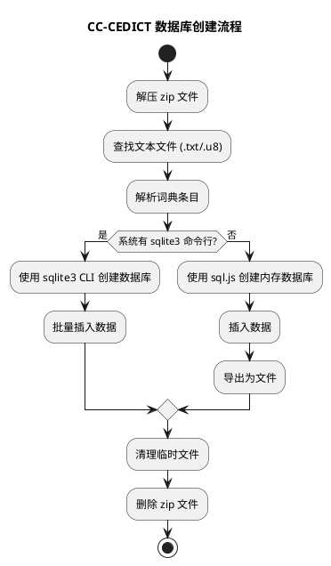

**核心方法设计**：

1. **构造函数**：
   - 接收目标存储目录配置
   - 接收代理服务器地址（可选）
   - 如果配置了代理，则创建代理 Agent 对象用于后续请求

2. **下载文件方法**：
   - 参数：下载地址、目标文件名、进度回调函数
   - 返回值：Promise，解析为下载文件的完整路径
   - 超时设置：5分钟（300秒）

3. **ECDICT 专用下载方法**：
   - 调用通用下载方法
   - 使用固定的 GitHub Releases 地址
   - 输出文件名：ecdict-sqlite-28.zip

4. **CC-CEDICT 专用下载方法**：
   - 调用通用下载方法
   - 使用固定的 MDBG 官方地址
   - 输出文件名：cedict_1_0_ts_utf-8_mdbg.zip

**下载流程图**：

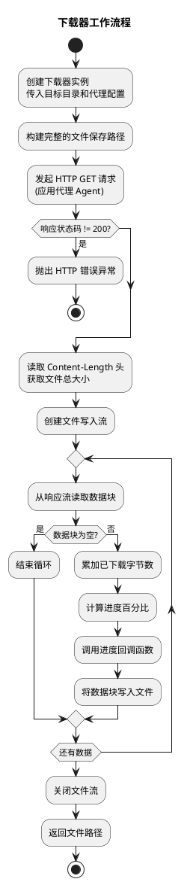

#### 5.2 `commands/mode.js` - 扩展模式选择命令

在现有的 `mode.js` 基础上扩展自动下载逻辑，主要修改 `handleSelect` 方法。

**选择处理流程**：

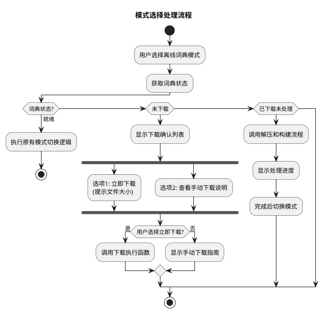

**下载执行函数流程**：

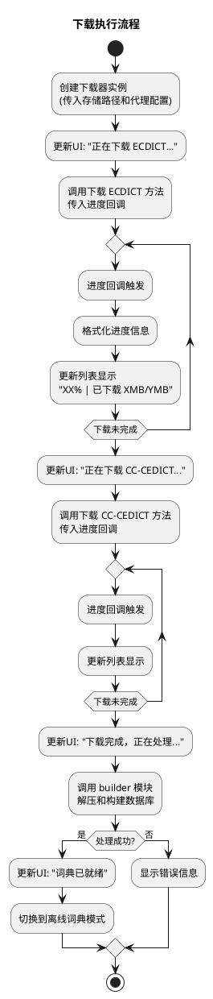

**关键设计要点**：

1. **状态检测时机**：在选择处理前先检测词典状态，根据不同状态进入不同处理分支

2. **UI 实时更新**：通过 `callbackSetList` 函数实时更新列表项，显示当前下载进度和处理状态

3. **错误处理**：所有异步操作都包裹在 try-catch 中，捕获异常后通过列表项显示错误信息

4. **进度格式化**：将字节数转换为人类可读格式（MB、KB），便于用户理解

### 6. 代理配置集成

#### 现有代理配置机制

项目已有 `/proxy` 命令用于设置代理，配置保存在 `appConfig.proxy`。

#### 代理使用方式

下载器通过以下方式使用代理：

1. **构造函数注入**：创建 `DictDownloader` 时传入 `proxy` 参数
2. **环境变量**：代理设置会自动应用到 `HTTP_PROXY` 和 `HTTPS_PROXY` 环境变量
3. **HttpsProxyAgent**：使用 `https-proxy-agent` 库创建代理 agent

**代理配置流程**：

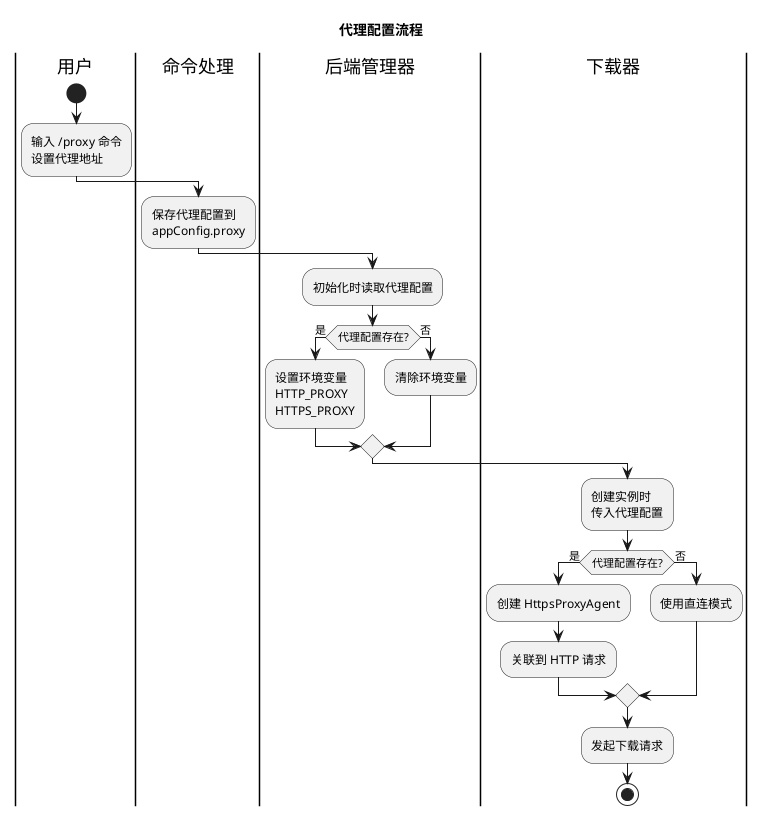

**配置应用说明**：

- **全局环境变量设置**：在 `BackendManager.init()` 方法中，如果 `appConfig.proxy` 存在，则设置 `process.env.HTTP_PROXY` 和 `process.env.HTTPS_PROXY`
- **下载器实例配置**：创建 `DictDownloader` 时，直接传入 `appConfig.proxy` 作为构造参数
- **优先级**：实例配置优先于环境变量，两者同时存在时使用实例配置

### 7. 错误处理与重试机制

#### 错误类型

| 错误类型 | 处理方式 |
|---------|---------|
| 网络超时 | 显示超时提示，保留临时文件支持断点续传，提供重试按钮 |
| 连接失败 | 检查代理设置，提供配置指引 |
| 磁盘空间不足 | 提示用户清理磁盘 |
| 下载中断 | 保留临时文件，下次自动断点续传 |
| **sql.js wasm 加载失败** | 优先使用系统 sqlite3 命令行工具，如不可用则配置 wasm 路径 |

**sql.js WebAssembly 加载问题**：

在 uTools/Electron 环境中，sql.js 加载 wasm 文件可能会失败（错误："both async and sync fetching of the wasm failed"）。解决方案：

1. **优先使用 sqlite3 命令行**：检查系统是否安装了 sqlite3，如有则使用 CLI 创建数据库
2. **配置 locateFile**：为 sql.js 配置 `locateFile` 回调，指定正确的 wasm 文件路径
3. **错误提示**：如果两种方法都失败，提示用户安装 sqlite3 或检查 sql.js 安装

#### 重试策略

下载失败时采用指数退避重试机制：

**重试流程**：

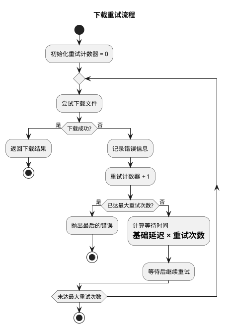

**重试策略说明**：

1. **最大重试次数**：默认为 3 次，可通过参数配置
2. **退避时间计算**：采用指数退避，第 1 次重试等待 2 秒，第 2 次等待 4 秒，第 3 次等待 6 秒
3. **错误记录**：每次失败都记录错误信息，最后一次失败时抛出记录的错误
4. **适用场景**：网络抖动、临时服务不可用等短暂性错误

---

## 文件修改清单

| 文件路径 | 修改内容 |
|---------|---------|
| `package.json` | 添加 `node-fetch` 和 `https-proxy-agent` 依赖 |
| `backends/dict/downloader.js` | 新建：下载管理器（支持断点续传） |
| `backends/dict/builder.js` | 新建：解压和构建数据库 |
| `backends/dict/index.js` | 扩展：集成下载和构建功能 |
| `commands/mode.js` | 扩展：自动下载、自动构建触发逻辑 |
| `test/dict_downloader.test.js` | 新建：下载器单元测试 |
| `test/dict_builder.test.js` | 新建：构建器单元测试 |

---

## 用户操作流程

### 场景1：首次使用自动下载

```
1. 用户输入: /mode
   └── 显示: 离线词典 (词典未下载)

2. 用户选择: 离线词典
   └── 显示下载确认列表

3. 用户确认下载
   ├── 显示: 正在下载 ECDICT... 45% | 45MB/100MB
   ├── 显示: 正在下载 CC-CEDICT... 60% | 30MB/50MB
   ├── 显示: 正在解压...
   └── 显示: 词典已就绪

4. 自动切换到离线词典模式
```

### 场景2：使用代理下载

```
1. 用户输入: /proxy http://127.0.0.1:7890
   └── 显示: 代理设置成功

2. 用户输入: /mode
   └── 选择离线词典

3. 确认下载
   └── 使用代理服务器下载词典文件
```

---

## 测试设计

### 单元测试

#### `test/dict_downloader.test.js`

**测试策略**：使用 `nock` 库模拟 HTTP 服务器，验证下载器的各项功能。

**测试用例设计**：

| 测试场景 | 测试目标 | 验证方法 |
|---------|---------|---------|
| 基础下载功能 | 文件能成功下载 | 模拟 HTTP 200 响应，检查文件是否存在 |
| 进度回调 | 进度信息正确计算 | 验证进度回调被调用，参数值正确 |
| 代理支持 | 代理配置生效 | 创建带代理的下载器，验证 Agent 对象存在 |
| 错误处理 | HTTP 错误被捕获 | 模拟 404/500 响应，验证抛出正确错误 |
| 超时处理 | 超时机制生效 | 模拟慢速响应，验证超时触发 |
| 重试机制 | 失败后自动重试 | 模拟前 N 次失败，最后成功，验证重试次数 |
| 断点续传 - 临时文件检测 | 能检测已存在的临时文件 | 创建临时文件，验证 getDownloadStatus 返回 downloading 状态 |
| 断点续传 - Range 请求 | 正确发送 Range 头 | 模拟 206 响应，验证请求包含 Range 头 |
| 断点续传 - 追加写入 | 数据正确追加到文件 | 模拟部分下载后继续，验证文件内容完整 |
| 断点续传 - 服务器不支持 | 正确处理服务器不支持情况 | 模拟 200 响应，验证删除临时文件重新下载 |
| 断点续传 - 进度计算 | 进度包含已下载部分 | 验证进度百分比从已下载位置开始计算 |
| 跳过下载 | 已存在文件跳过下载 | 创建目标文件，验证返回 skipped=true |
| 清理临时文件 | 正确清理临时文件 | 创建多个临时文件，验证 cleanupTempFile 清理正确 |

**测试流程示意**：

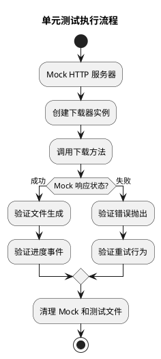

**测试数据准备**：

1. **Mock 文件内容**：使用 Buffer 创建小规模测试数据，避免大文件测试耗时
2. **Content-Length 头**：确保 Mock 响应包含正确的文件大小头，用于进度计算验证
3. **测试目录**：使用临时目录（如 `/tmp`），测试后清理

### 集成测试

1. **完整下载流程测试**：从下载到词典可用
2. **代理切换测试**：修改代理后下载能使用新代理
3. **错误恢复测试**：下载失败后重试

---

## 性能考虑

1. **并发下载**：两个词典可以并发下载（未来优化）
2. **内存占用**：使用流式下载，避免大文件占用内存
3. **磁盘空间检查**：下载前检查剩余空间
4. **下载速度限制**：避免占用全部带宽（可选）
5. **断点续传优化**：
   - 临时文件减少网络流量消耗
   - 大文件下载更可靠，网络中断后无需重新下载
   - 进度计算考虑已下载部分，提供准确进度显示

---

## 未来扩展

1. **多镜像源**：支持多个下载源，自动选择最快的
2. **增量更新**：支持词典增量更新
3. **后台下载**：支持后台下载，不影响正常使用
4. **下载速度显示**：在进度中显示实时下载速度