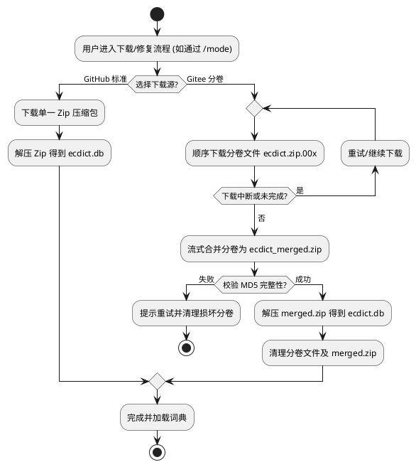
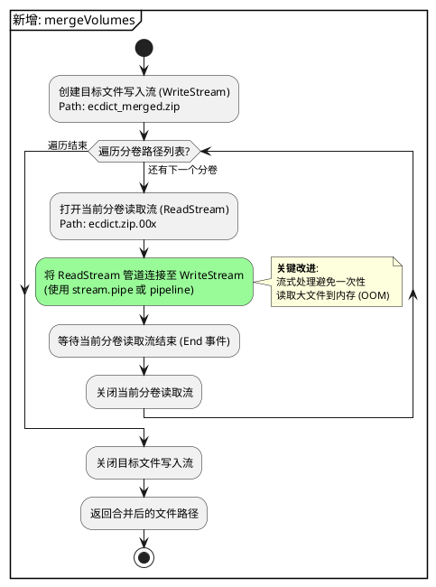

# 需求：支持从 Gitee 下载词典数据 (spec-00024)

## 1. 需求背景
由于 GitHub 在国内访问速度受限，导致 ECDICT 词典下载缓慢或失败。为了提升用户体验，增加 Gitee 镜像下载功能。由于 Gitee 平台对单个文件大小有限制（通常为 50MB-100MB），需要将原始词典压缩包进行分卷处理，并在插件侧实现自动下载、合并与解压逻辑。

## 2. 软件设计方案

### 2.0 流程图


### 2.1 词典预处理工具 (Developer Side)
在 `scripts/` 目录下实现分卷脚本，由开发者在发布词典资源前手动执行。
- **工具名称**: `scripts/split_dict.py`
- **功能**:
    - 将 `ecdict-sqlite-28.zip` 进行分卷切割。
    - 每个分卷大小设为 45MB（保留安全余量）。
    - 命名规则: `ecdict.zip.001`, `ecdict.zip.002`, ...
    - 生成校验文件 `checksum.json`，记录每个分卷的 MD5 和总分卷数。

### 2.2 下载器增强 (Client Side)
扩展 `src/backends/dict/downloader.js` 以支持多文件顺序下载。

#### 配置预留 (URL 占位)
在 `downloader.js` 头部预留配置常量，方便后续手工填入 Gitee 直链：
```javascript
// Gitee 分卷下载配置
const GITEE_ECDICT_CONFIG = {
  // 填写 Gitee 仓库的 Release 或 Raw 直链格式
  // 例如: https://gitee.com/user/repo/releases/download/v1.0.0/ecdict.zip.
  baseUrl: 'YOUR_GITEE_BASE_URL_HERE', 
  volumes: 3, // 分卷总数
  checksums: [
    'MD5_OF_001',
    'MD5_OF_002',
    'MD5_OF_003'
  ]
};
```

#### 新增方法
- **新增方法**: `downloadVolumes(config, onProgress)`
    - 根据 `baseUrl` 和 `volumes` 循环拼接出 `ecdict.zip.001` 等完整 URL。
    - 顺序下载列表中的所有文件。
    - 进度计算：`当前已下载字节数 / 所有分卷总字节数`。
    - 支持单个分卷的断点续传（复用现有 `TEMP_SUFFIX` 逻辑）。

### 2.3 构建器增强 (Client Side)
扩展 `src/backends/dict/builder.js` 处理分卷合并。

#### 分卷合并详细流程 (Merge Logic)


- **新增方法**: `mergeVolumes(volumePaths, outputPath)`
    - 使用 `fs.createReadStream` 和 `fs.createWriteStream` 流式合并分卷文件，避免全量读入内存导致的 OOM。
- **流程更新**: `buildEcdictFromGitee(destDir, onProgress)`
    - 步骤 1: 调用 `downloader` 下载全部分卷。
    - 步骤 2: 调用 `mergeVolumes` 将分卷合并为临时的 `ecdict_merged.zip`。
    - 步骤 3: 调用现有 `unzip` 逻辑对合并后的文件进行解压。
    - 步骤 4: 清理分卷临时文件及合并后的 zip 文件。

### 2.4 集成至现有流程
不增加新的 `/dict` 命令，而是复用 `/mode` 命令中的下载/修复触发逻辑。
- **修改模块**: `src/commands/mode.js`
- **交互逻辑**:
    - 当检测到词典 `UNAVAILABLE` 或 `DOWNLOAD_FAILED` 时，在原有的“立即下载”选项下，细分为两个子选项：
        1. `从 GitHub 下载 (标准)`
        2. `从 Gitee 下载 (国内极速)`
    - 复用现有的 `handleDownloadDict` 异步处理框架，根据用户选择的 `action` 路由至不同的下载分支。
- **状态同步**: 利用已有的 `callbackSetList` 机制实时反馈分卷下载进度。

### 2.5 错误处理与容错
- **网络中断**: 若下载分卷过程中失败，用户再次点击可从当前失败的分卷继续。
- **校验失败**: 合并前校验 MD5，若不匹配提示文件损坏，提供“重试”选项删除损坏分卷重新下载。
- **空间检查**: 在下载前检查目标磁盘剩余空间，至少需要 `2 * 原始压缩包大小` 的临时空间。

## 3. 测试设计

### 3.1 单元测试 (Unit Tests)
- **分卷脚本测试**: 验证 `split_dict.py` 是否能正确切割文件，且分卷总大小等于原始文件。
- **合并逻辑测试**: 提供 3 个小型文本分卷，验证 `mergeVolumes` 合并后内容与原文件完全一致。
- **进度计算测试**: 模拟下载了 1.5 个分卷（共 3 个），验证 `downloadVolumes` 返回的百分比是否正确。

### 3.2 集成测试 (Integration Tests)
- **断点续传测试**: 
    1. 开始下载分卷 2。
    2. 人为中断网络。
    3. 恢复网络后重新触发下载，校验分卷 2 是否从上次偏移量开始写入。
- **全流程覆盖**:
    1. 模拟 Gitee 环境返回 3 个分卷。
    2. 执行 `buildEcdictFromGitee`。
    3. 校验最终 `ecdict.db` 是否存在且能成功执行 `SELECT` 查询。

### 3.3 异常分支测试
- **校验失败场景**: 修改分卷 1 的内容，验证合并后 MD5 校验是否报错。
- **磁盘满载场景**: 模拟磁盘空间不足，验证下载器是否能提前拦截并给出友好提示。
- **并发下载测试**: 快速多次点击下载，验证是否会由于并发写入导致文件锁死或损坏。

## 4. 待办事项
- [ ] 编写 Python 分卷脚本。
- [ ] 上传分卷数据至 Gitee 仓库并获取直链。
- [ ] 重构 `DictDownloader` 支持批量下载。
- [ ] 实现 `buildEcdictFromGitee` 核心逻辑。
- [ ] 修改 `src/commands/mode.js` 集成 Gitee 下载选项并注册处理逻辑。