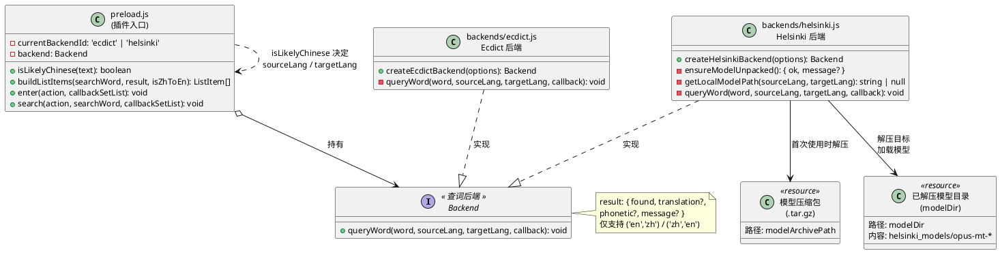
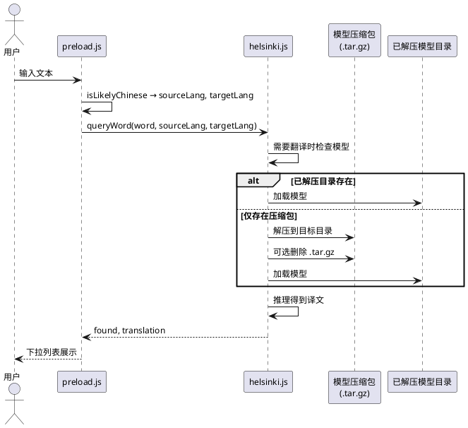

# spec-00004 支持本地 Helsinki-NLP 模型翻译

## 需求

- 支持本地使用 **Helsinki-NLP（OPUS-MT）** 模型进行翻译。
- **识别中英文的方法不变**：仍由 preload 通过 `isLikelyChinese(text)` 决定 `sourceLang`/`targetLang`（'en'↔'zh'），与现有 ecdict 行为一致。
- 提供一个**单独的 backend**，以支持使用 Helsinki-NLP 模型进行翻译（与 ecdict 后端并列，可插拔）。
- 提供**单元测试**，基于 **node:test**，验证是否能基于 Helsinki-NLP 模型进行翻译。
- 要求模型能够**预先离线下载**，**压缩后打包到插件中**，在**第一次使用时解压缩**。

---

## 软件设计

### 1. 架构概览

- **统一查词接口不变**：与 spec-00001 一致，所有后端实现 `queryWord(word, sourceLang, targetLang, callback)`，返回 `{ found, translation?, phonetic?, message? }`。preload 不感知后端类型，仅根据配置或选择加载对应后端并调用该接口。
- **语言方向由 preload 决定**：继续在调用 `queryWord` 前用 `isLikelyChinese(text)` 设置 `sourceLang`/`targetLang`，Helsinki 后端只接收并处理 (word, 'en'|'zh', 'zh'|'en')。
- **新增 Helsinki 后端**：独立模块 `backends/helsinki.js`，内部使用 OPUS-MT 类模型（如通过 `@xenova/transformers` 的 ONNX 或 Node 侧 ONNX Runtime）做神经翻译；对外与 ecdict 同一接口，便于 preload 或后续配置切换后端。
- **后端选择**：preload 通过**后端选择变量**决定使用哪一个后端；**当前默认选择 Helsinki-NLP 模型**。该变量后续将交由配置页面读写，实现用户可选的 ecdict / Helsinki 切换（见 2.3 节）。
- **模型分发与首次解压**：发布包中在 `resources/` 下提供**压缩后的模型包**（如 `helsinki-opus-en-zh.tar.gz` 或按实际命名）；Helsinki 后端在首次需要翻译时检查解压目录是否存在，若不存在则从该压缩包解压到指定目录（如 `resources/helsinki-models/` 或用户数据目录），解压成功后可选删除压缩包（与 spec-00003 词库 .gz 行为类似），后续直接使用已解压模型。

- **运行环境与 `@xenova/transformers` 的加载方式**：插件可能运行在 **Node**（如本机单测、CLI）或 **Electron**（如 uTools）中。`@xenova/transformers` 在 Node 下会加载 onnxruntime-node 的原生绑定，在 Electron 中易因 ABI 不一致导致进程崩溃（如 "Module did not self-register"）。因此采用**双路径架构**：
  - **Node 环境**：Helsinki 后端在 `backends/helsinki.js` 内直接 `import('@xenova/transformers')`，解压与推理均在 Node 完成，供单测与本机运行。
  - **Electron/uTools 环境（方案3）**：preload 中**不**加载 `@xenova/transformers`；**推理在独立 Node 子进程**中完成。preload 仅负责解压与路径解析，通过**进程间通信**（如 stdio、socket 或本地 HTTP）将待译文本发给子进程，子进程内加载 `backends/helsinki.js` 或等价逻辑并 `import('@xenova/transformers')` 执行翻译，将结果回传。主进程/渲染进程不加载 onnxruntime-node，避免崩溃。

**目标软件架构（类图）**：



**数据流（序列图）**：



### 2. 模块设计

#### 2.1 输入语言检测（preload.js）

- **不变**：继续使用现有 `isLikelyChinese(text)`（检测 CJK 统一汉字 `\u4e00-\u9fff`）在 `args.search` 与 `args.enter` 中决定 `sourceLang`、`targetLang`，再调用当前后端的 `queryWord(word, sourceLang, targetLang, callback)`。Helsinki 后端不实现语言检测，只按传入的语言对翻译。

#### 2.2 Helsinki 后端（backends/helsinki.js）

- **职责**：
  - 实现与 ecdict 一致的 **`queryWord(word, sourceLang, targetLang, callback)`**，回调 `(err, result)`，`result` 为 `{ found, translation?, phonetic?, message? }`。
  - 首次需要翻译时：若已解压模型目录不存在，则从配置的压缩包路径（如 `resources/helsinki-opus-en-zh.tar.gz`）解压到目标目录（如 `resources/helsinki-models/`），解压成功后可选删除压缩包；若解压失败或模型不可用，返回 `{ found: false, message: "模型未就绪或解压失败" }`。
  - 使用解压后的模型进行 en↔zh 神经翻译；`phonetic` 可为空（神经翻译无音标），或省略。
- **接口约定**：
  - 支持 `createHelsinkiBackend(options)`，`options` 可包含：`modelArchivePath`（压缩包路径）、`modelDir`（解压目标目录）、是否解压后删除压缩包等，便于测试与配置。
  - 仅支持 `(sourceLang, targetLang)` 为 `('en','zh')` 或 `('zh','en')`；其他语言对可返回 `{ found: false, message: "不支持的语言对" }`。
- **实现方式**：
  - 推理引擎：**@xenova/transformers**（Node 下使用 ONNX）或 **onnxruntime-node** 直接加载 ONNX 格式的 OPUS-MT 模型；模型文件由维护者预先从 Hugging Face 等下载并转为可打包格式，再压缩。
  - 解压使用 Node 内置 `zlib` 或 `tar` 库（如 `tar.gz` 需用 `tar` 解包）将压缩包解到 `modelDir`，逻辑封装在 `ensureModelUnpacked()` 或等价函数内，对外仅暴露「模型是否就绪」。
  - **运行环境区分**（避免 Electron 下 `import('@xenova/transformers')` 崩溃）：
    - **Node 环境**（单测、本机）：使用 `backends/helsinki.js` 的完整实现，在 Node 内 `import('@xenova/transformers')` 并完成解压与推理。
    - **Electron/uTools 环境**：preload 不加载 @xenova/transformers，仅做解压与路径；推理在**独立 Node 子进程**中执行，preload 通过 IPC 与子进程通信。详见 **2.5 Electron/uTools 下 Helsinki 推理（方案3）**。
- **错误与边界**：模型未下载、解压失败、推理异常时均返回 `{ found: false, message?: "..." }`，不向上抛未捕获异常。

#### 2.3 后端选择（preload.js）

- **选择变量**：在 preload 中增加**后端选择变量**（如 `currentBackendId`），取值约定为 `'ecdict'` 或 `'helsinki'`。
- **当前默认**：**默认使用 Helsinki-NLP 模型**，即 `currentBackendId` 初始值为 `'helsinki'`（或项目内约定的常量如 `BACKEND_IDS.HELSINKI`）。
- **按变量创建后端**：根据 `currentBackendId` 决定 `require` 并实例化哪一个后端（`createEcdictBackend()` 或 `createHelsinkiBackend()`），得到统一的 `queryWord` 接口对象，后续 search/enter 仅调用该对象的 `queryWord`，不写死具体后端。
- **后续扩展**：配置页面实现后，由配置页读写用户选择并写入持久化配置，preload 启动时读取配置并设置 `currentBackendId`，再按上述逻辑创建对应后端；本需求仅预留选择变量与分支逻辑，不实现配置页。

#### 2.4 模型打包与首次解压

- **发布包**：在 `resources/` 下提供**预下载并压缩**的模型包（如 `helsinki-opus-en-zh.tar.gz`），不随插件运行时从网络下载；仅维护者在打包前通过脚本下载并压缩。
- **解压策略**（与 spec-00003 词库一致）：
  1. 若 `modelDir` 已存在且包含所需模型文件 → 直接使用，不解压。
  2. 若 `modelDir` 不存在且压缩包存在 → 解压到 `modelDir`，解压成功后可选删除压缩包。
  3. 若压缩包也不存在 → 返回 `{ found: false, message: "模型未就绪" }`。
- **脚本**：在 `scripts/` 下提供**下载与打包脚本**（如 `scripts/download_helsinki_model.py` 或 `.sh`），供维护者执行：从 Helsinki-NLP/Hugging Face 下载指定 OPUS-MT 模型（如 en↔zh），转换为可被后端加载的格式（如 ONNX），并压缩为 `resources/` 下约定名称的压缩包；脚本说明写入 README 或脚本内注释。

#### 2.5 Electron/uTools 下 Helsinki 推理（方案3）

在 Electron（如 uTools）中，主进程/preload **不**加载 @xenova/transformers；**翻译在独立 Node 子进程**中执行，preload 通过**进程间通信（IPC）**向子进程发送请求并接收结果，避免 onnxruntime-node 在主进程导致的崩溃。

- **2.5.1 子进程入口脚本**
  - 新增可被 `node` 直接启动的脚本（如 `scripts/helsinki-translate-worker.js` 或置于 `backends/` 下），作为**常驻子进程**或**按需 spawn** 的 worker。
  - 子进程内：读取来自 stdin 或 socket 的请求（约定格式，如 JSON 行：`{ word, sourceLang, targetLang }`），调用与 `backends/helsinki.js` 一致的推理逻辑（可 `require` helsinki.js 或内联解压 + `import('@xenova/transformers')`），将结果写入 stdout 或通过 socket 回写（如 `{ found, translation?, message? }`）。
  - 子进程需能解析**模型路径**（通过环境变量、命令行参数或首行配置传入），确保使用与 preload 解压后的同一 `modelDir`。

- **2.5.2 preload 侧：仅解压与路径，不加载 transformers**
  - 当 `currentBackendId === 'helsinki'` 且运行在 **Electron/uTools** 时，preload **不要** `require('./backends/helsinki.js')`（会触发 `import('@xenova/transformers')`）。
  - 使用仅含解压与路径的模块（如从 helsinki.js 抽离的 `backends/helsinki-node-only.js`，或 helsinki.js 在「仅路径解压」模式下的接口）：执行 `ensureModelUnpacked()`，若 `!ok` 则后续翻译请求直接回调 `{ found: false, message }`；若 `ok`，得到 `modelDir` 绝对路径，供与子进程约定模型路径。

- **2.5.3 IPC 协议与通信方式**
  - **通信方式**（任选其一或由实现选定）：**stdio**（子进程 stdin/stdout，JSON 行协议）、**本地 TCP/Unix socket**、或**本地 HTTP**（子进程内起小型 HTTP 服务，preload 发 POST 请求）。
  - **请求**：preload 将 `{ word, sourceLang, targetLang, modelDir? }` 发给子进程（若子进程由 preload 启动，可将 `modelDir` 通过环境变量或启动参数传入，不必每请求都传）。
  - **响应**：子进程返回与 `queryWord` 回调一致的结构 `{ found, translation?, message? }`；超时或子进程未就绪时 preload 回调 `{ found: false, message: '神经翻译未就绪' }` 或等价提示。

- **2.5.4 preload 中 Electron 分支**
  - 检测到 Electron（如 `process.versions.electron`）且 `currentBackendId === 'helsinki'` 时：启动或连接上述子进程（若采用按需 spawn，可在首次翻译请求时启动），执行解压与路径校验后，将 enter/search 的翻译请求通过 IPC 发给子进程，收到响应后调用现有 `buildListItems` 等逻辑展示。
  - 若子进程启动失败或不可用，回退到 `{ found: false, message: '神经翻译未就绪' }` 或提示用户。

**产出**：在 uTools 中选用 Helsinki 时，主进程不加载 @xenova/transformers；推理在独立 Node 子进程中完成，preload 仅负责解压、路径与 IPC，无 onnxruntime-node 崩溃。

### 3. 单元测试（node:test）

- **位置**：`test/helsinki.test.js`。
- **方式**：与 `test/ecdict.test.js` 类似，`require` 后端后通过 `queryWord(word, sourceLang, targetLang, callback)` 的 Promise 封装进行断言。
- **用例建议**：
  - **有模型时**：`queryWord('hello', 'en', 'zh', ...)` 断言 `result.found === true`、`result.translation` 为字符串且非空（可放宽为包含中文字符）；`queryWord('你好', 'zh', 'en', ...)` 断言 `found === true`、`translation` 为英文非空。
  - **无模型/未解压时**：使用指向不存在路径的 `createHelsinkiBackend({ modelArchivePath: notExist, modelDir: ... })`，调用 `queryWord` 断言 `found === false`，且若有 `message` 则非空。
  - **首次解压**（可选）：在仅提供压缩包的测试目录下创建 backend，首次调用 `queryWord` 触发解压，断言返回 `found === true` 且解压目录已生成；再次调用仍返回正确结果。若测试环境无真实模型包，该用例可 `this.skip()`。
- **运行**：`node --test test/helsinki.test.js`（与现有 ecdict 测试一致）。

### 4. 数据流（首次使用英→中为例）

**Node 环境（单测/本机）**：
1. 用户输入英文，preload 通过 `isLikelyChinese` 得到 `sourceLang='en'`, `targetLang='zh'`，调用 `backend.queryWord(word, 'en', 'zh', callback)`。
2. Helsinki 后端检查 `modelDir` 是否存在；不存在则查找 `resources/helsinki-opus-en-zh.tar.gz`，解压到 `modelDir` 并可选删除 .tar.gz。
3. 从 `modelDir` 加载模型，执行推理得到中文译文，回调 `(null, { found: true, translation: "..." })`。
4. preload 按统一结构组列表项并展示；后续请求若模型已加载可直接推理，无需重复解压。

**Electron/uTools 环境（方案3）**：preload 不调用 `backend.queryWord`，改为执行解压与路径校验后，将 `{ word, sourceLang, targetLang }` 及模型路径通过 IPC 发给独立 Node 子进程；子进程内加载 helsinki 推理逻辑并返回 `{ found, translation }`；preload 收到结果后同样按统一结构组列表项并展示。

### 5. 文件与目录

```
backends/
├── ecdict.js
├── helsinki.js                  # Helsinki-NLP 翻译后端（Node 内推理）
└── helsinki-node-only.js        # 可选：仅解压与路径，供 Electron 下 preload 使用（方案3）

resources/
├── ecdict.db.gz
├── cccedict.db.gz
├── helsinki-opus-en-zh.tar.gz   # 发布包内：预下载并压缩的模型
└── helsinki-models/             # 首次使用后解压生成（或用户数据目录）

scripts/
├── zip_dicts.py
├── download_helsinki_model.py   # 维护者下载并压缩模型
└── helsinki-translate-worker.js # 方案3：子进程入口，供 Electron 下 IPC 翻译

test/
├── ecdict.test.js
└── helsinki.test.js             # Helsinki 后端 node:test
```

### 6. 与现有设计的关系

- **preload**：不修改语言检测逻辑；通过**后端选择变量**（默认 `helsinki`）决定使用 `createEcdictBackend()` 或 `createHelsinkiBackend()`，调用方式一致；后续由配置页面驱动该变量。
- **ecdict 后端**：不改动，与 Helsinki 后端并列存在。
- **spec-00003**：词库 .db.gz 首次解压、删除 .gz 的流程与模型 .tar.gz 首次解压、可选删除压缩包的流程一致，仅封装在各自后端内部。

### 7. 验收要点

- 新增 `backends/helsinki.js`，实现 `createHelsinkiBackend(options)` 与 `queryWord(word, sourceLang, targetLang, callback)`，返回结构与 ecdict 一致。
- 模型以压缩包形式随插件发布，首次使用时解压到指定目录，解压成功后可选删除压缩包；后续直接使用已解压模型。
- 识别中英文的方法仍为 preload 的 `isLikelyChinese`，未改动。
- `node --test test/helsinki.test.js` 通过，能验证在有模型情况下可完成 en↔zh 翻译，无模型时返回 `found: false` 及合理 message。
- **Electron/uTools 下（方案3）**：选用 Helsinki 时主进程不加载 `@xenova/transformers`，推理在独立 Node 子进程中完成，preload 通过 IPC 与子进程通信，无因 onnxruntime-node 导致的崩溃。
- 提供脚本供维护者预下载并压缩模型，文档或注释说明用法。
- preload 中增加后端选择变量，默认值为 Helsinki；根据该变量创建对应后端，后续可通过配置页面切换。

以上为 spec-00004 的完整需求与软件设计，可直接作为实现与验收依据。