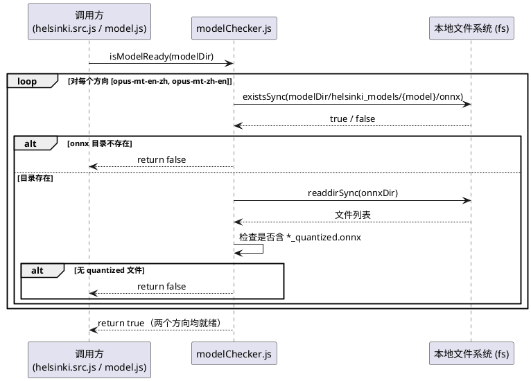
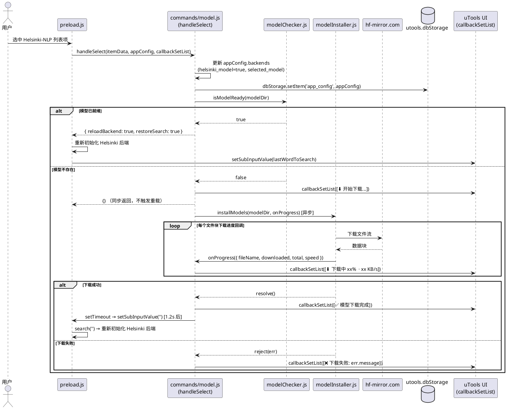

## 核心需求

1. 如果当前无 Helsinki 模型，点击选择模型模式时自动使用 Hugging Face 的国内镜像进行下载。
2. 如果查词时，当前模式为基于 Helsinki 模型进行翻译，且检测到本地无 Helsinki 模型，自动使用 Hugging Face 的国内镜像进行下载，下载时显示进度，下载完成后使用新下载的模型进行翻译。

---

## 软件设计方案

### 1. 总体思路

现有代码中已有 `backends/helsinki/downloader/` 目录，其中封装了完整的下载能力（`ModelDownloader`、`fileManager`），以及指向 `hf-mirror.com` 的国内镜像端点。本方案的核心是**将已有的下载器能力接入到 `createHelsinkiBackend` 的初始化流程中**，而非重新实现下载逻辑。

两个触发场景的共同底层动作均为"检测模型是否存在 → 若不存在则下载 → 下载完成后继续"，差异仅在于上层如何向用户呈现进度。

**模型目录约定**：Helsinki 模型统一存放在用户通过 `/path` 命令配置的数据根目录（`resourcePath`）的 `helsinki` 子目录下。例如，用户配置 `C:\Users\Banny\Downloads\词典`，则 Helsinki 模型目录为 `C:\Users\Banny\Downloads\词典\helsinki`。未配置时回退到插件内置的 `resources/helsinki-models` 目录（向后兼容）。

---

### 2. 模型存在性检测（`modelChecker.js`）

新增 `backends/helsinki/modelChecker.js`，提供一个轻量的同步/异步检测函数，供 `helsinki.src.js` 和 `commands/model.js` 共同调用：



---

### 3. 下载封装层（`modelInstaller.js`）

新增 `backends/helsinki/modelInstaller.js`，对 `ModelDownloader` 进行薄封装，统一两种场景共用的下载逻辑：

```javascript
// backends/helsinki/modelInstaller.js
const path = require('path');
const ModelDownloader = require('./downloader/modelDownloader');

const MIRROR_ENDPOINT = 'https://hf-mirror.com';
const MODEL_IDS = ['Xenova/opus-mt-zh-en', 'Xenova/opus-mt-en-zh'];

/**
 * 下载全部所需模型文件到 destDir。
 * @param {string} destDir       - 存放模型的根目录（helsinki_models 父目录）
 * @param {Function} onProgress  - 进度回调 (fileName, downloaded, total, speed)
 * @returns {Promise<void>}
 */
async function installModels(destDir, onProgress) {
    const downloader = new ModelDownloader(MIRROR_ENDPOINT);
    const modelRoot = path.join(destDir, 'helsinki_models');

    for (const modelId of MODEL_IDS) {
        const shortName = modelId.split('/')[1]; // e.g. opus-mt-zh-en
        const modelDestDir = path.join(modelRoot, shortName);
        await downloader.downloadModel(modelId, modelDestDir, {
            onProgress: (fileName, downloaded, total, speed) => {
                if (onProgress) {
                    onProgress({ modelId: shortName, fileName, downloaded, total, speed });
                }
            }
        });
    }
}

module.exports = { installModels };
```

---

### 4. 改造 `helsinki.src.js`：场景二——查词时自动下载

在 `queryWord` 方法内，将原来直接返回"模型未就绪"错误的逻辑，改为**触发后台下载并向调用方推送进度消息**。

**改动点：`ensureModelUnpacked` 函数**

```javascript
// 原逻辑（返回错误）
async function ensureModelUnpacked() {
    if (!fs.existsSync(modelDir)) {
        return { ok: false, message: '模型未就绪，请确保已下载并放置在指定目录下' };
    }
    return { ok: true };
}
```

```javascript
// 新逻辑（检测 → 不存在则自动下载）
const { isModelReady } = require('./modelChecker');
const { installModels } = require('./modelInstaller');

async function ensureModelUnpacked(onDownloadProgress) {
    if (isModelReady(modelDir)) {
        return { ok: true };
    }

    // 模型不存在，触发自动下载
    try {
        await installModels(modelDir, onDownloadProgress);
        return { ok: true };
    } catch (err) {
        return { ok: false, message: '模型下载失败: ' + err.message };
    }
}
```

**`queryWord` 接收进度回调**

`queryWord` 签名增加一个可选的 `onProgress` 回调，与 `preload.js` 现有的 `progressMsg` 回调机制对接：

```javascript
// queryWord 内部调用 ensureModelUnpacked 时传入进度回调
function queryWord(word, sourceLang, targetLang, callback, onProgress) {
    // ...（省略参数归一化逻辑）

    (async () => {
        try {
            // 通知 UI 层当前开始安装
            const unpack = await ensureModelUnpacked((prog) => {
                if (onProgress) {
                    const pct = prog.total > 0
                        ? Math.round((prog.downloaded / prog.total) * 100)
                        : 0;
                    const speedKB = Math.round(prog.speed / 1024);
                    onProgress(
                        `正在下载 ${prog.modelId}/${prog.fileName}: ${pct}% (${speedKB} KB/s)`
                    );
                }
            });

            if (!unpack.ok) {
                return callback(null, { found: false, message: unpack.message });
            }

            // 下载完成后正常发起推理
            // ...（后续 Worker 调用逻辑不变）
        } catch (e) {
            callback(null, { found: false, message: '模型代理队列异常: ' + e.message });
        }
    })();
}
```

**`preload.js` 侧无需改动**：`applyEnterWithWord` 和 `search` 防抖块中已经为 `backend.queryWord` 传递了 `progressMsg` 回调，调用格式 `backend.queryWord(w, src, tgt, callback, progressCallback)` 与上述新签名完全兼容。

---

### 5. 改造 `commands/model.js`：场景一——选择模型时自动下载

当用户通过 `/model` 命令选择 `Helsinki-NLP` 且本地无模型时，在 `handleSelect` 内启动后台下载，并借助 `callbackSetList` 实时刷新进度展示。

**方案说明**

`handleSelect` 的核心设计原则是**异步下载、同步持久化、延迟重载后端**。由于 `handleSelect` 本身是同步调用并立即返回信号的，而下载过程是耗时的异步操作，两者天然解耦——通过 `installModels` 的 Promise 链在后台执行下载，每次进度回调直接刷新 `callbackSetList` 更新 UI，下载完成后再借助 `utools.setSubInputValue('')` 间接触发 `search` 事件，从而让 `preload.js` 重新初始化后端，整个流程对 `preload.js` 完全无侵入。

**模型目录推导**：`modelDir` = `appConfig.resourcePath + '/helsinki'`（用户数据根目录的 `helsinki` 子目录）；未配置 `resourcePath` 时回退到 `resources/helsinki-models`。



> **注**：`callbackSetList` 已由 `preload.js` 在调用 `CommandManager.handleSelect` 时作为第三参数传入（参见 `preload.js` 第 214 行），无需修改 `preload.js`。

---

### 6. 文件变更总览

| 文件 | 变更类型 | 说明 |
|------|----------|------|
| `backends/helsinki/modelChecker.js` | **新增** | 轻量检测两个方向模型文件是否就绪 |
| `backends/helsinki/modelInstaller.js` | **新增** | 封装 `ModelDownloader`，统一下载两个模型 |
| `backends/helsinki/helsinki.src.js` | **修改** | `ensureModelUnpacked` 改为自动下载；`queryWord` 传递进度回调 |
| `commands/model.js` | **修改** | `handleSelect` 检测模型存在性，不存在时触发下载并展示进度 |
| `backends/helsinki/downloader/modelDownloader.js` | 不变 | 已有能力无需改动 |
| `backends/helsinki/downloader/fileManager.js` | 不变 | 已有能力无需改动 |
| `preload.js` | 不变 | 已有进度回调机制与本方案兼容 |

---

### 7. 验收标准

1. **场景一（命令触发）**：在 `/model` 命令下选择 `Helsinki-NLP`，若本地无模型，uTools 列表区域实时显示下载进度（文件名、百分比、速度）；下载完成后约 1 秒内自动切换到大模型翻译模式，随后输入查词词语可正常触发翻译。
2. **场景二（查词触发）**：在大模型模式下输入查询词，若本地无模型，列表展示"正在下载…"的进度信息；下载完成后自动执行推理并返回翻译结果，期间 UI 不卡死、不白屏。
3. **模型已就绪**：两个场景均不触发任何下载流程，直接进入正常推理路径。
4. **下载失败**：网络不通或镜像返回错误时，列表展示友好的失败提示，不崩溃。
5. **配置持久化**：选择 Helsinki 模型后，`appConfig.backends.helsinki_model = true` 与 `selected_model` 均已写入 `utools.dbStorage`，重启插件后模式保持。
