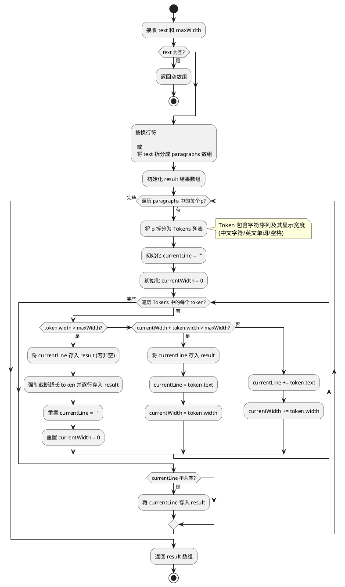

# spec-00025 处理过长的翻译内容

## 需求

当翻译文字超过一行所能显示的范围后，应翻页滚动显示，避免用户无法看全翻译结果。

## 背景与问题分析

当前在 `uTools` 的列表模板插件（`mode: "list"`）中，长文本默认会截断为单行显示，并在末端显示省略号（`...`）。
对于一些返回长释义的查询（特别是像 `Ollama` 等生成自然语言回复的后端，或者一些长句翻译），原本的一条 `title` 无法展现所有文本，导致用户难以阅读完整的返回内容。
由于 uTools 列表项视图格式的限制，唯一的“翻页滚动”途径是将长文本拆分为**多条列表项**（`List Items`），每行/每段占用一个项，这样用户就可以通过上下方向键或鼠标滚动浏览了。

---

## 软件设计

### 1. 文本拆分策略设计

由于中英文混合时文本的实际占用宽度不好纯按字符数估算（通常中文字符比英文字母宽），一种合理的拆分策略如下：

1. **保留自然段落分隔**：首先按照换行符（`\n`）对翻译结果进行初步数组化切割。
2. **长单行切割**：对每一个段落，如果文本长度仍超过某个阈值，则根据配置好的固定字符数（比如 `60` 到 `70` 个字符截断）进行等分切分。
   - 为了更准确地排版，可以计算字符占位权重（中文字符计 2，英文字符计 1，计算达到占位阈值再切断）。
   - 切分后，每段文字依次追加到最终展示的结果集合中。

### 2. 模块级修改方案

#### 2.1 扩展文本处理工具 (如 `src/utils/text_utils.js`)

在通用的工具模块中增加切断函数 `splitTextToLines(text, maxDisplayWidth)`：
- 接收一个字符串，先执行 `split(/\r?\n/)` 获取所有原本带换行的段落。
- 采用“词法分析”的思想，将每一行段落拆分为原子单元（Token）：中文字符（宽2）、英文单词（连续非空字符集，宽=长度）、空白符（宽=长度）。
- 采用贪婪包装算法（Greedy Wrap）拼装行：
  - 维护一个当前行缓存 `currentLine` 和当前宽度 `currentWidth`。
  - 遍历 Token 列表，如果 `currentWidth + token.width <= maxDisplayWidth`，则将其追加到当前行。
  - 否则，将 `currentLine` 存入结果集，并开启新行存放该 Token。
  - 特殊处理：如果单个 Token 的宽度直接超过了 `maxDisplayWidth`（罕见的超长单词或占位符），则对其进行强制截断分行。

*流程活动图：*


#### 2.2 视图组装层的改造 (`src/utils/view_presenter.js`)

在 `buildResultItems` 函数中，拦截待插入的条目，对超出单行界限的翻译释义文本及其关联的源文本（备注）使用并行的拆分与配对逻辑：

- **改动核心**：
  1. 同时对**释义文本** (`title`) 和**源文本** (`description`) 调用 `splitTextToLines`。
  2. 取两者的最大行数 `maxLines` 作为生成的 `ListItem` 数量。
  3. 在循环中依次配对填充：如果其中一方已无剩余行，则用空格 `' '` 占位填充。
- **视觉一致性**：
  长源文本将以列表底部的“小字”形式，分多行与释义同步展示，实现了上下层级的对齐显示。
- **复制增强**：
  每个 `ListItem` 均附加 `copyText`，确保点击该组内的任意行均能获取完整的原始释义。

*逻辑示例：*
```javascript
const translationLines = splitTextToLines(fullTranslationText, 80);
const sourceLines = splitTextToLines(searchWord, 80);
const maxLines = Math.max(translationLines.length, sourceLines.length);

for (let i = 0; i < maxLines; i++) {
    list.push({
        title: (translationLines[i] || ' ').trim(),
        description: (sourceLines[i] || ' ').trim() || ' ',
        copyText: fullTranslationText 
    });
}
```

#### 2.3 交互逻辑维护 (`preload.js`)

在 `window.exports` 的 `select` 回调中，优先读取条目数据中的 `copyText` 字段进行剪贴板写入。

*逻辑示例：*
```javascript
select: function (action, itemData, callbackSetList) {
    // 优先读取自定义数据中的完整待复制文本
    let textToCopy = itemData.copyText || itemData.title;
    // ... 保持原有的特殊提示逻辑 (如词库未就绪等) 
    if (typeof utools !== 'undefined') {
        utools.copyText(textToCopy);
        utools.hideMainWindow();
        utools.showNotification('已复制内容');
    }
}
```

- 对于**中→英**的情况（原版按分号做了单词数组切割），亦可以引入切断作为“长句短发”的一道额外防线，以避免极其少见的长英文占行被截断。

### 3. 测试与验证点

- **多端落返回**：在给 Ollama 发送具有完整换行分段的长文本响应时，预期在 uTools 中会被渲染为多条独立且不被省略号吞噬的记录，保持原本的层级感。
- **单行超长文本**：复制一句包含超过 100 词的长中文语句，进行中文到英文的机器翻译，要求翻译出的对应长英文能够整整齐齐地以数行（数个 list items）逐次展示完，且可以通过上下方向键自由滚动阅览。
- **纯边界条件**：测试仅有一个短文本查询请求、含特殊排版符号查询的无异变崩溃，以覆盖原有测试用例。

### 4. 结论

该设计通过纯逻辑代码切割了过长的文本字符串使其符合列表条目的天生尺寸，既规避了 uTools 模板插件系统不原生支持折行的缺点，又达成了**类似翻页滚动**的沉浸查词体验，总体改造成本较小且可控。