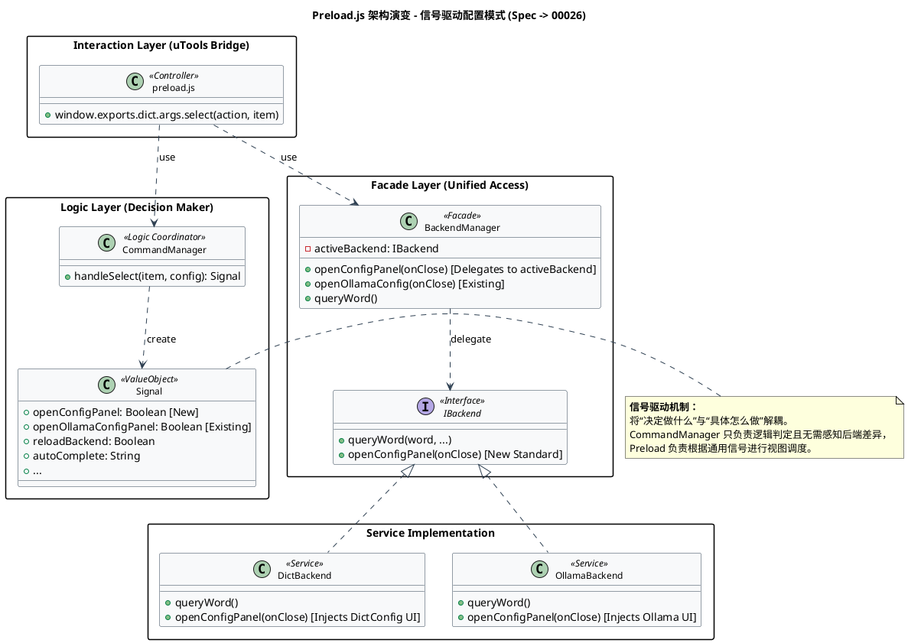
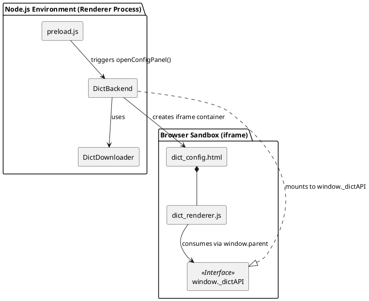

# Spec-00026: 重构离线词典配置交互为弹出式 UI

## 1. 背景与目标 (Objective)
当前离线词典（`offline_dict`）在未就绪时，通过 uTools 列表项（`setList`）引导用户配置路径或下载，交互较为零碎。
本重构旨在提供类似 Ollama 模式的 **弹出式配置面板**，使用户能够在专门的 UI 中一站式完成：
1. 配置数据存放目录。
2. 选择下载源（GitHub/Gitee）。
3. 实时查看下载与构建进度。

## 2. 交互流程 (User Interaction)
1. **触发触发**：用户输入 `/mode` 并选择 `离线词典`。
2. **状态检测**：如果离线词典状态不是 `READY`：
   - 不再返回指令列表项。
   - 自动弹出“离线词典配置”全屏面板。
3. **面板操作**：
   - **路径选择**：显示当前路径，点击“浏览”打开系统文件夹选择器。
   - **下载源选择**：下拉选择“Gitee (国内推荐)”或“GitHub (标准)”。
   - **开始下载**：点击按钮开始，下方实时显示进度条和详细状态。
   - **完成自动关闭**：下载并构建完成后，界面提示成功并自动关闭。
4. **即刻使用**：面板关闭后，后端自动重载，用户可直接输入单词查词。

## 3. 设计细节 (Design Details)

### 3.1 后端扩展 (`src/backends/dict/index.js`)
- 增加 `openConfigPanel(onCloseCallback)` 方法。
- 功能：创建全屏 `iframe` 容器，加载 `dict-config.html`，并暴露关闭方法。

### 3.2 UI 组件 (`src/backends/dict/`)
- **`dict-config.html`**:
  - 使用 Vanilla CSS 构建。
  - 包含路径文本框、浏览按钮、源下拉框、开始按钮、进度条容器。
  - **原型设计参考**:
    

      <h3 style="margin-top: 0; color: #24292e; font-size: 18px;">离线词典配置</h3>
      
请选择下载源和数据存储目录

      
      

        <label style="display: block; font-size: 13px; font-weight: 600; margin-bottom: 6px; color: #24292e;">下载节点</label>
        <select style="width: 100%; padding: 8px 12px; border: 1px solid #d1d5da; border-radius: 6px; background-color: #f6f8fa; font-size: 14px;">
          <option>Gitee (国内推荐 - 分卷快速下载)</option>
          <option>GitHub (海外节点 - 官方直链)</option>
        </select>
      

      
      

        <label style="display: block; font-size: 13px; font-weight: 600; margin-bottom: 6px; color: #24292e;">数据存储目录</label>
        

          <input type="text" placeholder="/默认路径/resources" readonly style="flex-grow: 1; padding: 8px 12px; border: 1px solid #d1d5da; border-radius: 6px; background-color: #fafbfc; font-size: 14px; color: #586069;">
          <button style="padding: 8px 16px; background-color: #f3f4f6; border: 1px solid #d1d5da; border-radius: 6px; cursor: pointer; font-size: 14px; font-weight: 500;">浏览...</button>
        

      

      
      <!-- 进度条区域 (默认隐藏，点击下载后显示) -->
      

        

          下载 ECDICT...
          45% (12MB / 28MB)
        

        

          

        

      

      
      

         <button style="padding: 8px 16px; background-color: transparent; border: none; cursor: pointer; font-size: 14px; color: #586069;">取消</button>
         <button style="padding: 8px 24px; background-color: #2ea44f; color: white; border: 1px solid rgba(27,31,35,0.15); border-radius: 6px; cursor: pointer; font-size: 14px; font-weight: 600;">开始下载与部署</button>
      

    

- **`dict-renderer.js`**:
  - 负责与父窗口（`preload.js`）通信。
  - 调用 `utools.showOpenDialog` 选择目录。
  - 监听下载/构建进度并更新进度条。

### 3.3 命令层修改 (`src/commands/mode.js`)
- 修改 `handleSelect`：当 `modeId === 'offline_dict'` 且状态不为 `READY` 时，返回信号 `{ openConfigPanel: true }`。

### 3.4 预加载层修改 (`preload.js`)

#### 架构设计图 (PlantUML)

**架构设计说明：**

1.  **元素关系 (Relationships)**：
    *   **preload.js**：作为 uTools 的桥接层，承担 View Controller 的职责，负责监听用户输入并将决策逻辑委托给 `CommandManager`。
    *   **CommandManager**：逻辑协调器，根据当前状态（如词典是否 READY）决定返回给顶层的操作类型（Signal）。
    *   **BackendManager**：后端门面（Facade），对顶层屏蔽各引擎（Dict, Ollama, LibreTranslate）的具体实现细节，提供统一的生命周期和视图控制接口。
    *   **Dict/Ollama Backend**：具体服务实现，负责各自业务逻辑及独立的弹出式 UI 注入。

2.  **本次主要修改点 (Key Changes)**：
    *   **引入 `openConfigPanel` 信号**：将原先分散在 `handleSearch` 中的“词库未就绪”判断逻辑提升至 `handleSelect` 指令层，并抽象为标准的通用弹出信号。
    *   **标准化 Facade 接口**：在 `BackendManager` 中对齐了 `openConfigPanel` 的调用模式，在维持向下兼容的同时实现了调用链的逻辑标准化。
    *   **控制反转 (IoC) 的雏形**：通过 `onClose` 回调机制，使 UI 层只需关心面板开启，而重载、刷新等后续操作由顶层统一协调。

3.  **架构影响 (Architectural Impact)**：
    *   **解耦升级**：`preload.js` 内部将不再包含任何特定于离线词典的 UI 容器代码（如 `iframe` 创建），实现了纯粹的可配置化驱动。
    *   **高度可扩展性**：未来任何需要独立配置界面的后端（如 DeepSeek, GPT 等），都可以复用此“信号-门面-服务”的模式，无需修改核心分发逻辑。
    *   **UI 状态一致性**：通过集中式的逻辑控制，可以有效避免多个配置面板同时弹出或状态重置不彻底的问题。

## 3.5 核心概念：信号 (Signal)
本项目采用“信号驱动”的指令传递机制：
- **定义**：Signal 是命令层（Command Layer）在 `handleSelect` 或 `handleSearch` 执行结束后的**同步返回值**。
- **初衷**：解耦业务逻辑与环境副作用。CommandManager 纯粹处理“判断”，而 `preload.js` 负责“执行”。
- **区别于事件 (Event)**：Signal 是确定的、即时的反馈流，不是广播模式。它更像是一个任务清单，告诉调用者下一步该做什么。

## 3.6 前后端协作下载机制 (Cross-Frame Bridge)
由于 iframe 与 `preload.js` 运行在**同一 Electron 渲染进程**中，iframe 可通过 `window.parent` 直接获取父窗口对象上的函数引用并调用——这不是真正的跨进程 IPC，而是**同进程的跨帧函数委托（Cross-Frame Invocation）**。调用时没有序列化开销，`_dictAPI` 方法内部可直接执行 Node.js 的 `fs`、`http` 等特权操作。

### 协作架构图 (PlantUML)

### 设计说明：

上图体现了各组件的职责划分与协作关系：

1. **实现与挂载 (Implement & Mount)**：`DictBackend` 自身构造 `_dictAPI` 对象并直接挂载到 `window._dictAPI`。同时，它负责在 DOM 中动态创建 iframe 容器来承载配置界面。内部依赖 `DictDownloader` 完成实际的网络下载与文件 I/O。
2. **触发机制 (Trigger)**：`preload.js` 不再直接操作 DOM 或创建容器，只负责调用后端统一开放的 `openConfigPanel()` 接口，将渲染职责完全下放。
3. **消费 (Consume)**：iframe 内的 `dict-renderer.js` 通过 `window.parent._dictAPI` 访问这组接口，完成目录选择、发起下载、接收进度回调等交互。

### `window._dictAPI` 接口设计

| 方法 | 签名 | 说明 |
|------|------|------|
| `chooseDirectory` | `() => string \| null` | 弹出系统原生目录选择器，返回用户选定的绝对路径；取消则返回 `null` |
| `getDefaultDirectory` | `() => string` | 返回当前已配置的数据存储路径（来自 `DictConfig`），供 UI 初始化时展示 |
| `startDownload` | `(options, onProgress) => Promise<{success, error?}>` | 启动词典下载与构建流程，`options` 包含 `destDir` 和 `source`；`onProgress` 持续推送进度 |
| `closePanel` | `() => void` | 通知宿主销毁 iframe 并执行清理 |

**`startDownload` 参数详细说明**：

| 参数 | 类型 | 说明 |
|------|------|------|
| `options.destDir` | `string` | 数据存储目标目录 |
| `options.source` | `'gitee' \| 'github'` | 下载源选择 |
| `onProgress` | `(info) => void` | 进度回调，`info` 结构见下方 |

## 4. 单元设计 (Unit Design)

为了将上述架构落地，我们将系统明确划分为以下几个独立单元：

### 4.1 容器挂载单元 (`DictBackend.openConfigPanel`)
- **所在文件**：`src/backends/dict/index.js`
- **主要职责**：
  1. 动态生成全屏 `div` 与 `iframe` 元素并覆盖于 uTools 原生列表之上。
  2. 收拢 `fs`、`path`、`utools.showOpenDialog` 等 Node/Electron 特权操作。
  3. 将特权操作封装为高内聚的 `window._dictAPI` 对象供子帧调用。
  4. 实现 `closePanel`，卸载 DOM 并触发 `onCloseCallback` 告知主逻辑进行重载。

### 4.2 配置交互视图单元 (`dict-config.html`)
- **所在文件**：`src/backends/dict/dict-config.html`
- **主要职责**：
  1. 纯静态的声明式 UI，无 Node 环境依赖。
  2. 包含“路径配置区”、“下载源下拉框”、“进度条组件”和“操作按钮”。
  3. 通过引入 `dict-renderer.js` 激活交互逻辑。

### 4.3 渲染进程交互控制单元 (`dict-renderer.js`)
- **所在文件**：`src/backends/dict/dict-renderer.js`
- **主要职责**：
  1. **初始化**：取得 `window.parent._dictAPI` 句柄，初始化默认的字典存储路径。
  2. **事件绑定**：
     - 用户点击“浏览”，调用 `api.chooseDirectory` 更新输入框。
     - 用户点击“下载”，禁用所有按钮，显示进度条，组装参数调用 `api.startDownload`。
     - 捕获 `onProgress` 回调以实时刷新 DOM 的百分比和提示文本。
  3. **结束态处理**：下载完成或错误时，向用户抛出反馈，最终调用 `api.closePanel`。

## 5. 技术实现难点 (Implementation Notes)
- **文件系统访问**：Iframe 内部无法直接调用 `fs`。需通过 `window.parent` 调用特权 API。
- **进度中转**：`DictDownloader` 的进度回调需要借助传递给 `startDownload` 的回调函数，实时桥接给渲染进程刷新 DOM。
- **UI 状态防抖**：下载期间必须禁用所有输入框和按钮，防止用户重复点击拉起多重下载任务。

## 6. 验收标准 (Success Criteria)
1. `/mode` 选择离线词典，若后台检测未就绪，不再返回普通列表，而是全屏弹窗。
2. 弹窗内原生打开文件浏览器并允许用户自由指定路径或使用默认路径。
3. 点击开始下载后，进度条无卡顿渲染，底层正确执行了 Gitee 或 GitHub 的下载重组流程。
4. 完成提示出现后，窗口正常自销毁，主业务顺利接管，开始提供查词服务。
