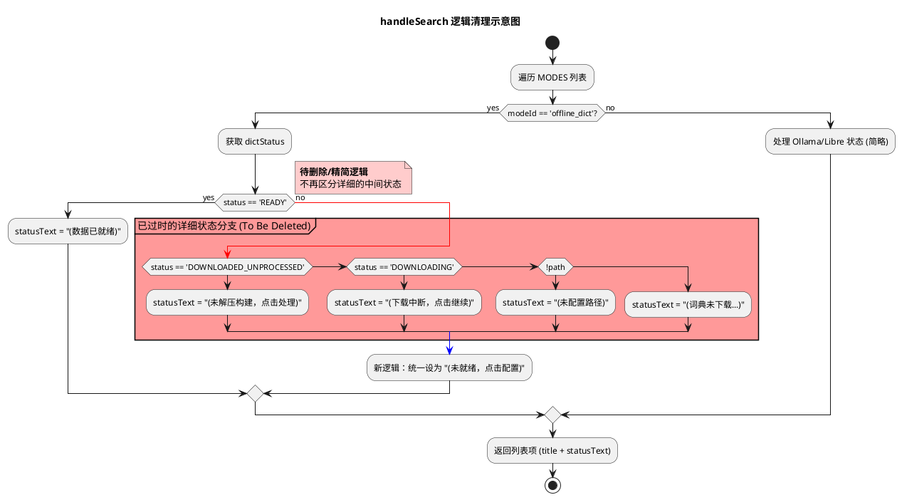
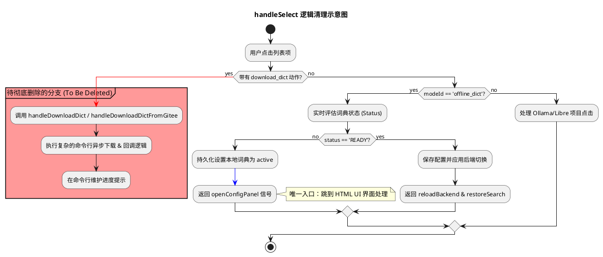
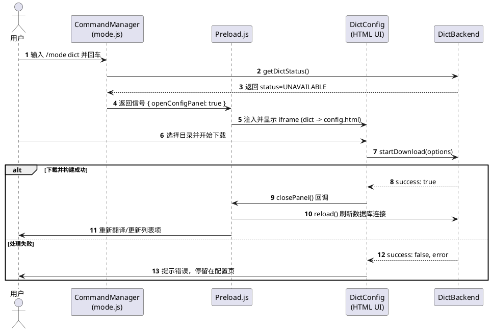

# Spec 00027: 删除命令行词典维护逻辑，实现 UI 驱动的单一配置入口

## 1. 背景 (Background)
在引入了 `dict-config.html` 可视化配置面板后，原本集成在命令行（Slash Commands）中的词典下载、分卷合并、构建进度展示等逻辑已变得冗余且交互体验不一致。为了保持代码简洁并提供统一的用户体验，需要将所有词典配置和下载任务合并到 HTML UI 中，并从命令层移除相关实现。

## 2. 目标 (Objectives)
- **移除冗余代码**：删除 `src/commands/mode.js` 中所有涉及词典下载和构建的逻辑。
- **统一入口**：当词典未就绪时，强制通过 `openConfigPanel` 信号唤起 UI，不再提供命令行下载选项。
- **精简接口**：清理 `src/backends/dict/index.js` 中仅供命令层使用的公共导出函数。

## 3. 详细设计 (Detailed Design)

### 3.1 `src/commands/mode.js` 的清理
该文件目前承担了过重的下载管理职责，需进行如下精简：
- **移除函数**：
    - `handleDownloadDict`：删除整个异步下载和构建流程逻辑。
    - `handleDownloadDictFromGitee`：删除 Gitee 分卷下载特化逻辑。
    - `formatBytes`：辅助函数同步删除。
- **修改 `handleSearch`**：
    - 简化本地词典的状态文案。当状态不是 `READY` 时，统一提示“点击配置”或“未就绪”，不再区分“按回车下载”。

- **修改 `handleSelect`**：
    - 移除对 `action === 'download_dict'` 等分支的处理。
    - 当用户选中一个未就绪的模式时，直接返回 `{ openConfigPanel: true, reloadBackend: true }`。

### 3.2 `src/backends/dict/index.js` 的精简
- **移除导出**：
    - 停止向外部暴露 `downloadDicts` 和 `downloadDictsFromGitee`。这些逻辑应作为 `DictBackend` 的私有方法或仅通过 `_dictAPI` 在 `openConfigPanel` 内部调用。
- **删除逻辑**：
    - 彻底删除 `queryWithCli` 及其相关逻辑。

### 3.3 交互流程变更 (时序)

## 4. 实施清单 (Implementation Todo)

- [ ] **代码清理**：删除 `src/commands/mode.js` 中的下载相关函数（200+行代码）。
- [ ] **接口收缩**：修改 `src/backends/dict/index.js` 的 `module.exports`。
- [ ] **交互修正**：确保 `mode.js` 在词典 `UNAVAILABLE` 时能够正确返回 `openConfigPanel`信号并持久化配置。
- [ ] **验证**：删除代码后，分别从 GitHub 和 Gitee 源通过 UI 进行下载，确保流程不受影响且命令行无报错。

## 5. 影响评估 (Impact Assessment)
- **正向影响**：大幅减少 `mode.js` 的代码量（预计减少 60%），降低维护难度。
- **风险**：需确保 `DictBackend.openConfigPanel` 内部的内容（如 `_dictAPI`）引用了正确的内部函数，因为原来这些函数是直接导出的。

## 6. 测试设计 (Test Design)

### 6.1 冒烟测试 (Smoke Testing)
| 场景 | 操作 | 预期结果 |
|------|------|----------|
| **首次安装/无数据** | 输入 `/mode` 选中“离线词典” | 插件搜索框下方自动滑出 HTML 配置面板 |
| **UI 下载流程** | 在配置面板选择 Gitee 源并下载 | 进度条正常推进，完成后面板自动消失，搜索框恢复翻译功能 |
| **断点续传** | 下载中途关闭插件再重新进入 `/mode dict` | 配置面板应能识别 `.downloading` 文件并恢复进度展示 |
| **查询验证** | 下载完成后输入 `apple` 和 `苹果` | 英汉（ECDICT）和汉英（CC-CEDICT）均能返回结果 |

### 6.2 负面测试与回归 (Regression Testing)
- **指令清理验证**：手动在输入框输入 `/mode dict download`。
    - **预期**：不应触发任何 CLI 级的下载逻辑；如果该指令仍存在，应直接导向 UI 面板而非触发旧的文字提示。
- **并发环境验证**：在配置面板打开时，尝试使用其他 `/` 指令（如 `/ollama`）。
    - **预期**：`preload.js` 应能正确清理旧的 iframe 层，防止 UI 堆叠。
- **接口完整性**：检查 `index.js` 导出项减少后，`ollama` 和 `libretranslate` 是否仍能正常切换。
    - **预期**：后端重载逻辑（`BackendManager.reload`）丝滑切换，无报错。
