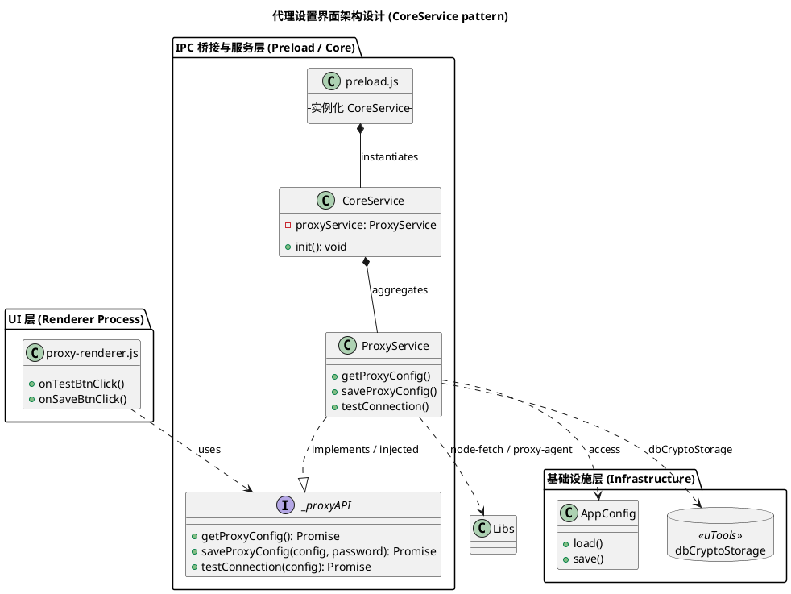
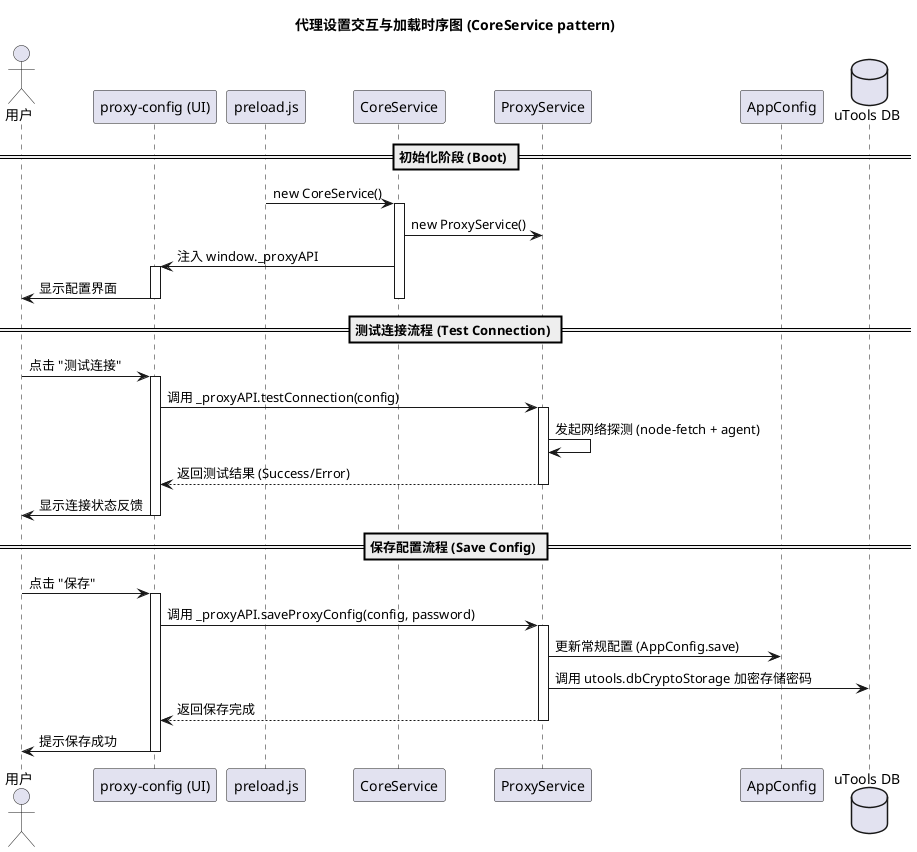

# Spec-00028: 实现全局代理设置界面与加密存储

## 1. 背景与目标 (Objective)
为插件提供一个全局的网络代理配置界面，支持 HTTP 和 SOCKS5 代理，并具备自动测试连接和敏感数据（密码）加密存储的能力。其他网络相关的配置页面（如离线词典下载）可以通过超链接导航至此页面。

## 2. 用户交互流程 (User Interaction)
1. **进入设置**：用户通过 uTools 输入 `/proxy` 进入代理设置。
2. **代理配置**：
   - 勾选“启用代理”。
   - 选择代理类型（HTTP 或 SOCKS5）。
   - 输入代理服务器地址（格式如 `127.0.0.1:7890`）。
   - 输入可选的身份验证信息（用户名、密码）。
3. **测试连接**：
   - 输入自定义的测试 URL（默认 `https://www.google.com`）。
   - 点击“一键测试连接”。
   - 系统显示实时测试状态和结果（成功或具体报错）。
4. **保存配置**：点击“保存”，密码将通过 `utools.dbCryptoStorage` 加密保存，其他信息保存至 `AppConfig`。
5. **外部跳转**：其他需要网络访问的页面（如词典配置）提供一个超链接，点击后在当前 iframe 中跳转至 `proxy-config.html`。

## 3. 架构设计 (Architecture)

### 3.1 数据存储单元 (`AppConfig` 升级)
- **文件**：`src/utils/app_config.js`
- **修改点**：
  - 将 `proxy` 字段从字符串升级为对象：
    ```javascript
    proxy: {
      enabled: Boolean,
      type: 'http' | 'socks5',
      host: String,
      port: String,
      username: String,
      testUrl: String // 用户输入的测试 URL (可选)
    }
    ```
  - **重要**：`password` 不存储在 `AppConfig` 中，而是通过 `utools.dbCryptoStorage` 独立存取，键名为 `proxy_password`。
  - **向后兼容**：`load()` 方法检测到原始 `proxy` 为字符串时，自动迁移解析。

### 3.2 视图与逻辑单元 (UI)
- **文件**：
  - `src/config/proxy-config.html`: Vanilla HTML 实现的配置表单。
  - `src/config/proxy-renderer.js`: 处理 UI 事件（状态切换、测试发起、保存）。
  - `src/config/proxy-style.css`: 统一样式，确保与插件整体视觉风格一致。

### 3.3 宿主桥接 (IPC API)
由于 UI 运行在独立的 `iframe` 中，无法直接访问 Node.js API 或 uTools API。设计遵循“极简 Preload”原则，`preload.js` 仅作为薄桥梁，不感知具体业务逻辑。



在插件启动期间，由 `CoreService` 将 `ProxyService` 实例以 `window._proxyAPI` 的形式注入到宿主环境，作为 UI 层与后台服务的通信网关。具体的接口定义如下：

| 方法 | 说明 |
|------|------|
| `getProxyConfig()` | **从宿主读取**：获取当前代理配置（包含从 `dbCryptoStorage` 解密后的密码）。 |
| `saveProxyConfig(config, password)` | **向宿主写入**：保存配置，并安全写入 `dbCryptoStorage`。 |
| `testConnection(config)` | **后台代理执行**：由 `ProxyService` 调用 Node.js 的相关网络模块和 `proxy-agent` 进行真实的网络测试。 |
| `closePanel()` | **UI 状态管理**：通知宿主销毁配置面板的 `iframe` 并恢复插件主界面。 |

### 3.5 实现参考 (Implementation Reference)

在该分层模式下，`preload.js` 仅作为应用启动入口。

> [!IMPORTANT]
> **薄 Preload 原则**：`ProxyService` 的具体业务逻辑应在独立的模块中实现（如 `src/core/proxy_service.js`），严禁在 `preload.js` 中直接堆砌业务代码。`preload.js` 只负责实例化 `CoreService` 并触发初始化。

```javascript
// preload.js (入口)
const { coreService } = require('./src/core/core_service');
coreService.init();

// src/core/core_service.js (服务管家)
class CoreService {
  constructor() {
    this.proxyService = new ProxyService(this); 
  }
  init() {
    // 注入 ProxyService 实例作为 API 镜像
    window._proxyAPI = this.proxyService;
  }
}
```

### 3.4 交互时序 (Interaction Sequence)



## 4. 技术实现难点 (Implementation Notes)

- **加密存储**：充分利用 uTools 官方提供的 `dbCryptoStorage` 接口，确保密码在 LevelDB 中不以明文存在。
- **代理支持**：测试连接时需支持 SOCKS5。推荐使用 `socks-proxy-agent` 类似的逻辑，或者直接封装 Node.js 的 `http.request` 传入 `agent`。
- **UI 反馈**：在测试连接期间，应将按钮置为 Loading 状态，防止重复点击。

## 5. 测试设计 (Testing Design)

### 5.1 单元测试 (Unit Tests)
- **ProxyService**: 
    - 验证 `saveProxyConfig` 能够正确拆分配置并调用 `AppConfig` 和 `dbCryptoStorage`。
    - 验证 `testConnection` 在不同状态码（200, 404, 500）和超时情况下的返回逻辑。
- **AppConfig**: 
    - 验证配置迁移逻辑：从旧版的 `proxy: "string"` 自动升级至新版的 `proxy: { ... }` 对象格式。

### 5.2 集成测试 (Integration Tests)
- **加密存储联调**: 注入 Mock 的 `utools.dbCryptoStorage`，验证密码在存入后是否被正确加密，且取出后能无损还原。
- **代理通达测试**: 
    - 使用 Mock 服务器验证 HTTP/SOCKS5 代理请求的 Header 是否正确携带了身份验证信息（Basic Auth）。

### 5.3 UI 与交互路径测试 (UI & Interaction)
- **连接状态测试**: 触发“一键测试”后，验证按钮是否进入 Loading/Disabled 状态，并在收到回调后恢复。
- **跨窗口跳转**: 模拟从离线词典配置页面点击“配置代理”超链接，验证 `iframe` 是否平滑跳转至 `proxy-config.html` 且环境参数不丢失。

## 6. 验收标准 (Success Criteria)
1. 能够正确录入和保存 HTTP/SOCKS5 代理。
2. 密码字段在保存后，刷新页面仍能正确读取。
3. “一键测试”功能能够根据用户输入的 URL 返回真实的连通性反馈（成功/超时/拒绝连接）。
4. 从其他页面跳转至 `proxy-config.html` 路径正确，且页面功能完整。
