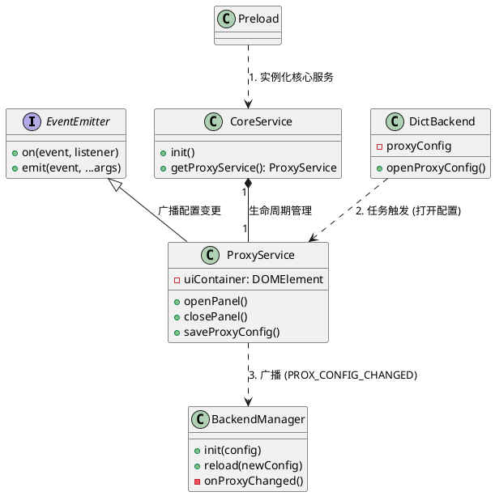
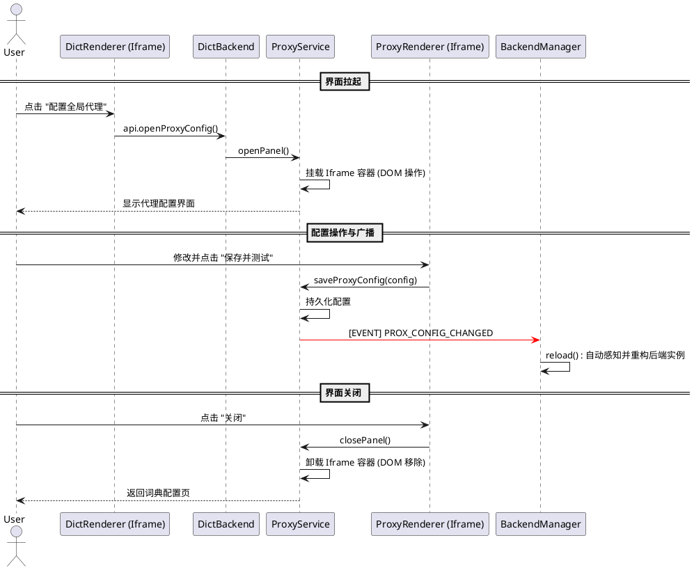

# SPEC-00029: 精简斜线命令 - 移除 /proxy 并重构为自治的代理服务

## 1. 背景与目标
为了提升系统的可维护性并解耦 UI 渲染与核心业务逻辑，我们将移除全局的 `/proxy` 斜线命令。同时，我们将代理配置入口整合至需要网络支持的“离线词典配置”界面中。通过基于事件驱动的重构，我们将实现后端模块对代理变更的自动感知，并使 `preload.js` 回归其作为“引导程序”的极简职责。

### 1.1 目标
- **去智化 `preload.js`**：取消其对具体 UI 面板的管理，仅负责初始化核心服务。
- **UI 整合**：在“离线词典配置”中提供代理配置入口。

  <h4 style="margin-top: 0; font-size: 14px; color: #586069;">UI 效果预览</h4>
  

    🌐
    

      <strong style="color: #0366d6; display: block; margin-bottom: 2px;">网络代理：</strong>
      如遇下载缓慢或失败，请尝试 <a href="#" style="color: #166534; font-weight: 600; text-decoration: underline;">配置全局代理</a>。
    

  

- **解耦重构**：代理配置界面的打开、关闭与重载逻辑由 `ProxyService` 自主管理，通过广播机制通知其他订阅者（如 `BackendManager`）。

## 2. 核心设计

### 2.1 架构模型 (Architecture)
我们将通过广播订阅模式确保各模块能够自愈地响应配置变更，剥离 `preload.js` 中的业务耦合。

### 2.2 关键架构变更点：
1. **职责迁移**：原本在 `preload.js` 中的 `window.openProxyConfigPanel` 及相关 DOM 操作代码迁移至 `ProxyService` 类中，使代理功能实现“自描述、自管理”。
2. **引导程序简化**：`preload.js` 的 `select` 函数中不再包含任何打开代理界面的信号判断逻辑。
3. **事件驱动重载**：`BackendManager` 在初始化时向 `ProxyService` 订阅变更事件，从而在代理变更时自动触发全局 `reload()`，无需 `preload.js` 在回调中显式介入。

### 2.3 交互时序 (Sequence Diagram)
通过时序图可以明确 `preload.js` 在整个生命周期中仅在启动阶段参与，后续的 UI 挂载与业务重载均由服务组件自主完成。

### 2.4 逻辑处理流
1. **引导初始化**：`preload.js` 启动 -> 调用 `coreService.init()` -> `ProxyService` 实例化。
2. **用户点击**：词典配置页点击链接 -> `_dictAPI.openProxyConfig()` (由 `DictBackend` 提供接口) -> 调用 `proxyService.openPanel()`。
3. **UI 渲染**：`ProxyService` 动态创建 iframe 容器并挂载至 `document.body`。
4. **配置保存**：用户在 Iframe 中保存配置 -> `ProxyService.saveProxyConfig()` 被触发 -> **广播 `PROXY_CONFIG_CHANGED` 事件**。
5. **系统重载**：`BackendManager` 监听到事件 -> 自动执行 `this.reload()` 刷新整个后端的代理环境。
6. **面板关闭**：调用 `proxyService.closePanel()` -> 清理 DOM，不涉及业务回调。

### 2.5 即时生效保障 (Hot-Reloading)
为确保用户在配置代理后能立即提升下载成功率，无需重启插件或重开下载面板：
1. **实例级监听**：`DictBackend` 实例在创建后会订阅 `ProxyService` 指送的 `PROX_CONFIG_CHANGED` 事件。
2. **状态同步**：收到事件后，`DictBackend` 将从 `appConfig` 获取最新代理，并调用其内部 `DictDownloader` 的配置更新接口。
3. **即时重用**：在下载过程中切换代理，后续的文件分卷请求将即刻使用新的 Proxy Agent，确保已失败的连接在重试时能享受新的网络通路。

## 3. 命令卸载
- **清理引用**：从 `src/commands/index.js` 移除 `proxyCommand` 注册。
- **物理删除**：逻辑迁移完成后，彻底删除 `src/commands/proxy.js`。

## 4. 测试重点
- [ ] 验证 `preload.js` 启动后是否有报错，是否符合极简化的要求。
- [ ] 验证点击词典下载页的代理链接，是否能正确触发 `ProxyService.openPanel()` 并显示界面。
- [ ] 验证代理面板关闭后，控制台是否能看到 `BackendManager` 触发的自动重载日志。
- [ ] 验证输入 `/` 后，建议列表中不再出现 `代理设置` 项。
