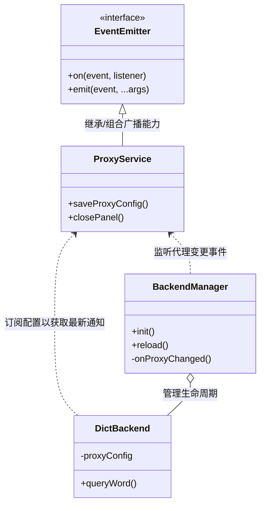

# SPEC-00029: 精简斜线命令 - 移除 /proxy 入口并整合至配置 UI

## 1. 背景与目标
目前网络代理配置通过 `/proxy` 斜线命令进入。为了提供更直观的用户体验并精简命令列表，我们计划将代理配置入口直接集成到需要网络环境的“离线词典下载”界面中，并删除 `/proxy` 这一全局命令。

### 1.1 目标
- 在“离线词典配置”界面（`dict-config.html`）提供明显的代理设置超链接。
- 彻底移除 `/proxy` 斜线命令，减少主搜索框的命令堆积。
- 确保代理配置更改后，后台服务能实时重载配置并生效。

## 2. 设计细节

### 2.1 UI 整合 (已初步实现，继续保留)
由于 `dict-config.html` 已经在顶部包含了一个绿色 Notice 区域及其 `#linkProxy` 超链接，我们将确认并维持这一设计：
- **位置**：表单顶部，紧随标题下方。
- **样式**：采用 Notice 警告框样式，绿色背景，黑色文本，包含带下划线的锚点。

  <h4 style="margin-top: 0; font-size: 14px; color: #586069;">UI 效果预览</h4>
  

    🌐
    

      <strong style="color: #0366d6; display: block; margin-bottom: 2px;">网络代理：</strong>
      如遇下载缓慢或失败，请尝试 <a href="#" style="color: #166534; font-weight: 600; text-decoration: underline;">配置全局代理</a>。
    

  

### 2.2 核心架构变更与广播机制 (重写)
在重构后，系统由“命令式驱动”转变为“事件驱动”，以解除渲染进程与主逻辑之间的直接耦合。

#### 类图 (Architecture)

#### 架构变更点：
1. **去智化 `preload.js`**：取消了 `preload.js` 在 `window.openProxyConfigPanel()` 回调中手动执行 `BackendManager.reload()` 的逻辑。`preload.js` 现在仅作为一个 UI 路由，不再感知配置与后端的绑定逻辑。
2. **事件源中心化 (`ProxyService`)**：`ProxyService` 负责维护代理状态并在配置变动（保存/关闭面板）时发出 `PROXY_CONFIG_CHANGED` 广播。
3. **主动依赖 (`DictBackend` & `BackendManager`)**：`BackendManager` 或正在工作的词典后端现在需要感知 `ProxyService` 指送的事件，从而实现自我更新或即时重载，保持代理状态同步。

### 2.3 逻辑处理流
1. **渲染进程 (`dict-renderer.js`)**：
   - 监听 `#linkProxy` 的点击事件。
   - 调用 `window.parent._dictAPI.openProxyConfig()`。
2. **后端支撑 (`src/backends/dict/index.js`)**：
   - `_dictAPI` 暴露 `openProxyConfig()` 函数。
   - 该函数调用主窗口环境下的 `window.openProxyConfigPanel()`。
3. **主入口 (`preload.js`)**：
   - `window.openProxyConfigPanel()` 注入存放 `proxy-config.html` 的 iframe。
   - **[变更点]** 面板关闭后不再执行回调，仅仅是纯粹的 UI 卸载。
4. **事件闭环**：
   - `ProxyService` 发出 `proxy-changed` 广播 -> `BackendManager` 监听到 -> 执行 `this.reload()`，将最新的代理参数同步至各个翻译子模块。

### 2.3 命令卸载流程
- **`src/commands/index.js`**：移除 `const proxyCommand = require('./proxy.js')` 以及 `COMMANDS` 数组中的 `proxyCommand`。
- **文件系统**：删除 `src/commands/proxy.js`（彻底移除该命令的逻辑定义）。

## 3. 测试重点
- [ ] 确保点击“配置全局代理”链接能成功弹出代理设置浮窗。
- [ ] 验证在代理浮窗中修改并保存配置后，返回词典下载页时，下载操作能正确使用新代理（即后端已成功 reload）。
- [ ] 验证输入 `/` 时，命令列表中不再出现 `/proxy` 命令。
- [ ] 验证 `/mode` -> 选择 `离线词典` 被引导至配置页时，代理引导入口依然有效。

## 4. 后续规划
- 在后续迭代中，计划为 **Ollama** 和 **LibreTranslate** 的配置界面添加类似的代理入口链接，确保各个后端都能方便地进行网络调试。
