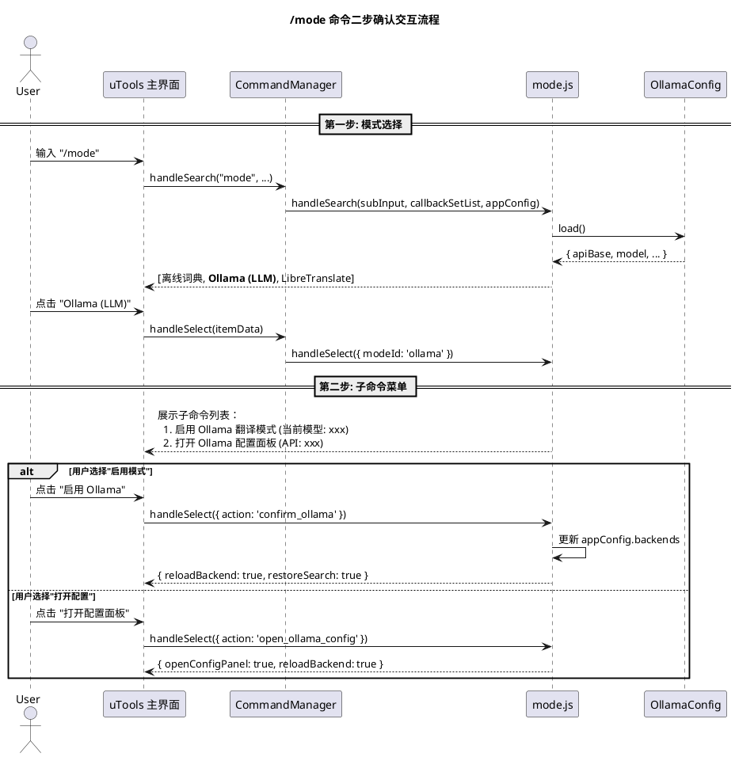
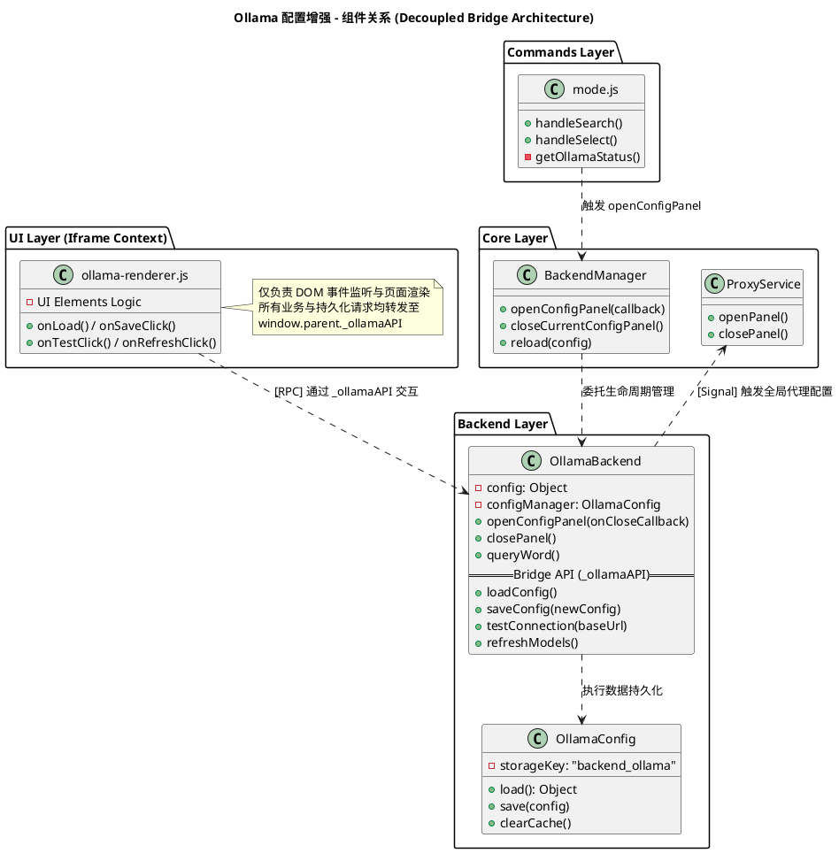
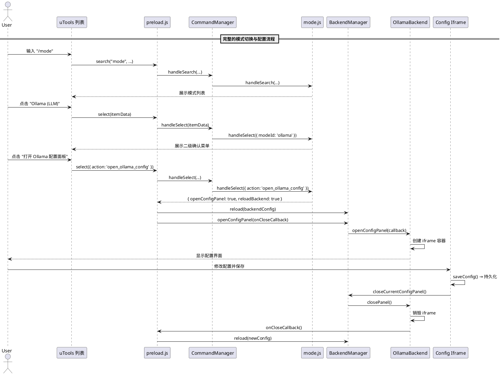

# SPEC-00030: 增强 Ollama 配置界面 - 子命令导航与综合配置面板

## 1. 背景与目标

### 1.1 现状分析
当前 `/mode` 命令中选择 Ollama 模式时，直接切换后端且立即生效。Ollama 配置面板虽然已具备 API Base URL、API Key、模型名称和提示词等字段，以及代理管理区域（状态指示灯、开关、全局配置链接），但以下交互体验仍有优化空间：

- **配置入口隐蔽**：原有设计下，配置面板依赖于后端查询报错或未就绪状态触发，已就绪用户难以快速修改。
- **架构耦合度**：原有实现中 `preload.js` 部分感知了后端关闭逻辑，需要通过重构确保 `preload.js` 回归「薄引导层」职责，实现对具体后端实现的「零感知」。

### 1.2 目标
1. **子命令导航**：在 `/mode` 选择 Ollama 后，展示二级子命令菜单，将「启用模式」与「打开配置面板」组织为同级操作入口，方便用户在切换模式时也能快捷访问配置。
2. **配置面板直达**：无论 Ollama 是否已就绪，用户始终可通过子命令菜单快速进入配置界面修改参数。
3. **综合配置面板**：确保面板内 API URL/Key、代理管理区域（状态显示、开关、全局配置跳转）的交互逻辑完善可靠。

## 2. 核心设计

### 2.1 子命令导航 (Mode Sub-Commands)

#### 2.1.1 交互流程



#### 2.1.2 子命令列表内容

当用户在 `/mode` 列表中点击 Ollama 选项后，`mode.js` 的 `handleSelect` 不直接切换后端，而是通过 `callbackSetList` 展开子命令菜单，将「启用模式」和「打开配置」组织为同级入口：

| # | 列表项标题 | 描述信息 | 触发动作 |
|---|-----------|---------|---------|
| 1 | `确认启用 Ollama 翻译模式` | `当前模型: ${modelName}` | `action: 'confirm_ollama'` → 写入配置并切换后端 |
| 2 | `打开 Ollama 配置面板` | `API: ${apiBase}` | `action: 'open_ollama_config'` → 打开配置 iframe |

#### 2.1.3 关键逻辑

```javascript
// mode.js - handleSelect 核心判断逻辑
handleSelect(itemData, appConfig, callbackSetList) {
    // 首次点击 Ollama 且无 action → 展开子命令菜单
    if (itemData.modeId === 'ollama' && !itemData.action) {
        const configManager = new OllamaConfig();
        const config = configManager.load();
        const modelName = config.model || '未选择模型';
        const apiBase = config.apiBase || '未配置地址';

        callbackSetList([
            {
                title: '确认启用 Ollama 翻译模式',
                description: `当前模型: ${modelName}`,
                isCommandContext: true,
                commandTrigger: 'mode',
                modeId: 'ollama',
                action: 'confirm_ollama'
            },
            {
                title: '打开 Ollama 配置面板',
                description: `API: ${apiBase}`,
                isCommandContext: true,
                commandTrigger: 'mode',
                modeId: 'ollama',
                action: 'open_ollama_config'
            }
        ]);
        return { disableClear: true };
    }

    // 处理子操作
    if (itemData.action === 'confirm_ollama') { ... }
    if (itemData.action === 'open_ollama_config') { ... }
}
```

### 2.2 Ollama 配置面板 (Config Panel)

#### 2.2.1 面板结构

配置面板以 iframe 方式嵌入，由 `OllamaBackend.openConfigPanel()` 负责挂载与销毁。面板内部分为三个功能区域：

<div style="border: 1px solid #e1e4e8; border-radius: 6px; padding: 0; background-color: #ffffff; margin-bottom: 20px; max-width: 520px;">
<div style="padding: 16px 20px; border-bottom: 1px solid #e1e4e8;">
<strong style="font-size: 16px; color: #2563eb;">Ollama 配置</strong>
<span style="float: right; font-size: 12px; color: #586069; border: 1px solid #e1e4e8; border-radius: 4px; padding: 2px 8px;">关闭</span>
</div>
<div style="padding: 16px 20px;">
<div style="font-size: 11px; font-weight: 600; color: #64748b; margin-bottom: 10px; letter-spacing: 0.05em;">接口设置</div>
<div style="font-size: 13px; font-weight: 500; color: #1e293b; margin-bottom: 4px;">API Base URL</div>
<table style="width: 100%; border-collapse: collapse; margin-bottom: 10px;"><tr>
<td style="vertical-align: top;"><div style="padding: 8px 10px; border: 1px solid #e1e4e8; border-radius: 6px; font-size: 13px; color: #475569; background-color: #fafbfc;">http://127.0.0.1:11434/v1</div></td>
<td style="width: 80px; padding-left: 8px; vertical-align: top;"><span style="display: block; text-align: center; padding: 8px; border: 1px solid #e1e4e8; border-radius: 6px; font-size: 12px; font-weight: 500; color: #1e293b; background-color: #ffffff;">测试连接</span></td>
</tr></table>
<div style="font-size: 13px; font-weight: 500; color: #1e293b; margin-bottom: 4px;">API Key (可选)</div>
<div style="padding: 8px 10px; border: 1px solid #e1e4e8; border-radius: 6px; font-size: 13px; color: #475569; background-color: #fafbfc; margin-bottom: 10px;">ollama</div>
<div style="font-size: 13px; font-weight: 500; color: #1e293b; margin-bottom: 4px;">模型 (Model)</div>
<table style="width: 100%; border-collapse: collapse; margin-bottom: 16px;"><tr>
<td style="vertical-align: top;"><div style="padding: 8px 10px; border: 1px solid #e1e4e8; border-radius: 6px; font-size: 13px; color: #475569; background-color: #fafbfc;">▾ llama3</div></td>
<td style="width: 36px; padding-left: 8px; vertical-align: top;"><span style="display: block; text-align: center; padding: 8px; border: 1px solid #e1e4e8; border-radius: 6px; font-size: 13px; color: #586069; background-color: #ffffff;">🔄</span></td>
</tr></table>
<div style="font-size: 11px; font-weight: 600; color: #64748b; margin-bottom: 10px; letter-spacing: 0.05em;">代理设置</div>
<div style="background-color: #f1f5f9; border-radius: 8px; padding: 12px 14px; margin-bottom: 16px;">
<table style="width: 100%; border-collapse: collapse;"><tr>
<td style="vertical-align: middle;">
<div style="font-size: 13px; font-weight: 500; color: #1e293b;">⚪ Ollama 代理未开启</div>
<div style="font-size: 11px; color: #64748b; margin-top: 2px;">启用后将使用全局代理转发请求</div>
</td>
<td style="text-align: right; vertical-align: middle;">
<a href="#" style="color: #2563eb; font-size: 12px; font-weight: 500; text-decoration: underline;">全局代理设置</a>
<span style="margin-left: 10px; font-size: 12px; color: #94a3b8;">🔘 OFF</span>
</td>
</tr></table>
</div>
<div style="font-size: 11px; font-weight: 600; color: #64748b; margin-bottom: 10px; letter-spacing: 0.05em;">提示词与参数</div>
<div style="font-size: 13px; font-weight: 500; color: #1e293b; margin-bottom: 4px;">System Prompt</div>
<div style="padding: 10px; border: 1px solid #e1e4e8; border-radius: 6px; font-size: 13px; color: #475569; background-color: #fafbfc; min-height: 50px;">你是一个专业的翻译助手。请将以下文本翻译为${target_lang}。只输出翻译结果，不要输出任何解释说明。</div>
</div>
<div style="padding: 12px 20px; border-top: 1px solid #e1e4e8;">
<span style="display: block; text-align: center; padding: 8px; border-radius: 6px; font-size: 13px; font-weight: 600; color: #ffffff; background-color: #2563eb;">保存并应用</span>
</div>
</div>

#### 2.2.2 代理设置区域

Ollama 配置面板提供独立的代理开关，用于控制 Ollama 请求是否经过全局代理转发。此开关不影响全局代理的启用状态，仅作用于 Ollama 后端：

| 组件 | 功能 | 实现方式 |
|------|------|---------|
| **Ollama 代理开关** | 控制 Ollama 请求是否使用全局代理 | Toggle switch，保存至 `OllamaConfig.useProxy` |
| **状态提示** | 开启时显示全局代理地址，关闭时提示「直连」 | 从 `appConfig.proxy` 读取地址展示 |
| **全局代理设置链接** | 跳转到全局代理配置面板 | 调用 `window.parent.openProxyConfig()` |

> [!NOTE]
> Ollama 通常运行在本地 (127.0.0.1)，经过代理反而可能导致连接失败。因此代理开关默认关闭，仅在 Ollama 部署于远程或需要穿透网络时手动开启。

#### 2.2.3 接口设置区域

| 字段 | 控件类型 | 说明 | 默认值 |
|------|---------|------|-------|
| API Base URL | 文本框 + 「测试连接」按钮 | OpenAI 兼容的 API 基础地址 | `http://127.0.0.1:11434/v1` |
| API Key | 文本框 (明文) | 可选的认证密钥 | `ollama` |
| Model | 下拉列表 + 「🔄 刷新」按钮 | 从 API 拉取可用模型列表供选择 | 空 |

#### 2.2.4 连接测试与模型刷新

**测试连接**按钮位于 API Base URL 输入框右侧，触发对 Ollama `/api/tags` 端点的 GET 请求：
- 连接成功时：在状态栏显示成功信息和发现的模型数量。
- 连接失败时：根据 Ollama 代理开关状态给出差异化的排错提示。

**模型刷新**按钮（🔄）位于模型下拉列表右侧，点击后请求 `/api/tags` 获取模型列表并填充下拉选项。若当前已有选中模型则保持选中状态，否则自动选中首个模型。

### 2.3 架构关系图



### 2.4 信号流与 preload.js 的职责边界

`preload.js` 在整个流程中仅负责信号中转，不包含具体的 UI 创建或业务逻辑：



### 2.5 preload.js 核心变更点

为了确保配置界面的平滑调起和关闭，`preload.js` 需要在主入口和选择逻辑中进行以下针对性适配：

#### 2.5.1 统一界面清理 (Generic UI Cleanup)
在 `enter` (关键字进入) 和 `search` (用户输入) 的生命周期起点，`preload.js` 需要确保任何之前挂载的配置面板已经被销毁。为了保持解耦，`preload.js` **不应感知具体后端的关闭函数**，而是调用核心服务提供的统一销毁接口。

这将通过 `BackendManager` 提供的统一方法或直接在切换搜索词时，利用 `CoreService` 管理的组件状态进行集中清理，从而确保：
- 搜索词变更时，任何悬浮的 iframe 配置层被自动移除。
- `preload.js` 保持纯净，仅保留对 `BackendManager` 等管理类的调用，而非具体后端逻辑的直接映射。

```javascript
// preload.js - search 入口 (概念示例)
search: function (action, searchWord, callbackSetList) {
    // 统一清理：移除当前挂载的所有动态 UI 容器
    BackendManager.closeCurrentConfigPanel(); 
    // ...
}
```

#### 2.5.2 信号响应与解耦设计 (Decoupled Signal Routing)
`preload.js` 对配置面板的处理应基于「抽象信号」而非「具体实现」。当捕获到 `openConfigPanel` 信号时，职责分工如下：

- **Preload 职责**：识别信号名，并将其透明转发给 `BackendManager.openConfigPanel()`。
- **BackendManager 职责**：根据当前激活的后端类型（Ollama, LibreTranslate 等），动态拉起对应的 HTML 界面。
- **自愈重载流程**：配置面板关闭后触发的回调应由 `preload.js` 处理，但其内部 logic 仅为刷新配置缓存并调用 `BackendManager.reload()`。

---

## 3. 受影响的文件清单

| 文件路径 | 改动类型 | 说明 |
|---------|---------|------|
| `src/commands/mode.js` | **已实现** | 二步确认逻辑已在 `handleSelect` 中实现 |
| `src/backends/ollama/ollama-prompt-config.html` | **已实现** | 包含接口设置、代理管理、提示词区域 |
| `src/backends/ollama/ollama-renderer.js` | **已实现** | 包含完整的UI交互逻辑（加载/保存配置、测试连接、代理状态管理） |
| `src/backends/ollama/config.js` | **已实现** | `OllamaConfig` 类提供 apiBase/apiKey/model/prompt/temperature 管理 |
| `src/backends/ollama/index.js` | **已实现** | `OllamaBackend.openConfigPanel()` 提供 iframe 挂载/销毁 |
| `src/core/backend_manager.js` | **已实现** | `openConfigPanel()` 委托至当前活跃后端 |
| `preload.js` | **已实现** | `select` 处理 `openConfigPanel` 信号并触发 reload |

## 4. 设计决策与取舍

### 4.1 子命令导航的设计动机
> [!IMPORTANT]
> 在 `/mode` 中点击 Ollama 后展开子命令菜单，而非直接切换后端。这是为了：
> 1. 将配置面板入口放在模式选择的自然路径上——用户选择 Ollama 时，既可以启用模式，也可以直达配置，无需通过「未就绪→自动弹出配置」的间接路径。
> 2. 子命令菜单是一种**导航组织模式**，而非安全防误触机制；核心价值是让配置面板成为 Ollama 模式的一等公民入口。

### 4.2 Ollama 专属代理开关
Ollama 配置面板提供独立于全局配置的代理开关（`OllamaConfig.useProxy`），而非直接操作全局代理状态。理由：
- Ollama 通常运行在 `127.0.0.1`，全局代理可能拦截本地请求导致连接失败，因此默认关闭。
- 当 Ollama 部署在远程服务器时，用户可以手动开启此开关以使用全局代理转发。
- 全局代理的具体参数（类型、地址、端口）仍由 `ProxyService` 统一管理，通过「全局代理设置」链接跳转配置。

### 4.3 iframe 沙箱通信模式 (UI Decoupling)
配置面板运行在独立的 iframe 中，为了实现完全的解耦，通信机制设计如下：

- **向上通信 (Closing the Panel)**：
    - **职责归属**：**具体的后端实现类 (如 `OllamaBackend`)** 负责实现具体的 `closePanel()` 方法，包含移除 DOM、解绑定全局方法、复原子窗口高度等操作。
    - **解耦接口**：`BackendManager` 在全局暴露一个通用的关闭入口（如 `window._closeConfigPanel`）。iframe 内部统一通过调用 `window.parent._closeConfigPanel()` 通知父级容器。
    - **分发机制**：`BackendManager` 接收到调用后，由于其持有当前活跃后端的实例，会将其请求分发给 `activeBackend.closePanel()` 执行的具体逻辑。这种模式确保了 `preload.js` 保持纯净，同时也隐藏了具体的后端实现名称。

- **数据持久化与业务操作 (Persistence & API Bridge)**：
    - **职责归属**：**`OllamaBackend`** 在打开面板时，在 `window` 对象上挂载一个领域专用的桥接对象 `window._ollamaAPI`。
    - **接口封装**：该对象封装了所有 Iframe 需要的功能，包括 `loadConfig()`, `saveConfig(config)`, `testConnection(url)`, `refreshModels()` 等。
    - **安全性与解耦**：Iframe 内部脚本 (`ollama-renderer.js`) **禁止直接访问 `window.parent.utools`** 或执行底层 `dbStorage` 操作。它必须且只能通过 `window.parent._ollamaAPI` 来请求宿主侧执行持久化或网络请求。
    - **设计一致性**：这种模式与插件中其他模块（如 `_dictAPI`）的实现风格保持一致，确保了 iframe 仅作为“无状态渲染层”存在，而核心业务逻辑和数据安全管理由 Backend 类掌控。

## 5. 测试设计

### 5.1 单元测试
| 测试用例 | 验证点 |
|---------|-------|
| `mode.js` 二级菜单展示 | 点击 Ollama 选项后 `callbackSetList` 被调用，包含 2 个子项且 `action` 字段正确 |
| `mode.js` 确认启用 | `action: 'confirm_ollama'` 正确更新 `appConfig.backends` 并返回 `reloadBackend` 信号 |
| `mode.js` 打开配置 | `action: 'open_ollama_config'` 返回 `openConfigPanel` 信号 |
| `OllamaConfig` 默认值 | 未存储数据时返回完整默认配置 |
| `OllamaConfig` 持久化 | 保存后重新加载数据一致 |

### 5.2 集成测试
| 测试用例 | 验证点 |
|---------|-------|
| 配置面板生命周期 | iframe 容器创建 → 显示 → 关闭后 DOM 被完全移除 |
| 代理状态同步 | 全局代理开启时，Ollama 面板内指示灯为绿色、文本正确 |
| 连接测试 | 本地 Ollama 启动时测试返回成功并填充模型列表 |
| 配置保存回调 | 保存后 `onCloseCallback` 触发 `BackendManager.reload()` |

### 5.3 端到端测试
- [ ] 输入 `/mode` → 点击 Ollama → 验证出现二级菜单
- [ ] 选择「确认启用」 → 验证后端切换为 Ollama 且输入框恢复
- [ ] 选择「打开配置」 → 验证配置面板正确显示且字段预填充
- [ ] 在配置面板修改 API Base → 保存 → 关闭 → 再次打开验证持久化
- [ ] 代理开关切换 → 保存 → 验证 `appConfig.proxy.enabled` 状态一致
- [ ] 点击「前往全局配置」 → 验证代理配置面板正确拉起

## 6. 验收标准

1. 在 `/mode` 列表中点击 Ollama 后，展示子命令菜单，包含「启用 Ollama」和「打开配置面板」两个入口。
2. 子菜单中的描述信息能正确反映当前已保存的模型名称和 API 地址。
3. 配置面板能正确加载和保存 API Base URL、API Key、模型名称和 System Prompt。
4. 代理管理区域能正确反映全局代理的启用状态，开关操作在保存后生效。
5. 「前往全局配置」按钮能正确调起 ProxyService 的全局代理配置面板。
6. 「测试连接」按钮能正确发起请求并反馈结果（包含根据代理状态差异化的错误提示）。
7. 面板关闭后，iframe DOM 被完全清理，高度恢复，焦点正确归还。
