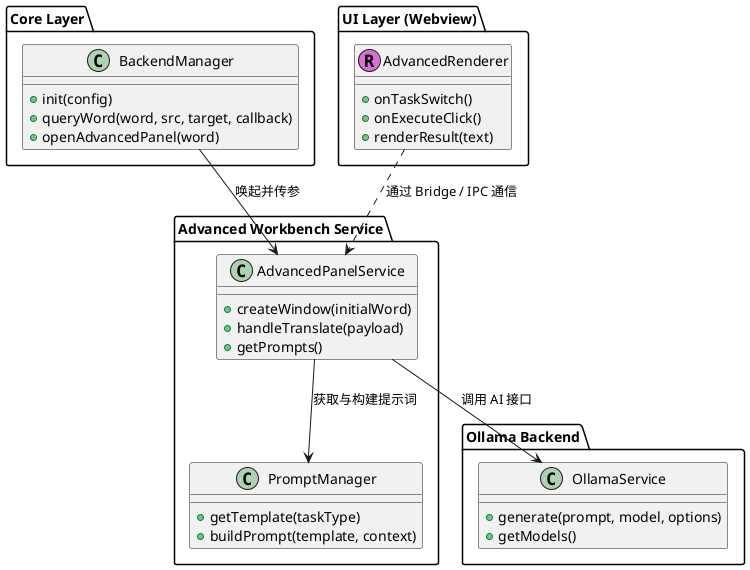

# Spec-00035: Ollama 进阶翻译中心 (Advanced translation center)

## 1. 背景与目标
目前插件的 Ollama 模式仅提供基础翻译。为了充分发挥 LLM 的潜力，我们需要一个功能更丰富的“进阶翻译面板”。
该面板将作为一个功能中心，不仅提供翻译，还支持内容润色、语法分析和场景用例展示。它将无缝集成在所有翻译模式（如词典模式、在线翻译）的结果列表中。

## 2. 用户体验设计 (UX)

### 2.1 入口逻辑
在所有翻译模式的结果项底部，追加一个固定列表项：
*   **标题**: `✨ 使用 Ollama 进阶翻译...`
*   **描述**: `基于 AI 提供深度润色、语法剖析与多风格翻译`
*   **动作**: 点击后隐藏 uTools 主窗口，弹出“进阶翻译面板” (Webview/Iframe)。

### 2.2 面板布局 (基于用户手绘原型)

下述代码块定义了进阶面板的最终 UI 结构和样式参考：

  <!-- 顶部工具栏 -->
  <header class="toolbar">
    
Ollama 进阶翻译

    

      
选择语言 (自动检测) ▾

      
选择模型 (llama3) ▾

      <button class="btn-execute">执行翻译</button>
      ⚙️
    

  </header>

  

    <!-- 左侧功能列表 -->
    <aside class="sidebar">
      
进阶翻译

    </aside>

    <!-- 三段式主编辑区 -->
    <main class="editor-main">
      <section class="pane result-pane">
        <label>翻译结果</label>
        
AI 生成的结果将在这里流式显示...

      </section>

      <section class="pane source-pane">
        <label>原文 (可编辑)</label>
        
输入或精修待翻译原文...

      </section>

      <section class="pane prompt-pane">
        <label>提示词 (可编辑)</label>
        
你是一位专业的翻译官...

      </section>
    </main>
  

  
  <footer class="footer-status">
    🟢 Ollama 已连接 | Token: 0 | Status: Ready
  </footer>

#### 左侧侧边栏 (Sidebar)
*   垂直列表形式，支持切换不同 AI 任务（首期仅包含核心翻译）：
    1.  **进阶翻译**: 默认功能，侧重含义准确，支持用户手动调整提示词。

#### 主内容区 (Main View) - 三段式
1.  **翻译结果 (Result Box)**: 位于上方。显示 AI 生成的内容，支持 Markdown 渲染。
2.  **原文 (Source Box - 可编辑)**: 位于中间。用户可以对带入的文本进行精修。
3.  **提示词 (Prompt Box - 可编辑)**: 位于下方。显示当前功能对应的 Prompt 模板，允许用户手动微调。

## 3. 技术实现 (Technical Details)

### 3.1 架构设计
插件通过 Bridge 模式实现 UI 与逻辑解耦，进阶面板将作为独立模块集成。

*   `BackendManager`: 负责拦截查询动作，在 `ViewPresenter` 构建列表时动态注入进阶选项。
*   `AdvancedPanelService`: 新增服务，管理 Webview 的生命周期及其与 `OllamaService` 的通信。
*   `PromptManager`: 管理各功能的 Prompt 模板，并根据“语言”、“原文”等动态生成初始提示词。

### 3.2 核心 Prompt 模板示例
*   **进阶翻译**: `你是一位专业的翻译官和语言学家。请根据语境，将以下文本准确且自然地翻译成 [TARGET_LANG]。\n\n目标语言：[TARGET_LANG]\n待翻译文本：[TEXT]`

### 3.3 面板文件结构
*   `src/backends/ollama/advanced-panel.html`: UI 结构。
*   `src/backends/ollama/advanced-renderer.js`: 处理用户输入、按钮点击和流式显示。
*   `src/backends/ollama/advanced-service.js`: 后端桥接，调用 Ollama API。

## 4. 关键交互 (Interaction)
1.  **进入**: 携带当前搜索词。
2.  **切换功能**: 自动更新 "Prompt Box" 内容。
3.  **编辑**: 用户修改原文或 Prompt。
4.  **执行**: 点击“翻译”按钮。
    *   显示 Loading 状态。
    *   调用 `ollama.generate` 或 `ollama.chat`。
    *   (可选) 支持 Stream 流式输出，实时显示结果。

## 5. 处理异常
*   **模型未启动/离线**: 在面板页眉显示红色状态灯及错误信息。
*   **网络错误**: 提示连接超时。
*   **空输入**: 禁用“翻译”按钮。

## 6. 单元测试设计 (Unit Test Design)
在代码实现之前，需先定义并实现以下核心单元测试，确保逻辑正确：

### 6.1 PromptManager 测试
*   **用例 1 (变量替换)**: 验证 `buildPrompt` 是否能正确将 `[TARGET_LANG]` 和 `[TEXT]` 替换为实际入参。
*   **用例 2 (语言兼容性)**: 验证在强制切换源语言或目标语言时，生成的提示词是否符合预期。

### 6.2 AdvancedPanelService 测试
*   **用例 1 (上下文传递)**: 模拟 `openAdvancedPanel` 调用，验证搜索词是否能准确传递给 UI 初始化函数。
*   **用例 2 (消息桥接回路由)**: 模拟前端点击“执行翻译”，验证 Service 是否正确解构 `payload` 并调用后台 `OllamaService.generate`。

### 6.3 列表注入测试
*   **用例 1 (进阶入口追加)**: 验证在 `ViewPresenter` 中是否能在普通结果后稳定追加进阶翻译选项。

## 7. 测试用例 (Manual Test Cases)
1.  **跨模式集成**: 验证在“词典模式”下是否能正确显示进阶入口。
2.  **原文编辑**: 在面板修改原文后点击翻译，确保 AI 接收到的是修改后的内容。
3.  **提示词自定义**: 手动修改提示词（如加入“用古诗风格翻译”），验证结果是否符合预期。
