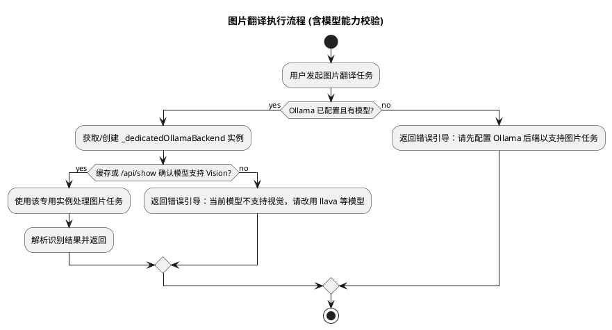

# Spec-00038: 基于 Ollama 多模态模型的图片翻译与文字提取

## 1. 背景与目标
目前插件主要支持文本翻译。为了扩展插件能力，本方案旨在利用 Ollama 的多模态能力（如 `llava` 等模型），实现“截图即翻译”的功能：
1.  **自动识别**：当用户截图后打开 uTools，插件应能识别剪贴板图片并建议触发翻译。
2.  **Ollama 驱动**：仅支持 Ollama 后端执行图片视觉任务。
3.  **列表展示**：识别并翻译后的结果以 uTools 标准列表项形式展示，保持当前工作流一致。

## 2. 详细设计

### 2.1 指令定义 (`plugin.json`)
在 `features` 数组中，为 `dict` 模式添加 `img` 类型的命令，以便 uTools 在剪贴板有图片时进行推荐。
```json
{
  "type": "img",
  "label": "图片翻译"
}
```

### 2.2 输入处理 (`preload.js`)
增强 `window.exports.dict.args.enter` 的逻辑：
1.  判断 `action.type === 'img'`。
2.  若为图片，直接从 `action.payload`（DataURL 格式）获取数据。
3.  显示“正在识别图片...”的 Loading 状态。
4.  调用 `BackendManager.queryImage(payload, ...)`。

### 2.3 接口定义 (`src/core/backend_manager.js`)
1.  **路径隔离**：在 `BackendManager` 类中新增 `queryImage` 方法。
2.  **直接调度与能力预检**：
    *   **步骤 A**：获取/创建专用的 Ollama 实例。
    *   **步骤 B (能力校验)**：在发起重量级图片传输前，优先检查当前模型是否具备 `vision` 能力（可通过缓存或调用 Ollama `/api/show` 接口获取模型描述）。
3.  **智能引导**：若检测到模型不支持视觉（如 `llama3`），则直接拦截并返回引导信息：“当前模型不支持图片识别，请配置 llava 等具备 Vision 能力的模型”。

#### 流程活动图 (Activity Diagram)




### 2.4 后端实现 (`src/backends/ollama/index.js`)
1.  实现 `queryImage(imageData, callback, progressCallback)`：
    *   构造符合 OpenAI Vision API 标准的 `messages` 结构。
    *   `content` 字段改为数组：包含一个 `text` 类型（提示词）和一个 `image_url` 类型（其中 `url` 包含原封不动的 DataURL）。
2.  **具体请求负载 (Payload) 示例**：
    ```json
    {
      "model": "llava", 
      "messages": [
        {
          "role": "user",
          "content": [
            { "type": "text", "text": "[VISION_PROMPT]" },
            { "type": "image_url", "image_url": { "url": "data:image/png;base64,..." } }
          ]
        }
      ],
      "stream": false
    }
    ```
3.  **Prompt 获取**：调用 `PromptManager.getPrompt('vision', { targetLang: '...' })`。

### 2.5 提示词管理 (`src/backends/ollama/prompt-manager.js`)
新增 `vision` 任务模板，专门用于指导多模态模型执行 OCR + 翻译任务。

### 2.6 UI 渲染 (`src/utils/view_presenter.js`)
1.  识别结果通常为长文本，复用 `ViewPresenter.buildResultItems`。
2.  如果识别出的文字过多，考虑在列表项中进行智能截断或提示进入“进阶翻译”查看全文。

## 3. 技术难点与考量
*   **模型兼容性**：用户必须在 Ollama 中拉取了支持视觉的模型（如 `llava:7b`）。若模型不支持，接口会报错，需给出清晰的重试或更换模型建议。
*   **Base64 负载与预处理**：
    *   **问题**：高清截图的 Base64 字符串极大（>10MB），导致传输延迟和模型推理过载。
    *   **对策**：在上传前进行**客户端预处理**。
        *   **等比缩略**：强制将图片长边缩放至不超过 **1024px**。
        *   **格式压缩**：转换为 `image/jpeg` 并应用 `0.8` 的压缩质量。
        *   **效果**：将 Payload 控制在 500KB - 1MB 左右，显著提升系统响应速度。

## 5. 测试设计

为了确保图片翻译功能的稳定性，我们将从以下几个维度进行单元测试：

### 5.1 Prompt 管理测试 (`test/prompt_manager.test.js`)
*   **用例**：验证 `getPrompt('vision', { targetLangCode: 'en' })` 是否正确加载了视觉模板。
*   **用例**：验证 `[TARGET_LANG]` 占位符是否被替换为正确的语言名称。

### 5.2 后端请求测试 (`test/ollama_backend.test.js`)
*   **Mock 测试**：使用 `jest` 或 `sinon` 模拟网络请求，验证 `queryImage` 发送的请求负载（Payload）是否符合 OpenAI Vision 规范。
    *   检查 `content` 数组是否包含 `text` 和 `image_url`。
    *   检查 `image_url.url` 是否正确包含了 Base64 图片数据。
*   **异常处理**：模拟 Ollama 返回 404 或 400（模型不支持视觉时），验证后端能否捕获错误并返回友好的提示。

### 5.3 路由逻辑测试 (`test/backend_manager.test.js`)
*   **路由验证**：在 `activeBackend` 为 `DictBackend`（不支持视觉）时调用 `queryImage`，验证是否返回了预期的错误提示。
*   **转发验证**：在 `activeBackend` 为 `OllamaBackend` 时调用 `queryImage`，验证请求是否成功转发至后端。

### 5.4 UI 渲染测试 (`test/view_presenter.test.js`)
*   **长文本渲染**：模拟模型返回的多行提取结果，验证 `ViewPresenter` 能否将其清晰地呈现在 uTools 列表中。

## 6. 任务拆解
1.  [ ] 更新 `plugin.json` 增加 `img` 指令支持。
2.  [ ] 修改 `PromptManager` 增加 `vision` 视觉提示词模板。
3.  [ ] 在 `BackendManager` 中定义 `queryImage` 路由逻辑。
4.  [ ] 实现 `OllamaBackend.queryImage` 的多模态请求封装。
5.  [ ] 在 `preload.js` 中接入 `action.type === 'img'` 的分发逻辑。
6.  [ ] **编写单元测试** 并确保覆盖以上场景。
7.  [ ] 联调测试：验证从截图到列表显示翻译结果的完整链路。
