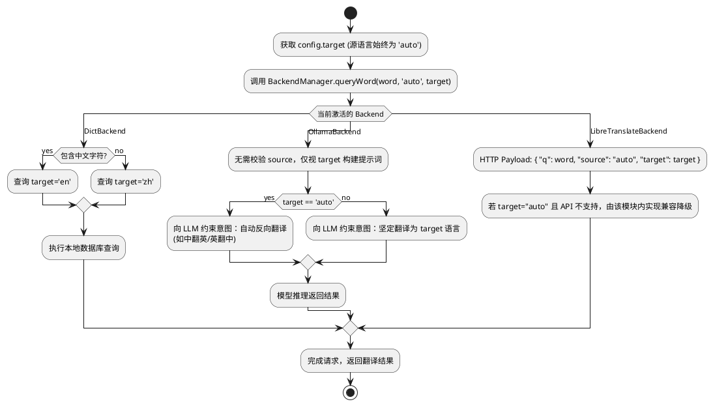

# Spec 00043: 语言设置斜线命令设计

## 1. 概述
当前翻译插件的源语言和目标语言依赖内容推断（中英文互译）。根据系统的多态后端架构，源语言 (`source`) 的强制设定对于各类核心翻译引擎（如 Ollama 及本地词典）并无实质意义且极易造成干预幻觉。
本设计的目的是引入精简版的单一全局语言指令 —— `/target` 斜线命令。允许用户为所有后端引擎配置全局持久化的**目标语言**，该静态配置将优先覆盖原有的目标语言探测机制，而源语言一律托管给后端的默认行为或大模型的自动识别。

## 2. 架构与数据流
1. **app_config.js**：负责维护和保存用户自定义目标语言配置的持久化状态。
2. **src/commands/language.js**：定义 UI 交互，基于预设的常见语言列表处理 `/target` 命令的选择事件。
3. **preload.js / 后端分发层**：仅从配置中抽取 `target`，原封不动地交由多态后端自行去解释和消费。

## 3. 详细设计

### 3.1 数据存储 (`app_config.js`)
- **默认状态**：在 `APP_CONFIG_DEFAULTS` 中增加缺省项（无需 source）：
  ```javascript
  translationLanguage: {
    target: 'auto'
  }
  ```
- **配置方法**：在 `AppConfig` 类中添加 `getTranslationTarget()` 和 `setTranslationTarget(targetCode)` 接口，以便支持安全的读写，并保证持久化写入 uTools 原生数据库。

### 3.2 命令交互层 (`src/commands/language.js`)
- **注册命令**：在 `src/commands/index.js` 中注册 `/target`（目标语言）入口。
- **列表数据**：新建命令处理模块，在其中定义统一的配置列表。显示项包含：自动推断 (auto)、简体中文 (zh)、英语 (en)、日语 (ja)、韩语 (ko)、法语 (fr)、西班牙语 (es)、俄语 (ru) 等。
- **操作响应**：当用户在界面中选择任意一种目标语言后：
  1. 获取所选项对应的标准语言代码。
  2. 更新 `app_config` 中的 `target` 值。
  3. 调用 `utools.showNotification` 在宿主界面通知用户更新成功。
  4. 清除或复原输入框内容，确保业务顺滑。

### 3.3 多态的后端推断逻辑 (Backend Polymorphism)
- 在 `preload.js` 层，放弃以往的前置拦截机制，只取目标语言配置，源语言固化为 `'auto'`。
- 调用签名如 `BackendManager.queryWord(word, 'auto', configTarget, ...)`。
- **多态处理策略**：每个后端自行定义如何处理 `target` 的 `'auto'` 状态：



## 4. 测试与验证
- **app_config.js 级测试**：验证默认状态能够正确载入配置；设置项修改后被妥善存储。
- **集成交互**：断言 `/from` 确实被彻底剔除或不存在；验证点击 `/target` 菜单响应流畅。
- **各引擎兼容测试**：在 target 被设置为 `ja` 的前提下，观测 Ollama Prompt 重构及 LibreTranslate HTTP payload 正确性。
