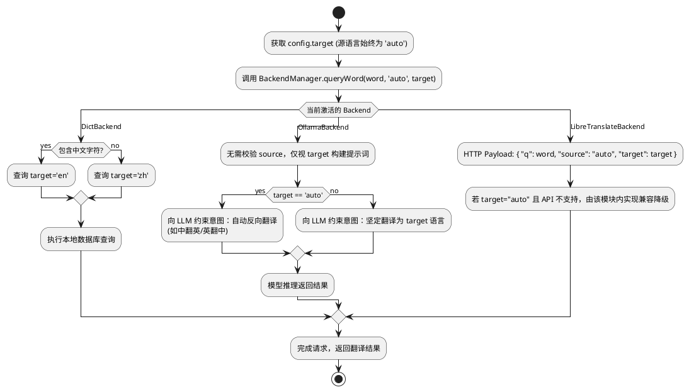

# Spec 00043: 语言设置斜线命令设计

## 1. 概述
当前翻译插件的源语言和目标语言依赖内容推断（中英文互译）。根据系统的多态后端架构，源语言 (`source`) 的强制设定对于各类核心翻译引擎（如 Ollama 及本地词典）并无实质意义且极易造成干预幻觉。
本设计的目的是引入精简版的单一全局语言指令 —— `/target` 斜线命令。允许用户为所有后端引擎配置全局持久化的**目标语言**，该静态配置将优先覆盖原有的目标语言探测机制，而源语言一律托管给后端的默认行为或大模型的自动识别。

## 2. 软件架构设计 (Software Architecture)

本指令基于重构后的命令系统流转，遵循 **ICommand** 插件化契约：

1. **CommandManager (Router)**：作为顶层网关，拦截 `/target` 关键字并路由至具体的指令处理器。
2. **TargetLanguageCommand (src/commands/target.js)**：实现具体的指令逻辑，负责呈现可选语言列表并处理状态更新。
3. **AppConfig (Data Layer)**：维护 `translationLanguage` 配置项，提供全局持久化支持。
4. **Signal Contract (Communication)**：指令执行后回传标准信号（如 `restoreSearch`），由 `preload.js` 响应并触发翻译界面刷新。

## 3. 详细设计

### 3.1 数据持久化 (`app_config.js`)
- **存储结构**：在 `APP_CONFIG_DEFAULTS` 中维护统一的语言偏好：
  ```javascript
  translationLanguage: {
    target: 'auto' // 缺省为自动探测反向翻译
  }
  ```
- **接口扩展**：在 `AppConfig` 类中封装 `getTranslationTarget()` 与 `setTranslationTarget(code)`，实现对 `utools.dbStorage` 的安全落盘。

### 3.2 指令交互实现 (`src/commands/target.js`)
遵循命令接口规范进行封装：

- **handleSearch(subInput, callbackSetList, appConfig)**：
  - 加载支持的语言字典（zh, en, ja, ko, fr, es, ru 等）。
  - 对比 `appConfig.translationLanguage`，为当前选中的语言标记 `🌟 (已设为目标)`。
  - 支持 `subInput` 对语言名称进行模糊过滤。
- **handleSelect(itemData, appConfig)**：
  1. 调用 `appConfig.setTranslationTarget(itemData.langCode)` 更新配置。
  2. 调用 `utools.showNotification` 提供 UI 反馈。
  3. 返回 `{ restoreSearch: true }` 信号，告知宿主重载翻译业务逻辑。

### 3.3 多态的后端推断逻辑 (Backend Polymorphism)
- 在 `preload.js` 层，放弃以往的前置拦截机制，只取目标语言配置，源语言固化为 `'auto'`。
- 调用签名如 `BackendManager.queryWord(word, 'auto', configTarget, ...)`。
- **多态处理策略**：每个后端自行定义如何处理 `target` 的 `'auto'` 状态：



## 4. 测试与验证
- **app_config.js 级测试**：验证默认状态能够正确载入配置；设置项修改后被妥善存储。
- **集成交互**：断言 `/from` 确实被彻底剔除或不存在；验证点击 `/target` 菜单响应流畅。
- **各引擎兼容测试**：在 target 被设置为 `ja` 的前提下，观测 Ollama Prompt 重构及 LibreTranslate HTTP payload 正确性。
