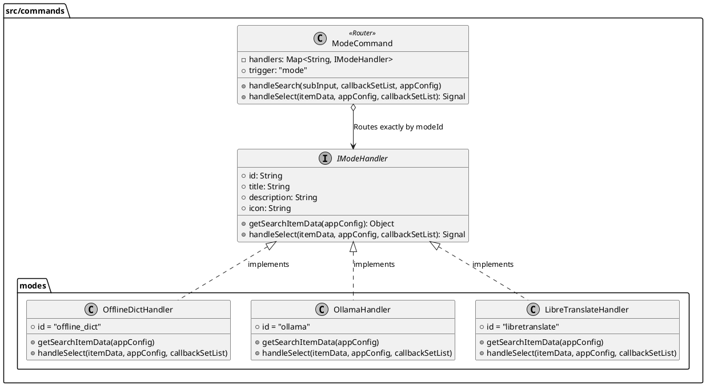

# Spec 00044: /mode 命令策略模式重构设计

## 1. 概述
当前插件的翻译模式切换命令(`/mode`)的控制器层 `src/commands/mode.js` 内部存在大量的 `if-else` 分支。由于它将离线词典 (offline_dict)、Ollama 和 LibreTranslate 的状态检测与多级子命令处理揉合在一起，导致代码冗长且不易维护。
本规范的目的是应用策略模式 (Strategy Pattern)，将不同的后端模式交互分离到各自独立的 Handler 文件中，解耦业务逻辑。主 `mode.js` 将仅作为路由转发层工作，实现高内聚和低耦合。

## 2. 架构设计

### 2.1 目录结构改造
我们在 `src/commands/` 目录下引入一个新的 `modes/` 文件夹用于存放各种后端的特定命令处理逻辑：

```text
src/commands/
├── index.js              # 各类主命令的入口
├── modes/                # 🆕 模式 Handler
│   ├── offline_dict.js     # 负责词典模式的逻辑
│   ├── ollama.js           # 负责 Ollama 模式的逻辑
│   └── libretranslate.js   # 负责 Libre API 模式的逻辑
├── mode.js               # 纯路由层
└── help.js               ...
```

### 2.2 IModeHandler 接口定义
每一个在 `modes` 目录下的 handler 都需要遵守并暴露以下的标准接口契约：



### 2.3 mode.js (Router) 重构
`mode.js` 的主要职责变化：
- **状态聚合**：在 `handleSearch` 中遍历所有 registered handlers 获取对应的 `getSearchItemData` 返回值，拼接出展示列表进行统一回调。
- **操作分发**：在 `handleSelect` 中提取出 `itemData.modeId`，转发给对应的 handler。
- 代码缩减：由于各类底层指令（如 `action: 'confirm_dict'`、状态常量等）都被移入对应的 handler 文件，`mode.js` 能够做到与具体的翻译服务解耦，新增后端不再需要改动 router（仅需在 handler 数组挂载即可）。

## 3. 具体执行步骤与兼容性处理

1. **分离线下逻辑**：将 `getDictStatus`, `getOllamaStatus`, `getLibreStatus` 等助手函数移动至对应 `modes/` 内的文件。
2. **提取业务方法**：依据旧版 `handleSelect` 将二级确认菜单及配置项保存的具体指令下沉并映射到 `handleSelect(itemData, ...)` 内部。
3. **副作用契约无缝对接**：由于 `Signal` (如 `{ reloadBackend: true, restoreSearch: true }` )机制未改变，且全局持久化 (uTools dbStorage 保存 `appConfig`) 的流程依然有效，渲染层的感知行为与改版前保持完全一致。
4. **清理遗留导入**：清理原先文件头部的多余 Import。

## 4. 验收与测试
- **白盒断言**：确认 `src/commands/mode.js` 行数大幅缩减且不存在任何硬编码后端识别 `if(modeId === '...')`。
- **黑盒运行**：
    - 输入 `/mode` 依然能够正常展示三个模式及正确状态词。
    - 点击 Ollama 触发 “确认启用”/“打开配置” 的二级状态正确无误。
    - `confirm_xx` 时能够成功切换活跃的后端，并在配置面板重载后不丢失设置。
