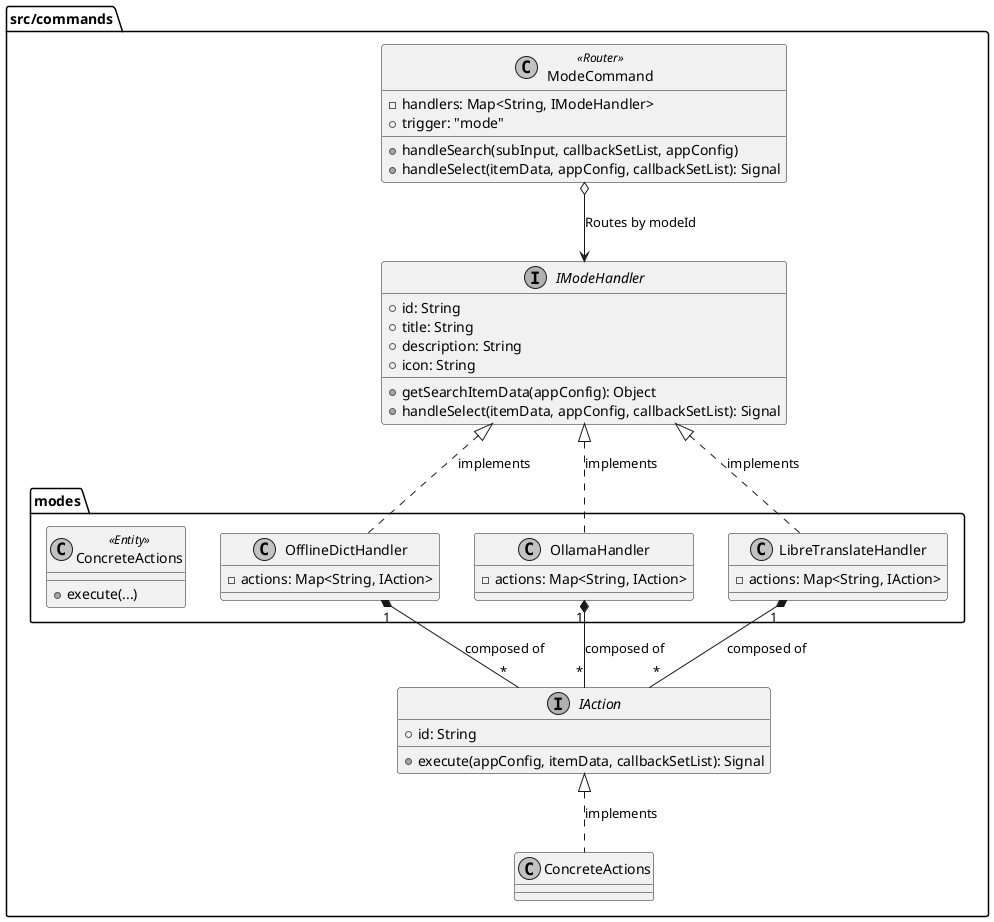
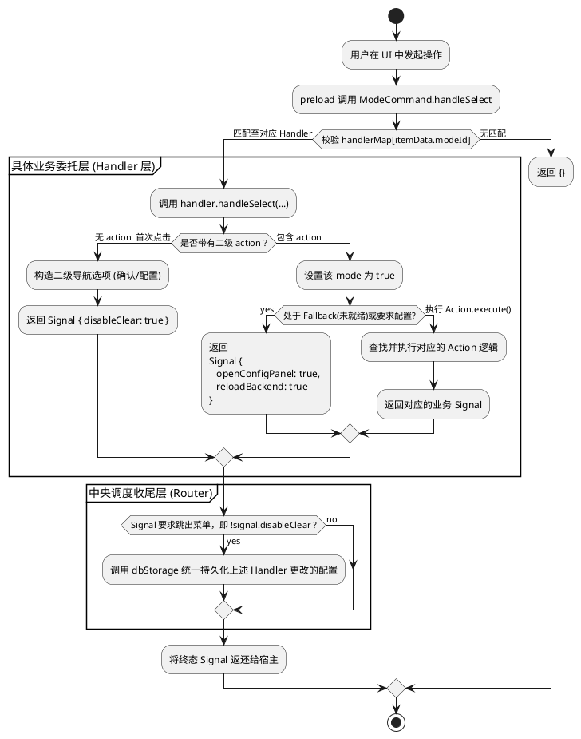

# Spec 00044: /mode 命令策略模式重构设计

## 1. 概述
当前插件的翻译模式切换命令(`/mode`)的控制器层 `src/commands/mode.js` 内部存在大量的 `if-else` 分支。由于它将离线词典 (offline_dict)、Ollama 和 LibreTranslate 的状态检测与多级子命令处理揉合在一起，导致代码冗长且不易维护。
本规范的目的是应用策略模式 (Strategy Pattern)，将不同的后端模式交互分离到各自独立的 Handler 文件中，解耦业务逻辑。主 `mode.js` 将仅作为路由转发层工作，实现高内聚和低耦合。

## 2. 架构设计

### 2.1 目录结构改造
我们在 `src/commands/` 目录下引入一个新的 `modes/` 文件夹用于存放各种后端的特定命令处理逻辑：

```text
src/commands/
├── index.js              # 各类主命令的入口
├── modes/                # 🆕 模式 Handler
│   ├── offline_dict.js     # 负责词典模式的逻辑
│   ├── ollama.js           # 负责 Ollama 模式的逻辑
│   └── libretranslate.js   # 负责 Libre API 模式的逻辑
├── mode.js               # 纯路由层
└── help.js               ...
```

### 2.2 IModeHandler 接口定义
每一个在 `modes` 目录下的 handler 都需要遵守并暴露以下的标准接口契约：



### 2.3 mode.js (Router) 的 `handleSelect` 拆分设计

#### 子模块 Handler (策略实现) 拆分清单表
在具体的设计流转中，从 `mode.js` 中抽出并原子化分工的子 Handler（严格对应上一节类图中的三个具体实现类）包含了：

- **`OfflineDictHandler`** (`src/commands/modes/offline_dict.js`): 承接状态判定，全权接管提取离线词典通过 `!itemData.action` 渲染的二级菜单逻辑及其关联的 **Action 列表**。
- **`OllamaHandler`** (`src/commands/modes/ollama.js`): 承接应用联通状态检查，全权接管提取 Ollama 首层点击时构建二级导航的逻辑及其关联的 **Action 列表**。
- **`LibreTranslateHandler`** (`src/commands/modes/libretranslate.js`): 承接 API 状态检查，全权接管提取 Libre 二级导航的构建逻辑及其关联的 **Action 列表**。

### 2.4 各 Handler 职责剥离明细 (Action 映射表)
为了确保重构不遗漏任何逻辑，下表列出了从原 `mode.js` 中剥离并封装进各 Handler 内部的 `Action` 对象：

| 所属 Handler | 剥离的 Action ID | 业务逻辑描述 | 预期返回 Signal |
| :--- | :--- | :--- | :--- |
| **OfflineDictHandler** | `confirm_dict` | 激活离线词典模式，禁用其他后端 | `{ reloadBackend: true, restoreSearch: true }` |
| | `open_dict_config` | 激活并跳转至词典管理/下载面板 | `{ openConfigPanel: true, reloadBackend: true }` |
| **OllamaHandler** | `confirm_ollama` | 激活 Ollama 模式，禁用其他后端 | `{ reloadBackend: true, restoreSearch: true }` |
| | `open_ollama_config` | 激活并跳转至 Ollama 配置面板 | `{ openConfigPanel: true, reloadBackend: true }` |
| **LibreTranslateHandler** | `confirm_libre` | 激活 LibreTranslate 模式 | `{ reloadBackend: true, restoreSearch: true }` |
| | `open_libre_config` | 激活并跳转至 Libre 配置面板 | `{ openConfigPanel: true, reloadBackend: true }` |
| | `open_libre_docs` | 调起外部浏览器打开技术文档 | `{ restoreSearch: true }` |

### 2.5 Action 类设计概念
为了进一步规范代码，每个子 Handler 内部可以使用统一的 `Action` 结构或调度方式来消费事件：

```javascript
/**
 * 形式化 Action 接口（逻辑概念）
 * 在每个 handler 内部，我们将原先散落在 mode.js 中的 if-else 转化为 Action 字典映射
 */
const actions = {
  'confirm_ollama': (appConfig) => {
    setActiveMode(appConfig, 'ollama'); // 调用互斥工具函数
    return { reloadBackend: true, restoreSearch: true };
  },
  // ... 其他 Action
};
```

### 2.6 mode.js (Router) 重构后的动态流转
此时的 `mode.js` 将由原本承担所有底层状态判断与子级动作匹配的重度角色，退化为单纯的“中转路由”。

#### 动态流转设计 (Activity Flow)
结合前一节类图表述的静态架构，下列活动图展示了重构后 `handleSelect` 的动态流转机制。主路由通过配置字典匹配定位策略实例，实现请求的透明转发以及收尾时的统一落盘动作。



在重构后的代码层级上，`handleSelect` 退化为简练的结构：
1. **依据 `modeId` 路由查找**：从传入的 `itemData.modeId` 匹配出已注册的 Handler 对象。
2. **底层职责委派**：调用 `handler.handleSelect(...)`，转交上下文。

```javascript
// 重构后的 mode.js 的 handleSelect 结构示意：
handleSelect(itemData, appConfig, callbackSetList) {
    const handler = handlerMap[itemData.modeId];
    if (handler) {
        // 1. 将多级逻辑控制权原封不动转交给对应后端
        const signal = handler.handleSelect(itemData, appConfig, callbackSetList);
        
        // 2. 统一保存应用级配置修改 (防止重构产生漏写)
        if (typeof utools !== 'undefined' && signal && !signal.disableClear) {
            utools.dbStorage.setItem('app_config', appConfig);
        }
        return signal;
    }
    return {};
}
```

## 3. 拆分稳定性与防退化保证 (Regression Safety)

这是一次纯粹的系统内置逻辑解耦重构，为确保对 uTools 宿主及最终用户的交互体验 **零影响 (无副作用)**，我们将实施以下契约保障：

1. **入参上下文无损透传**：`mode.js` 仅仅是转移了执行发生的作用域。原始传入的 `(itemData, appConfig, callbackSetList)` 三大件参数完全透明地被传入子 Handler 中，使得由于嵌套引发的下一级菜单回调功能（如 Ollama 的"确认启用" / "配置面板"菜单）依然后向兼容。
2. **通信契约(Signal)对齐**：顶层的 `preload.js` 仅校验返回的纯数据指令（即 `{ disableClear: true }`, `{ reloadBackend: true, restoreSearch: true }`, 等）。这要求各个提取出来的子模块中 `handleSelect` 函数末尾，**必须原样返回与老代码一样的 Signal 载荷**。只要返回的对象的结构一致，系统的响应表现就是无缝等价的。
3. **状态修改合并归心与互斥保障**：曾经的老代码里，散落着十几处繁杂的相互剥夺活跃权的冗余代码（如 `appConfig.backends.offline_dict = false; appConfig.backends.ollama = true;` 等）。重构中我们将在 `mode.js` 或公共层抽离出一个互斥激活工具函数（如 `setActiveMode(appConfig, targetModeId)`），确保某一个后端被激活时，其他挂载的后端会自动被安全剥夺激活权（置为 `false`）。同时，底层不再零散调用 `utools.dbStorage.setItem`，而是统一交由上层 `mode.js` 在函数流转结束前根据 Signal 来统一落盘，杜绝忘写、漏写与数据覆盖冲突。
4. **自动备用容灾处理 (Fallback Bypass)**：对于当引擎未处于 `READY` 强制跳转至 Config 页面的降级功能，会在抽离各模块时予以严格复刻。不论是通过共用的 Helper 处理还是被各 `Handler` 分别纳入，都能确信不可用节点同样无法触发导致异常的 `confirm_` 行动。

## 4. 验收与测试
- **白盒断言**：确认 `src/commands/mode.js` 行数大幅缩减且不存在任何硬编码后端识别 `if(modeId === '...')`。
- **黑盒运行**：
    - 输入 `/mode` 依然能够正常展示三个模式及正确状态词。
    - 点击 Ollama 触发 “确认启用”/“打开配置” 的二级状态正确无误。
    - `confirm_xx` 时能够成功切换活跃的后端，并在配置面板重载后不丢失设置。
