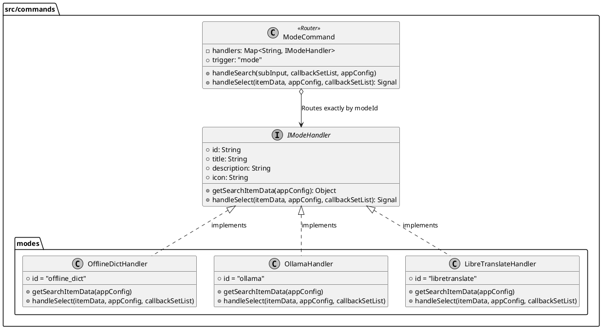

# Spec 00044: /mode 命令策略模式重构设计

## 1. 概述
当前插件的翻译模式切换命令(`/mode`)的控制器层 `src/commands/mode.js` 内部存在大量的 `if-else` 分支。由于它将离线词典 (offline_dict)、Ollama 和 LibreTranslate 的状态检测与多级子命令处理揉合在一起，导致代码冗长且不易维护。
本规范的目的是应用策略模式 (Strategy Pattern)，将不同的后端模式交互分离到各自独立的 Handler 文件中，解耦业务逻辑。主 `mode.js` 将仅作为路由转发层工作，实现高内聚和低耦合。

## 2. 架构设计

### 2.1 目录结构改造
我们在 `src/commands/` 目录下引入一个新的 `modes/` 文件夹用于存放各种后端的特定命令处理逻辑：

```text
src/commands/
├── index.js              # 各类主命令的入口
├── modes/                # 🆕 模式 Handler
│   ├── offline_dict.js     # 负责词典模式的逻辑
│   ├── ollama.js           # 负责 Ollama 模式的逻辑
│   └── libretranslate.js   # 负责 Libre API 模式的逻辑
├── mode.js               # 纯路由层
└── help.js               ...
```

### 2.2 IModeHandler 接口定义
每一个在 `modes` 目录下的 handler 都需要遵守并暴露以下的标准接口契约：



### 2.3 mode.js (Router) 的 `handleSelect` 拆分设计
`mode.js` 将由原本承担所有底层逻辑的角色，退化为单纯的“中转路由”。

在重构后的 `mode.js` 中，`handleSelect` 将只做两件事：
1. **依据 `modeId` 路由查找**：从传入的 `itemData.modeId` 匹配出已注册的 Handler 对象。
2. **底层职责委派**：调用 `handler.handleSelect(...)`，将业务逻辑需要的全部上下文（用户点击数据、应用配置、底层回调列表）转交。

```javascript
// 重构后的 mode.js 的 handleSelect 结构示意：
handleSelect(itemData, appConfig, callbackSetList) {
    const handler = handlerMap[itemData.modeId];
    if (handler) {
        // 1. 将多级逻辑控制权原封不动转交给对应后端
        const signal = handler.handleSelect(itemData, appConfig, callbackSetList);
        
        // 2. 统一保存应用级配置修改 (防止重构产生漏写)
        if (typeof utools !== 'undefined' && signal && !signal.disableClear) {
            utools.dbStorage.setItem('app_config', appConfig);
        }
        return signal;
    }
    return {};
}
```

## 3. 拆分稳定性与防退化保证 (Regression Safety)

这是一次纯粹的系统内置逻辑解耦重构，为确保对 uTools 宿主及最终用户的交互体验 **零影响 (无副作用)**，我们将实施以下契约保障：

1. **入参上下文无损透传**：`mode.js` 仅仅是转移了执行发生的作用域。原始传入的 `(itemData, appConfig, callbackSetList)` 三大件参数完全透明地被传入子 Handler 中，使得由于嵌套引发的下一级菜单回调功能（如 Ollama 的"确认启用" / "配置面板"菜单）依然后向兼容。
2. **通信契约(Signal)对齐**：顶层的 `preload.js` 仅校验返回的纯数据指令（即 `{ disableClear: true }`, `{ reloadBackend: true, restoreSearch: true }`, 等）。这要求各个提取出来的子模块中 `handleSelect` 函数末尾，**必须原样返回与老代码一样的 Signal 载荷**。只要返回的对象的结构一致，系统的响应表现就是无缝等价的。
3. **状态修改合并归心**：曾经的老代码里，散落着十几处繁杂的 `appConfig.backends.xyz = true; utools.dbStorage.setItem('app_config')`。在拆分后，由于 `appConfig` 对象通过引用传递各个模块，各 Handler 依旧拥有原先**原地修改配置值**的权利。最后统一由上层 `mode.js` 在函数终了前检查 Signal 是否需要保存，统一安全调用 `utools.dbStorage.setItem` 做收尾，杜绝忘写、漏写的情况。
4. **自动备用容灾处理 (Fallback Bypass)**：对于当引擎未处于 `READY` 强制跳转至 Config 页面的降级功能，会在抽离各模块时予以严格复刻。不论是通过共用的 Helper 处理还是被各 `Handler` 分别纳入，都能确信不可用节点同样无法触发导致异常的 `confirm_` 行动。

## 4. 验收与测试
- **白盒断言**：确认 `src/commands/mode.js` 行数大幅缩减且不存在任何硬编码后端识别 `if(modeId === '...')`。
- **黑盒运行**：
    - 输入 `/mode` 依然能够正常展示三个模式及正确状态词。
    - 点击 Ollama 触发 “确认启用”/“打开配置” 的二级状态正确无误。
    - `confirm_xx` 时能够成功切换活跃的后端，并在配置面板重载后不丢失设置。
