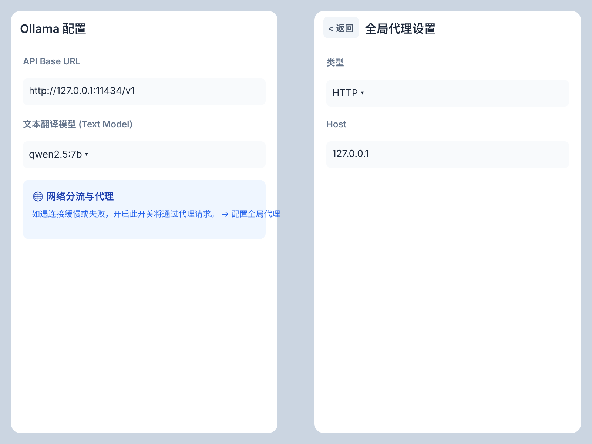
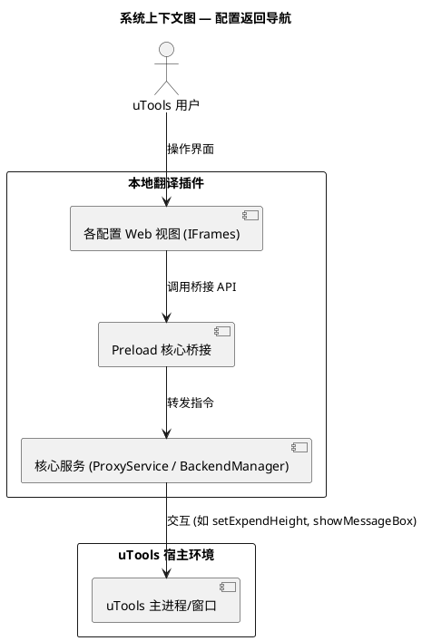
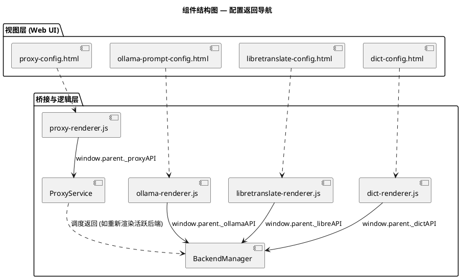
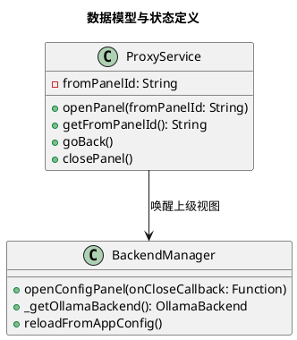
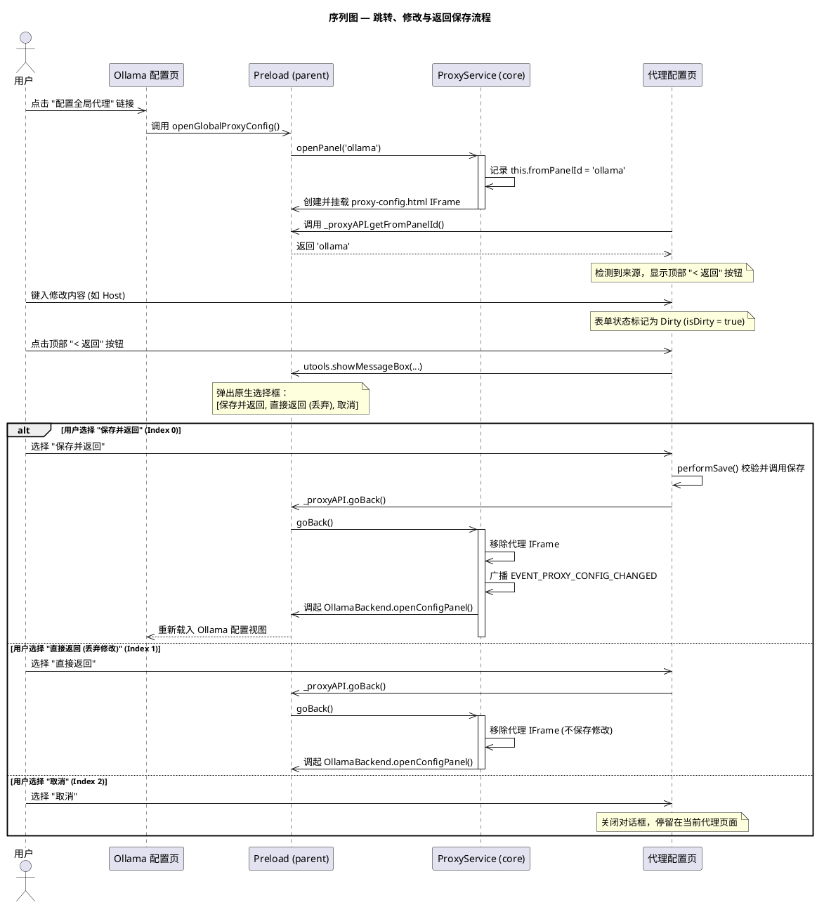
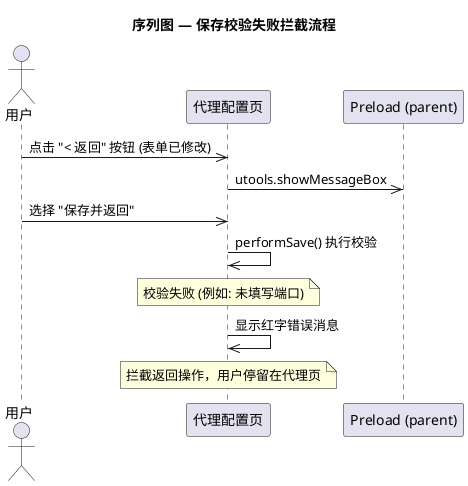
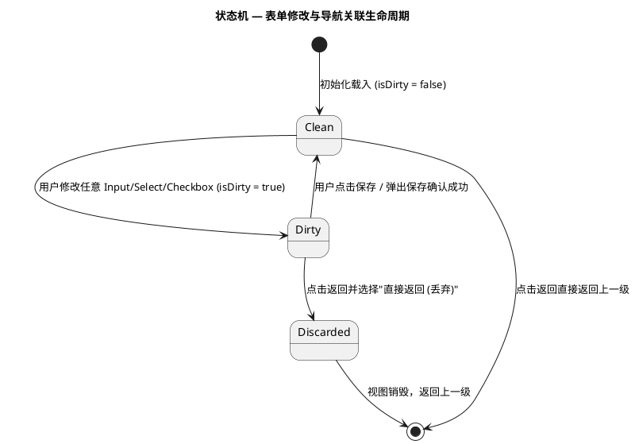
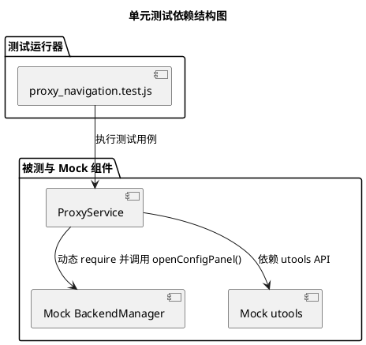
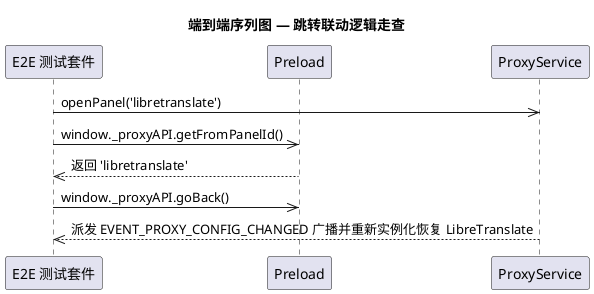

# Spec-00045: 配置界面返回导航与统一顶部栏设计规格书

## 1. 概述与目标

### 1.1 问题背景
本翻译插件包含多个后端及系统级的配置视图（Ollama 配置、LibreTranslate 配置、离线词典配置、全局代理配置）。当用户从某个翻译后端配置项跳转至全局代理配置进行设置时，由于页面上下文重叠且没有记录跳转路径，用户无法快捷返回，只得关闭配置窗口并重新进入。这给多步骤的交互流程带来了不良的割裂体验。

### 1.2 设计目标
- **设计统一的配置页顶部栏**：所有配置界面共享统一的导航栏，对齐视觉高度和排版风格。
- **引入双向导航机制**：建立一种轻量级的跳转路径记忆，在从上级页面跳转至下级配置页时自动记录来源。当来源存在时，顶部栏左侧激活返回按钮。
- **提供防丢失保存验证机制**：在配置处于修改未保存状态时，拦截返回行为并弹窗提示，确保用户的数据不会因为意外返回而丢失。

### 1.3 成功标准
- 所有配置子页面均具有高度一致的导航栏。
- 通过在 Ollama/LibreTranslate/离线词典中点击“配置代理”跳转后，代理页面正确显示“返回”键。
- 点击“返回”时，对于未保存修改，能够调起 uTools 系统级原生对话框，引导完成保存/丢弃/取消流。
- 单元测试与端到端场景覆盖导航记忆状态与关闭流程。

### 1.4 UI 原型设计
页面交互和样式细节的原型设计已导出并保存在：

源设计文件：[navigation.pen](file:///Users/guangyu/Projects/utools/utools_local_translate/doc/ui/navigation.pen)
包含以下两个核心界面在横向并排的线框图定义：
- **左侧**：直接进入时的 Ollama 配置页，包含提示配置全局代理的分流卡片。
- **右侧**：从上级页面跳转过来后的全局代理设置页面，左上角显示“< 返回”按钮。

---

## 2. 静态架构设计

### 2.1 系统上下文

### 2.2 组件结构

### 2.3 数据模型

### 2.4 接口契约
各配置子页面与核心层通过注入的 API 对象进行交互：

#### 1. 全局代理接口 `window.parent._proxyAPI`
- `getFromPanelId(): String` — 获取来源页面 ID（`'ollama'`/`'libretranslate'`/`'dict'`/`null`）。
- `goBack(): void` — 销毁当前代理视图，广播配置变更并恢复来源视图。
- `closePanel(): void` — 完全退出配置流。

#### 2. 各翻译后端配置接口 `window._ollamaAPI` / `window._libreAPI` / `window._dictAPI`
- 增加统一的 `openGlobalProxyConfig()` / `openProxyConfig()` 接口，统一调用 `proxyService.openPanel(fromPanelId)` 传入对应后端的 ID。

---

## 3. 动态流程设计

### 3.1 核心流程

#### 跳转与返回流程（以 Ollama -> 代理页面 -> 点击返回为例）

### 3.2 异常与边界流程

#### 保存校验失败拦截

### 3.3 状态管理

---

## 4. 测试设计

### 4.1 单元测试

单元测试将聚焦于 `ProxyService` 中的返回路径存储、获取和返回调度。

| 测试ID | 被测模块 | 测试场景 | 输入 | 期望行为 | 优先级 |
|--------|---------|---------|------|---------|-------|
| UT-NAV-001 | `ProxyService` | 正常记录和获取来源面板 ID | 调用 `openPanel('ollama')` | `getFromPanelId()` 正确返回 `'ollama'` | P0 |
| UT-NAV-002 | `ProxyService` | 完全关闭面板时清除来源面板 ID | 调用 `closePanel()` | `getFromPanelId()` 返回 `null` | P0 |
| UT-NAV-003 | `ProxyService` | 正常执行返回上一级面板逻辑 | 设定来源为 `'ollama'`，调用 `goBack()` | 清除来源记录，销毁代理视图，派发配置变更事件并触发重新打开 Ollama 的行为 | P0 |

#### 测试组件依赖与 Mock 关系

### 4.2 端到端功能测试

E2E 功能测试通过模拟 iframe 内桥接 API 调用链，走查完整跳转逻辑。

| 步骤 | 动作 | 验证点 | 通过标准 |
|------|------|--------|---------|
| 1 | 调用 `proxyService.openPanel('libretranslate')` | 检查代理的 `fromPanelId` 状态 | 状态值为 `'libretranslate'` |
| 2 | 调用 `_proxyAPI.goBack()` | 检查是否触发了事件及上级面板重新开启 | 广播事件成功派发，LibreTranslate `openConfigPanel` 成功被调用 |

### 4.3 验收测试

| 验收ID | Given（前置条件） | When（用户操作） | Then（期望结果） | 自动化可行性 |
|--------|-----------------|-----------------|-----------------|------------|
| AT-001 | 用户打开了 Ollama 配置页面 | 点击页面中的“配置全局代理”链接 | 成功跳转到代理页面，且顶部左侧显示“返回”按钮 | 需手动验证（基于 WebView DOM 渲染） |
| AT-002 | 处于从 Ollama 跳转来的代理页面，表单未做修改 | 点击顶部的“返回”按钮 | 直接关闭代理页面，重新显现并切回 Ollama 配置页，不弹确认框 | 可在测试脚本中模拟交互事件验证 |
| AT-003 | 处于从 Ollama 跳转来的代理页面，表单已做修改 | 点击顶部的“返回”按钮 | 弹出 uTools 原生选择对话框，选择“取消”则保留当前修改状态且不返回 | 需手动验证原生对话框调用 |

---

## 5. 设计决策记录

### 5.1 页面切换技术方案：重绘 vs 覆叠
- **备选方案 A**：跳转时彻底销毁上级页面容器，返回时重新创建并渲染。
- **备选方案 B**：跳转时上级页面不销毁（仅被下级页面 `zIndex` 覆叠），返回时只需移除当前页面容器，自动显露出下级页面。
- **决策与理由**：选择 **方案 A（彻底销毁，返回重绘）**。虽然方案 B 更加省力，但在 uTools 环境下，如果存在多个处于挂载状态的 IFrame，容易造成 DOM 节点的频繁堆积、甚至引发内存泄漏和事件冲突（如两套 IFrame 监听相同的 `Escape` 或 `window._closeConfigPanel` 导致逻辑打架）。因此，跳转时彻底移除旧视图，返回时从零初始化重绘是更为干净和自治的做法。

### 5.2 状态 Dirty 检测方案
- **方案选择**：在配置页初始化时对初始值进行快照（或建立 isDirty 状态标记，一旦监听到任意 `input` 或 `change` 事件就将其标记为 `true`）。当成功进行存盘操作后重置为 `false`。这非常直观且易于在各 Renderer 的原生 JS 中以低耦合形式实现。

---

## 6. 开放问题
- 无。
