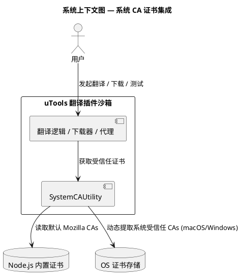
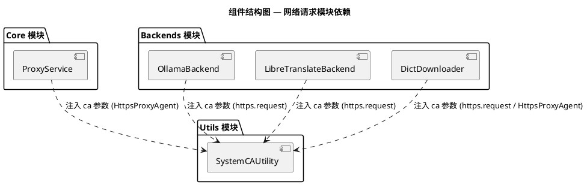
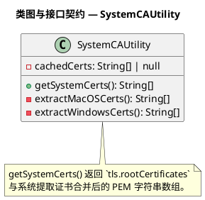
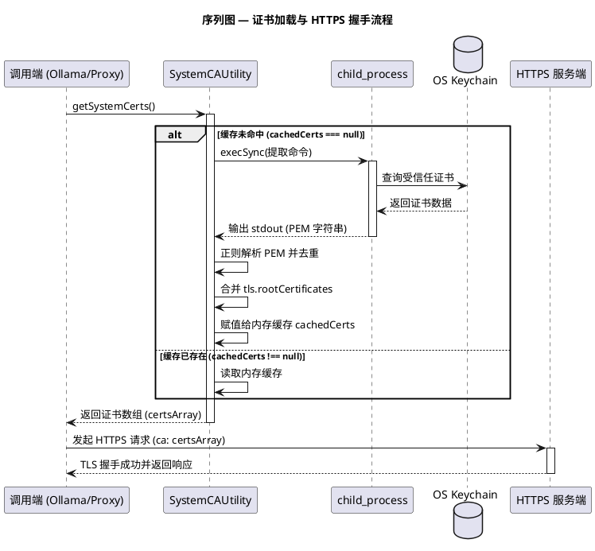
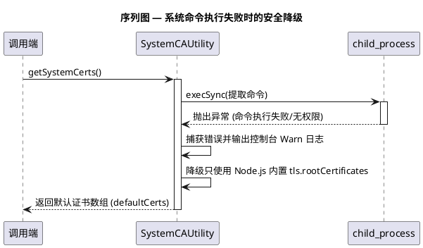
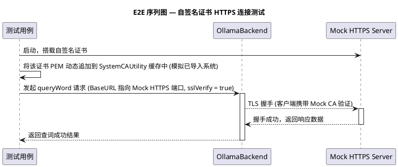

# 系统 CA 证书集成 设计规格书

## 1. 概述与目标
### 1.1 问题背景
本翻译插件集成了本地大模型（Ollama）与自建翻译服务（LibreTranslate）。在 HTTPS 部署场景下，本地服务常使用自签名证书。虽然用户可在操作系统（如 macOS Keychain 或 Windows 证书存储）中信任该证书，但 Node.js 默认仅使用内置的 Mozilla 根证书，导致 HTTPS 连接报错。

### 1.2 设计目标
1. 自动提取操作系统 Keychain / 证书存储中信任的 CA 证书。
2. 将系统受信任证书与 Node.js 默认的 `tls.rootCertificates` 合并，使得公网 HTTPS 请求与本地自签名 HTTPS 请求均能正常校验。
3. 将提取的证书数组安全地传递给所有 Node.js 内部发起的 HTTPS 请求（包括直连请求、代理隧道握手、词典下载）。
4. 在内存中缓存合并后的证书，避免频繁执行系统命令导致翻译卡顿。

### 1.3 成功标准
- 开启 `sslVerify`（证书校验）时，访问由系统已信任的自签名证书保护的本地 HTTPS 服务（例如本地 Ollama）不会抛出证书校验异常。
- 不影响常规的公网 HTTPS 请求，也不通过全局关闭 `rejectUnauthorized` 来妥协安全性。

---

## 2. 静态架构设计

### 2.1 系统上下文
系统上下文图展示了 `SystemCAUtility` 在插件网络层与底层操作系统及 Node.js 内置证书库之间的关系。

### 2.2 组件结构
本功能的组件结构设计如下：

### 2.3 数据模型与接口契约
`SystemCAUtility` 模块对外暴露的属性和方法结构。

`SystemCAUtility` 在运行时通过 Node.js 原生的 `process.platform` API 来判断当前运行的操作系统平台，实现精细化区分：
1. **macOS** (`process.platform === 'darwin'`)：分发调用私有方法 `extractMacOSCerts()`，使用 `security find-certificate -a -p` 提取钥匙串证书。
2. **Windows** (`process.platform === 'win32'`)：分发调用私有方法 `extractWindowsCerts()`，通过 PowerShell 执行 `Get-ChildItem` 指令导出根证书。
3. **其他平台 / 异常降级**：若运行于其他操作系统，或执行系统指令时捕获到任何异常，则打印 Warn 日志，静默降级为只使用内置的 `tls.rootCertificates`。

---

## 3. 动态流程设计

### 3.1 核心流程
首次加载证书并用于发起 HTTPS 请求的运行时交互序列。

### 3.2 异常与边界流程
当提取系统证书失败或命令执行异常时的降级流程。

---

## 4. 测试设计

### 4.1 单元测试

| 测试ID | 被测模块 | 测试场景 | 输入 | 期望行为 | 优先级 |
|--------|---------|---------|------|---------|-------|
| UT-001 | `SystemCAUtility` | getSystemCerts 返回类型校验 | 无 | 返回包含 PEM 格式证书的字符串数组 | P0 |
| UT-002 | `SystemCAUtility` | 首次提取与内存缓存校验 | 连续调用 2 次 `getSystemCerts` | 第二次调用不触发底层 `execSync` 命令行调用 | P0 |
| UT-003 | `SystemCAUtility` | macOS 系统证书提取 | `platform === 'darwin'` | 能执行 `security` 命令且提取出至少 1 个包含 `BEGIN CERTIFICATE` 标识的证书 | P0 |
| UT-004 | `SystemCAUtility` | Windows 系统证书提取 | `platform === 'win32'` | 能执行 PowerShell 脚本且成功解析出 PEM 证书 | P1 |
| UT-005 | `SystemCAUtility` | 异常降级验证 | `execSync` 抛出 Error | 捕获异常，打印日志，降级返回 `tls.rootCertificates` | P0 |

### 4.2 端到端功能测试

E2E 测试通过构建一个临时的 HTTPS Mock 服务器，配置自签名证书，验证客户端的握手过程。

### 4.3 验收测试

| 验收ID | Given（前置条件） | When（用户操作） | Then（期望结果） | 自动化可行性 |
|--------|-----------------|-----------------|-----------------|------------|
| AT-001 | 自签名证书已导入系统证书库并设为信任 | 在 Ollama 配置界面填入 `https://...` 并开启证书校验，测试连接 | 连接测试通过，成功拉取模型列表 | 需手动验证（依赖外部系统状态） |
| AT-002 | 使用默认公网服务（如 `https://www.google.com`） | 执行常规词典下载或测试连接 | 正常发起 HTTPS 请求并握手成功 | 可自动化 |

---

## 5. 设计决策记录

### 5.1 备选方案对比

- **方案 A：引入第三方包（如 `mac-ca` / `win-ca`）**
  - *优点*：成熟稳定，社区维护。
  - *缺点*：引入外部依赖会增加打包体积（特别是含有 Native C 绑定的二进制组件时，在 Electron 中编译极为繁琐，且存在多平台兼容构建的风险）。
  - *决策*：**不采用**。保持依赖极简，仅使用 Node.js 原生的 `child_process` 配合系统自带工具（`security` 和 `powershell`）是最稳妥的做法。

- **方案 B：动态提取并合并到 CA 参数（本设计方案）**
  - *优点*：纯 JS 实现，无二进制依赖，利用系统原生命令提取，通过内存缓存避免性能损耗，合并 Mozilla + System 证书保证公网与内网兼容。
  - *决策*：**采用**。

---

## 6. 开放问题
- Windows PowerShell 提取命令在不同 PowerShell 版本（如 PS 5.1 经典版 vs PS 7 Core）下的换行格式兼容性，将在开发和测试阶段进行重点覆盖与测试。
